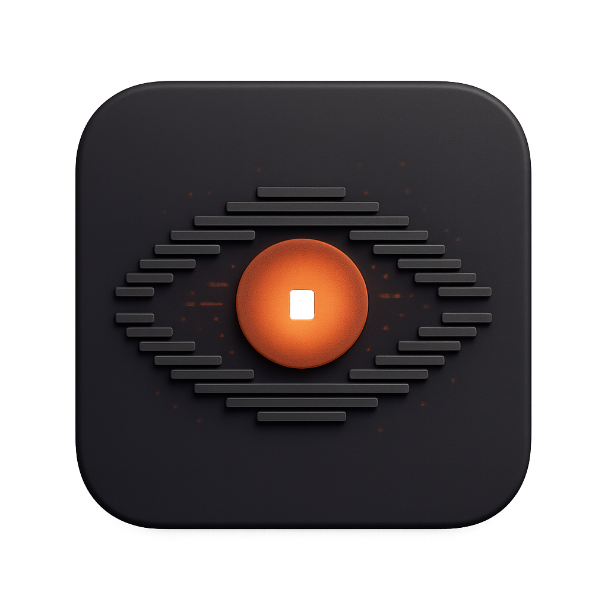

<p align="center"> 
  
</p>

# Claude Code Trace

[](https://github.com/delexw/claude-code-trace/actions/workflows/ci.yml)
[](LICENSE)
[](https://www.rust-lang.org/)
[](https://react.dev/)
[](https://v2.tauri.app/)
[](https://github.com/delexw/claude-code-trace/releases)

**Claude Code Trace** is a **Claude Code session log viewer** for local JSONL files stored in `~/.claude/projects/`.

Browse, tail, and inspect Claude Code conversations in real time. Claude Code Trace renders Claude Code JSONL session files as readable conversations with expandable tool calls, token counts, timestamps, MCP tool call detection, and live log tailing. It also helps you find sessions by user message. It runs as a **native desktop app** for macOS, Linux, and Windows, or a **web app**.

Use Claude Code Trace when you want to:

- View Claude Code conversation history from `~/.claude/projects/`
- Find Claude Code sessions by user message
- Inspect Claude Code tool calls, MCP calls, timestamps, and token usage
- Monitor live Claude Code sessions while they are running
- Debug long-running Claude Code workflows without reading raw JSONL files
- Browse Claude Code session logs from a desktop, browser, or terminal interface

> Also check out [**Codex Trace**](https://github.com/PixelPaw-Labs/codex-trace) — a session viewer for OpenAI Codex.

<p align="center">
  
</p>

## Features

- **Claude Code JSONL viewer** — reads local Claude Code session files from `~/.claude/projects/`
- **Conversation browser** — renders raw JSONL logs as scrollable Claude Code conversations
- **Live tailing** — monitor active Claude Code sessions in real time
- **Session search** — find sessions by user message
- **Tool call inspection** — expand Claude Code tool calls for detailed debugging
- **MCP support** — detects Model Context Protocol tool calls and displays human-friendly names
- **Token visibility** — shows token counts where available in Claude Code session data
- **Desktop, web, and TUI modes** — choose the interface that fits your workflow
- **Cross-platform builds** — supports macOS, Linux, and Windows

## Why use Claude Code Trace?

Claude Code stores local session history as JSONL files. Those files are useful for debugging and reviewing AI coding sessions, but they are difficult to read directly. Claude Code Trace turns those JSONL logs into an interactive session viewer so you can find sessions by user message, inspect conversations, understand tool usage, and debug Claude Code workflows faster.

Unlike general observability platforms, Claude Code Trace focuses on local Claude Code session logs. It does not require sending traces to an external service.

## Install

### Download pre-built app

Grab the latest release from [Releases](https://github.com/delexw/claude-code-trace/releases):

| Platform | File                        |
| -------- | --------------------------- |
| macOS    | `.dmg`                      |
| Linux    | `.deb`, `.rpm`, `.AppImage` |
| Windows  | `.msi`, `.exe`              |

> [!IMPORTANT]
> **macOS:** The app is unsigned. After installing, remove the quarantine attribute:
>
> ```bash
> xattr -cr /Applications/Claude\ Code\ Trace.app
> ```

### Build from source

Use this option if you want to build Claude Code Trace locally on macOS, Linux, or Windows with Rust and Node.js installed.

```bash
git clone git@github.com:delexw/claude-code-trace.git
cd claude-code-trace
./script/install.sh       # builds everything + installs to PATH

cctrace              # desktop app (default)
cctrace --web        # web mode (opens browser)
cctrace --tui        # terminal UI
```

### Run from source without installing

```bash
git clone git@github.com:delexw/claude-code-trace.git
cd claude-code-trace
npm install

npm run tauri dev        # desktop app with hot reload
npm run dev:web          # web mode (opens browser)
npm run dev:tui          # TUI (starts backend + terminal UI)
```

### Run in Docker

Docker is supported for web mode only.

```bash
docker build -t claude-code-trace .
docker run --rm -p 1421:1421 \
  -v "$HOME/.claude:/home/app/.claude:ro" \
  claude-code-trace
# then open http://localhost:1421
```

Or with Docker Compose:

```bash
docker compose up --build
```

See [docs/docker.md](docs/docker.md) for runtime environment variables, volume layout, and troubleshooting.

## Requirements

- [Rust](https://rustup.rs/) 1.77+
- Node.js 18+
- macOS: Xcode Command Line Tools (`xcode-select --install`)
- Linux: `libwebkit2gtk-4.1-dev libayatana-appindicator3-dev librsvg2-dev libxdo-dev libssl-dev`
- Windows: [WebView2](https://developer.microsoft.com/en-us/microsoft-edge/webview2/) is required and is pre-installed on Windows 10 and Windows 11

## Usage

```bash
cctrace              # desktop app (default)
cctrace --web        # web mode (opens browser at http://localhost:1420)
cctrace --tui        # terminal UI (starts backend + TUI together)
```

Launch Claude Code Trace to open the session picker. It automatically discovers Claude Code sessions from `~/.claude/projects/`.

Select a session to view the conversation. Click messages to expand tool calls, or open the detail view for full inspection.

In desktop mode, click **Open in Browser** in the toolbar to switch to browser mode. This opens `http://localhost:1420` in your default browser and hides the desktop window.

If you installed the pre-built `.dmg`, `.deb`, or `.msi`, you can also launch the desktop app directly and pass `--web` to the binary:

```bash
# macOS
/Applications/Claude\ Code\ Trace.app/Contents/MacOS/Claude\ Code\ Trace --web
```

> **Note:** The TUI is functional but has a few UX rough edges. Contributions are welcome.

## MCP tool call support

MCP (Model Context Protocol) tool calls are automatically detected and displayed with human-friendly names.

For example, `mcp__chrome-devtools__take_screenshot` renders as **MCP chrome-devtools** with the summary `take screenshot`.

Supported MCP servers include chrome-devtools, figma, atlassian, buildkite, cloudflare, and any other server following the `mcp__<server>__<tool>` naming convention.

## Keybindings

`?` toggles keybind hints in any view.

### List view

| Key               | Action                                 |
| ----------------- | -------------------------------------- |
| `j` / `k`         | Move cursor down / up                  |
| `G` / `g`         | Jump to last / first message           |
| `Tab`             | Toggle expand/collapse current message |
| `e` / `c`         | Expand / collapse all Claude messages  |
| `Enter`           | Open detail view                       |
| `d`               | Open debug log viewer                  |
| `t`               | Open team task board when teams exist  |
| `s` / `q` / `Esc` | Open session picker                    |

### Detail view

| Key         | Action                         |
| ----------- | ------------------------------ |
| `j` / `k`   | Navigate items                 |
| `Tab`       | Toggle expand/collapse item    |
| `Enter`     | Open subagent or toggle expand |
| `h` / `l`   | Switch panels left / right     |
| `q` / `Esc` | Back to list                   |

### Session picker

| Key         | Action                |
| ----------- | --------------------- |
| `j` / `k`   | Navigate sessions     |
| `Enter`     | Open selected session |
| `q` / `Esc` | Back to list          |

### Debug log viewer

| Key         | Action       |
| ----------- | ------------ |
| `q` / `Esc` | Back to list |

## Development

```bash
npm install
npm run tauri dev        # desktop app with hot reload
npm run dev:web          # web mode, no desktop window
npm run dev:tui          # TUI, starts backend + terminal UI together
npm run tauri build      # production build
```

### Check and test

```bash
npm run check            # run all checks at once
npx vitest run           # frontend tests
cargo test --manifest-path src-tauri/Cargo.toml    # Rust tests
npx tsc --noEmit         # TypeScript type check
npx oxlint               # JS/TS lint
npx oxfmt                # JS/TS format
cargo clippy --manifest-path src-tauri/Cargo.toml  # Rust lint
cargo fmt --manifest-path src-tauri/Cargo.toml     # Rust format
```

## Release

Push a version tag to trigger a GitHub Actions build:

```bash
git tag v0.4.0
git push origin v0.4.0
```

This creates a draft release with macOS, Linux, and Windows artifacts attached. Review and publish it from the [Releases](https://github.com/delexw/claude-code-trace/releases) page.

## Contributing

Bug reports, feature requests, and pull requests are welcome. See [Development](#development) for how to build and run locally. For significant changes, open an issue first to align on scope.

## License

[MIT](LICENSE)
