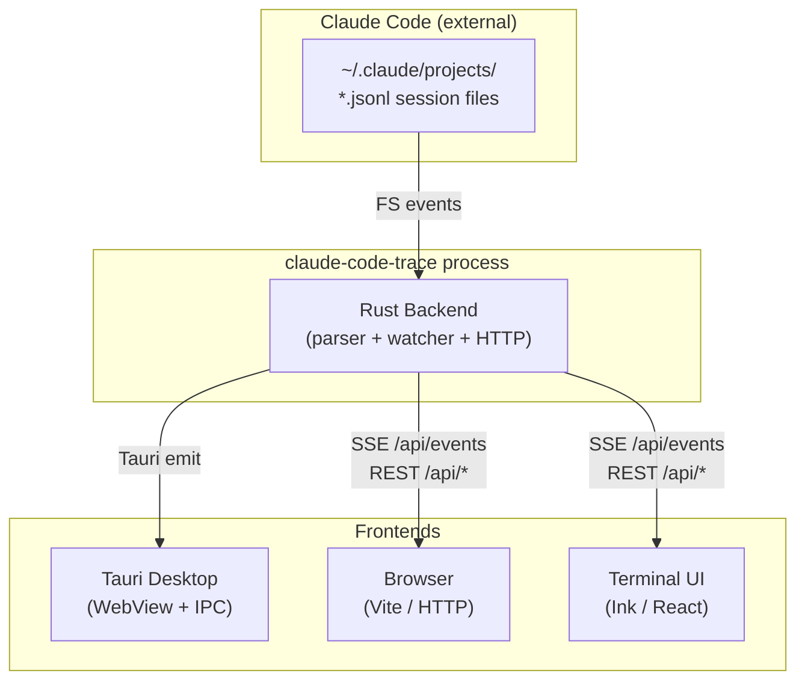
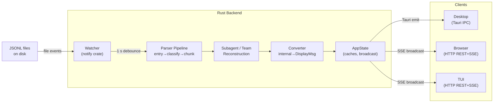

# Claude Code Trace — Architecture Overview

**claude-code-trace** is a multi-platform session viewer for Claude Code JSONL transcripts.
It ships as a Tauri desktop app, a browser-served web app, and a terminal UI (TUI).
All three frontends share a single Rust backend that parses JSONL files, watches for live changes,
and exposes them over both Tauri IPC and HTTP/SSE.

---

## System Context

---

## Major Subsystems

| Layer              | Location                    | Responsibility                                   |
| ------------------ | --------------------------- | ------------------------------------------------ |
| JSONL Parser       | `src-tauri/src/parser/`     | Parse, classify, assemble conversation turns     |
| File Watcher       | `src-tauri/src/watcher.rs`  | FS events → debounce → re-parse → broadcast      |
| App State          | `src-tauri/src/state.rs`    | In-memory caches, watcher handles, SSE broadcast |
| Tauri Commands     | `src-tauri/src/commands/`   | IPC layer for desktop frontend                   |
| HTTP API           | `src-tauri/src/http_api.rs` | REST + SSE for browser and TUI                   |
| Frontend Converter | `src-tauri/src/convert.rs`  | Internal → JSON-serialisable display types       |
| Web Frontend       | `src/`                      | React components, hooks, keyboard navigation     |
| TUI                | `tui/`                      | Ink/React terminal rendering                     |
| Shared             | `shared/`                   | Types, project tree builder, format helpers      |
| CLI Launcher       | `bin/cctrace.mjs`           | Mode selector (desktop / web / tui / headless)   |

---

## Top-Level Data Flow

---

## All Specs

| #   | File                                               | Topic                                                               |
| --- | -------------------------------------------------- | ------------------------------------------------------------------- |
| 01  | [01-parser-pipeline.md](01-parser-pipeline.md)     | JSONL parsing: entry → classify → chunk → subagent → team → convert |
| 02  | [02-file-watcher.md](02-file-watcher.md)           | File watching, debounce, session watcher vs picker watcher          |
| 03  | [03-state-management.md](03-state-management.md)   | AppState, session cache, SSE broadcast                              |
| 04  | [04-http-api.md](04-http-api.md)                   | REST endpoints, SSE contract, Tauri IPC mirror                      |
| 05  | [05-frontend-web.md](05-frontend-web.md)           | React hooks and components (web/desktop)                            |
| 06  | [06-tui.md](06-tui.md)                             | Terminal UI (Ink/React), keyboard routing, windowing                |
| 07  | [07-data-types.md](07-data-types.md)               | Shared TypeScript types, Rust serialisation                         |
| 08  | [08-session-lifecycle.md](08-session-lifecycle.md) | End-to-end session loading, live update, truncation                 |
| 09  | [09-subagent-linking.md](09-subagent-linking.md)   | Four-phase subagent linking algorithm                               |
| 10  | [10-tool-taxonomy.md](10-tool-taxonomy.md)         | Tool categorisation and summary generation                          |
| 11  | [11-project-tree.md](11-project-tree.md)           | Project key parsing and tree construction                           |
| 12  | [12-cli-launcher.md](12-cli-launcher.md)           | CLI mode selection, service installer, health check                 |
| 13  | [13-item-rendering.md](13-item-rendering.md)       | Per-type item rendering, expansion, selection, auto-scroll          |
