# Spec: JSONL Parser Pipeline

**Location**: `src-tauri/src/parser/`

The parser transforms raw Claude Code JSONL session files into structured, display-ready message
trees. It is a pure pipeline with no side effects: the same input always produces the same output.

---

## Pipeline Overview

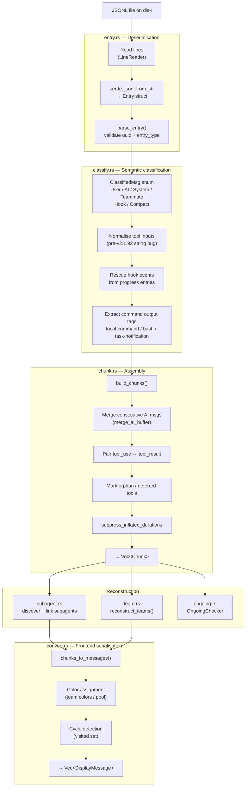

---

## Stage 1: Entry Deserialisation (`entry.rs`)

Each JSONL line is decoded into an `Entry` struct that mirrors the raw Claude Code format.

### Key Fields

| Field              | Description                                                              |
| ------------------ | ------------------------------------------------------------------------ |
| `uuid`             | Unique message identifier                                                |
| `entry_type`       | Discriminant: `user`, `assistant`, `system`, `hook_event`, etc.          |
| `role`             | Same as `entry_type` for most messages                                   |
| `content`          | Message body (string or content-block array)                             |
| `model`            | Model string (assistant messages only)                                   |
| `subtype`          | Hook subtype: `PreToolUse`, `PostToolUse`, `Stop`, …                     |
| `hookEvent`        | Hook event name                                                          |
| `isCompactSummary` | Compaction boundary marker                                               |
| `away_summary`     | Session-recap text                                                       |
| `forkedFrom`       | Pre-v2.1.118 fork reference                                              |
| `tool_use_result`  | JSON object for tool results                                             |
| `background_tasks` | v2.1.145+: running background task descriptors (Stop/SubagentStop hooks) |
| `session_crons`    | v2.1.145+: registered session cron jobs (Stop/SubagentStop hooks)        |
| `workflowId`       | v2.1.154+: workflow identifier on lifecycle entries                      |
| `workflowName`     | v2.1.154+: workflow name on lifecycle entries                            |
| `workflowRunUrl`   | v2.1.154+: workflow run URL on lifecycle entries                         |
| `workflowStatus`   | v2.1.154+: workflow run status on lifecycle entries                      |

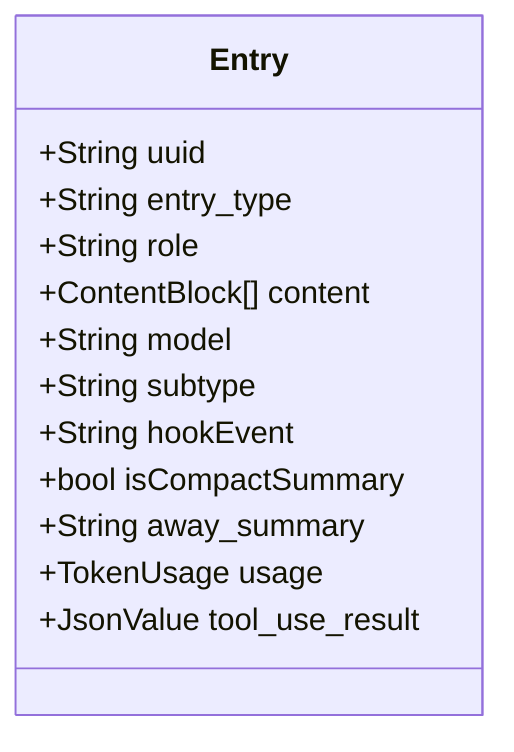

---

## Stage 2: Classification (`classify.rs`)

Classification converts each `Entry` into a `ClassifiedMsg` variant by inspecting `entry_type`,
`role`, `subtype`, and content. This stage normalises differences between Claude Code versions.

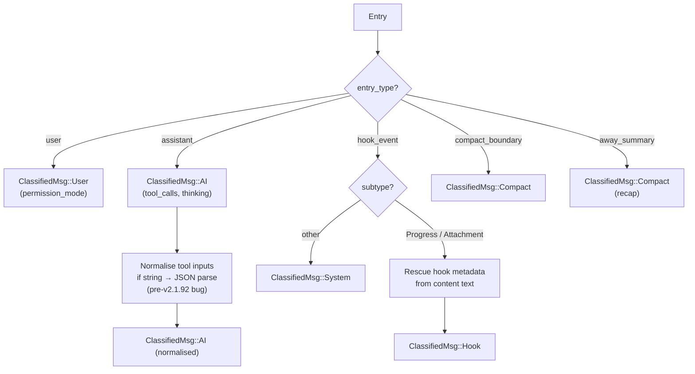

### Version-Compatibility Normalisations

| Issue                                                                                     | Version      | Fix                                                                       |
| ----------------------------------------------------------------------------------------- | ------------ | ------------------------------------------------------------------------- |
| Tool inputs JSON-encoded as strings                                                       | pre-v2.1.92  | Deserialise inner string → object                                         |
| Fork reference in `forkedFrom` field                                                      | pre-v2.1.118 | Map to synthetic `fork-context-ref`                                       |
| Hook payload in content text                                                              | all          | Regex extraction of teammate ID, color, protocol                          |
| Large outputs written to disk                                                             | v2.1.89+     | `RE_PERSISTED_OUTPUT_PATH` → file read                                    |
| Dynamic Workflow lifecycle types                                                          | v2.1.154+    | Add to `NOISE_ENTRY_TYPES`; capture workflow fields on `Entry`            |
| `cache_creation_input_tokens` always 0 when API uses nested `cache_creation.input_tokens` | v2.1.152+    | `cache_creation_from_value()` reads both flat and nested forms; takes max |

---

## Stage 3: Chunk Assembly (`chunk.rs`)

Chunks are the displayable conversation turns. Assembly merges sequences of classified messages
and pairs tool calls with their results.

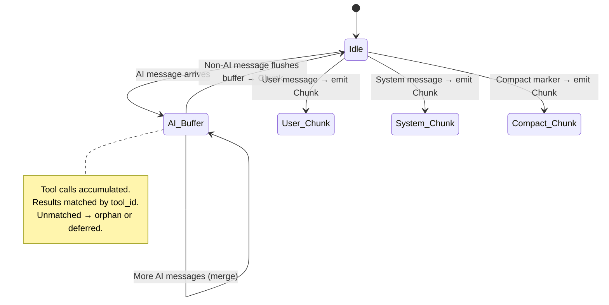

### Tool Pairing Logic

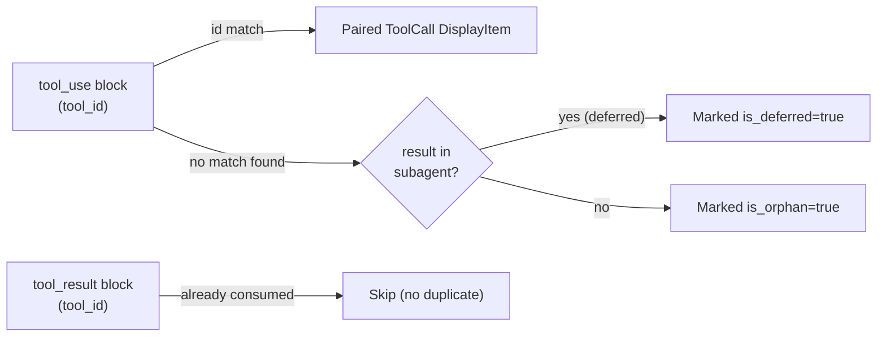

### Chunk Types

| Type      | Source              | Key Fields                                         |
| --------- | ------------------- | -------------------------------------------------- |
| `AI`      | assistant entries   | text, model, usage, tool_calls, items, duration_ms |
| `User`    | user entries        | user_text, permission_mode                         |
| `System`  | hook/system entries | output, is_error                                   |
| `Compact` | compact_boundary    | (separator marker)                                 |
| `Recap`   | away_summary        | output text                                        |

### DisplayItem Types

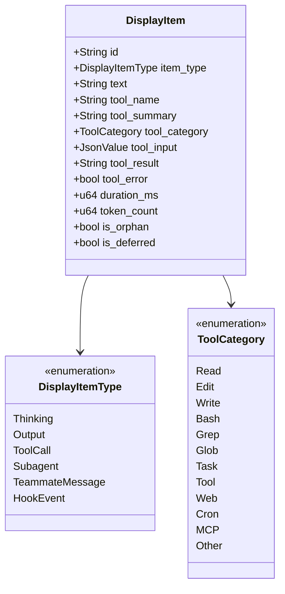

---

## Stage 4: Subagent Reconstruction (`subagent.rs`)

Subagents are child Claude processes, each writing to their own `agent-*.jsonl` file.
This stage discovers them, parses their files, and links each to the parent tool call.

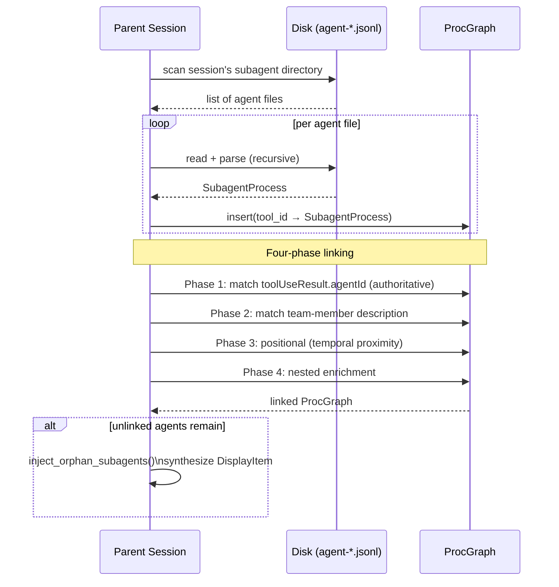

### Token Deduplication

Agents can appear both in the parent's tool_result AND as a separate JSONL file.
`TokenSnapshot` and `insert_best_snapshot()` keep only the more-complete token record,
preventing double-counting.

---

## Stage 5: Team Reconstruction (`team.rs`)

Teams are reconstructed from sparse signals (TaskCreate, TaskUpdate, SendMessage) in the message
stream.

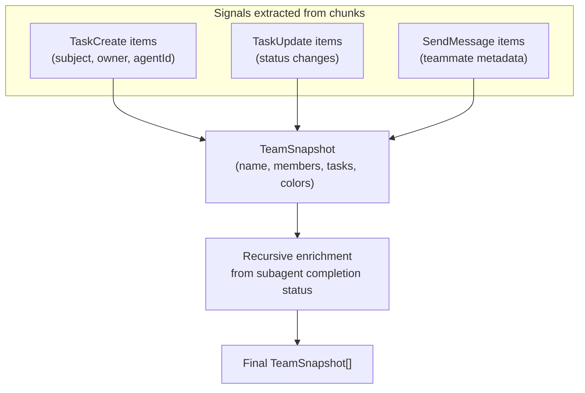

---

## Stage 6: Completion Detection (`ongoing.rs`)

`OngoingChecker` determines if a session is still running.

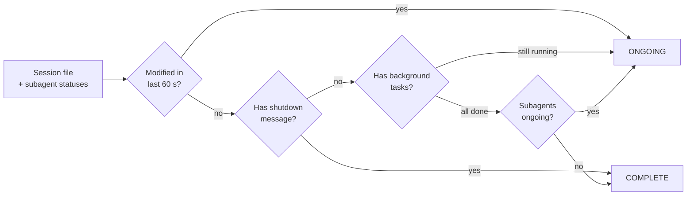

---

## Stage 7: Frontend Conversion (`convert.rs`)

Translates internal `Chunk` trees into JSON-serialisable `DisplayMessage` structs for the frontend.

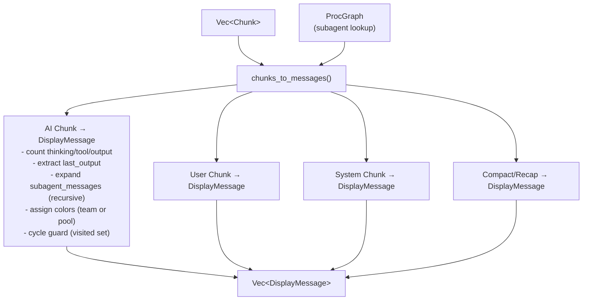

### Color Assignment

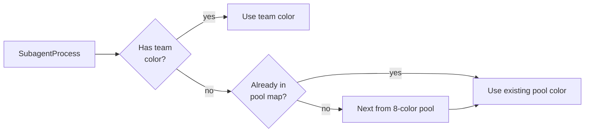

---

## Helper Modules

| Module          | Purpose                                                                |
| --------------- | ---------------------------------------------------------------------- |
| `linereader.rs` | Buffered line reader; tolerates lines exceeding default buffer         |
| `sanitize.rs`   | Strip XML tags, extract command output, resolve persisted output paths |
| `taxonomy.rs`   | `categorize_tool_name()` — maps tool name → ToolCategory               |
| `summary.rs`    | `tool_summary()` — generates human-readable one-liner per tool call    |
| `patterns.rs`   | Compiled regex patterns (command tags, teammate metadata, etc.)        |
| `dategroup.rs`  | Groups session list by Today / Yesterday / This Week / Older           |
| `debuglog.rs`   | Incremental debug log reader with deduplication                        |
| `project.rs`    | `project_name()` — derives "repo // branch" from cwd                   |
| `cache.rs`      | Per-file parse memoisation keyed by (path, mtime, size)                |

---

## Related Specs

- [02-file-watcher.md](02-file-watcher.md) — triggers re-runs of this pipeline
- [07-data-types.md](07-data-types.md) — full type definitions
- [08-session-lifecycle.md](08-session-lifecycle.md) — end-to-end flow including this pipeline
