# Spec: JSONL Parser Pipeline

**Location**: `src-tauri/src/parser/`

The parser transforms raw Claude Code JSONL session files into structured, display-ready message
trees. It is a pure pipeline with no side effects: the same input always produces the same output.

---

## Pipeline Overview

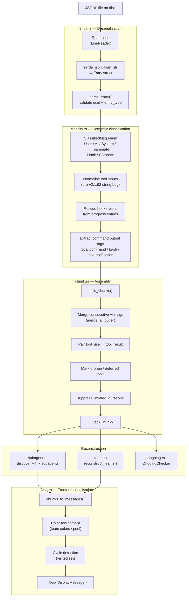

---

## Stage 1: Entry Deserialisation (`entry.rs`)

Each JSONL line is decoded into an `Entry` struct that mirrors the raw Claude Code format.

### Key Fields

| Field                   | Description                                                                                                                                     |
| ----------------------- | ----------------------------------------------------------------------------------------------------------------------------------------------- |
| `uuid`                  | Unique message identifier                                                                                                                       |
| `entry_type`            | Discriminant: `user`, `assistant`, `system`, `hook_event`, etc.                                                                                 |
| `role`                  | Same as `entry_type` for most messages                                                                                                          |
| `content`               | Message body (string or content-block array)                                                                                                    |
| `model`                 | Model string (assistant messages only)                                                                                                          |
| `subtype`               | Hook subtype: `PreToolUse`, `PostToolUse`, `Stop`, …                                                                                            |
| `hookEvent`             | Hook event name                                                                                                                                 |
| `isCompactSummary`      | Compaction boundary marker                                                                                                                      |
| `away_summary`          | Session-recap text                                                                                                                              |
| `forkedFrom`            | Pre-v2.1.118 fork reference                                                                                                                     |
| `tool_use_result`       | JSON object for tool results                                                                                                                    |
| `background_tasks`      | v2.1.145+: running background task descriptors (Stop/SubagentStop hooks)                                                                        |
| `session_crons`         | v2.1.145+: registered session cron jobs (Stop/SubagentStop hooks)                                                                               |
| `hookSpecificOutput`    | v2.1.163+: hook result payload; `additionalContext` sub-field carries feedback text injected back into the session                              |
| `workflowId`            | v2.1.154+: workflow identifier on lifecycle entries                                                                                             |
| `workflowName`          | v2.1.154+: workflow name on lifecycle entries                                                                                                   |
| `workflowRunUrl`        | v2.1.154+: workflow run URL on lifecycle entries                                                                                                |
| `workflowStatus`        | v2.1.154+: workflow run status on lifecycle entries                                                                                             |
| `agentDepth`            | v2.1.172+: 1-indexed nesting depth for sidechain entries from deeply nested sub-agents (up to 5 levels)                                         |
| `parentAgentName`       | v2.1.172+: name of the spawning agent for deeply nested sidechain attribution                                                                   |
| `version`               | v2.1.141+: Claude Code version string (e.g. `"2.1.195"`) on all entries from SDK/background-agent sessions; acts as schema-version discriminant |
| `entrypoint`            | v2.1.141+: how Claude Code was invoked (`"sdk-ts"`, `"cli"`, …); present on all background-agent session entries                                |
| `sessionId`             | v2.1.141+: owning session UUID; on all background-agent entries and on `last-prompt`/`queue-operation` metadata                                 |
| `agentId`               | v2.1.141+: opaque background-agent instance ID (distinct from the human-readable `agentName`)                                                   |
| `userType`              | v2.1.141+: actor classification (`"external"` for SDK/background agents, `"human"` for interactive CLI)                                         |
| `attributionSkill`      | v2.1.141+: skill name that spawned this background-agent session; absent for directly-launched agents                                           |
| `lastPrompt`            | v2.1.195+: prompt text in `type:"last-prompt"` checkpoint entries; used by Claude Code for background-agent resume                              |
| `sourceAgentName`       | v2.1.186+: display name of the background subagent requesting a cross-session permission prompt                                                 |
| `requestingAgentUuid`   | v2.1.186+: session UUID of the background subagent requesting a cross-session permission prompt                                                 |
| `reason`                | v2.1.193+: human-readable denial explanation in `auto-mode-denial` / `permission-denial` entries                                                |
| `toolName`              | v2.1.193+: name of the blocked tool in `auto-mode-denial` entries                                                                               |
| `heartbeat_tool_use_id` | v2.1.214+: ID of the in-flight tool call in heartbeat `progress` entries; identifies which tool call is still running                           |
| `heartbeat_elapsed_ms`  | v2.1.214+: milliseconds elapsed since the tool call started, in heartbeat `progress` entries                                                    |
| `heartbeat_seq`         | v2.1.214+: monotonically increasing counter per `toolUseId` across heartbeat emissions for the same tool call                                   |

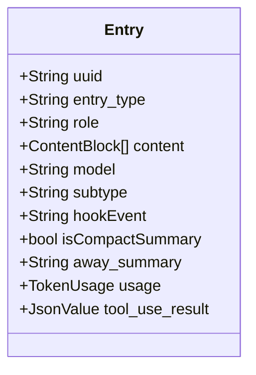

---

## Stage 2: Classification (`classify.rs`)

Classification converts each `Entry` into a `ClassifiedMsg` variant by inspecting `entry_type`,
`role`, `subtype`, and content. This stage normalises differences between Claude Code versions.

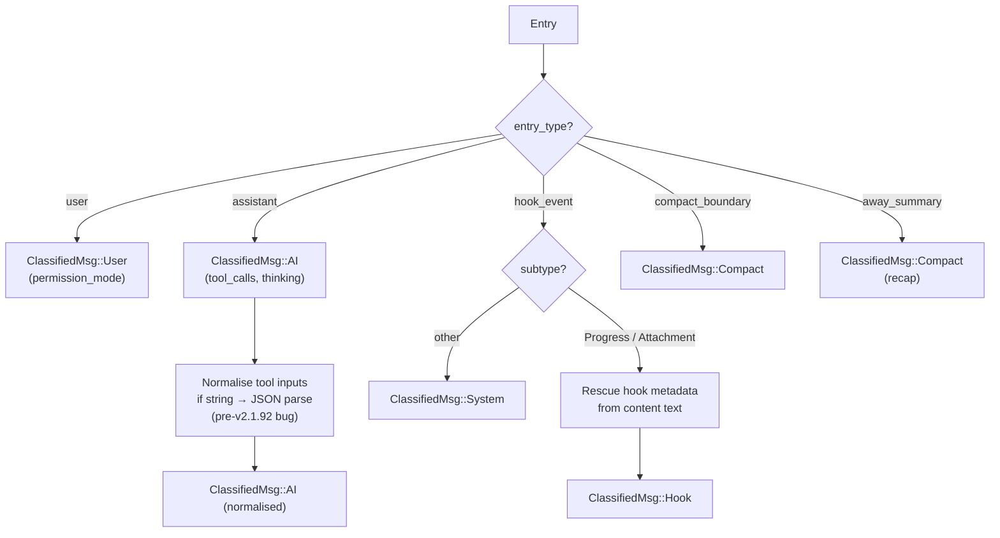

### Version-Compatibility Normalisations

| Issue                                                                                                                                                                                                                                                                                                                                                                                                                          | Version                                                     | Fix                                                                                                                                                                                                                                                                                                                                                                                                                                                                                                                                                                                                                                                                                                                                                    |
| ------------------------------------------------------------------------------------------------------------------------------------------------------------------------------------------------------------------------------------------------------------------------------------------------------------------------------------------------------------------------------------------------------------------------------ | ----------------------------------------------------------- | ------------------------------------------------------------------------------------------------------------------------------------------------------------------------------------------------------------------------------------------------------------------------------------------------------------------------------------------------------------------------------------------------------------------------------------------------------------------------------------------------------------------------------------------------------------------------------------------------------------------------------------------------------------------------------------------------------------------------------------------------------ |
| Tool inputs JSON-encoded as strings                                                                                                                                                                                                                                                                                                                                                                                            | pre-v2.1.92                                                 | Deserialise inner string → object                                                                                                                                                                                                                                                                                                                                                                                                                                                                                                                                                                                                                                                                                                                      |
| Fork reference in `forkedFrom` field                                                                                                                                                                                                                                                                                                                                                                                           | pre-v2.1.118                                                | Map to synthetic `fork-context-ref`                                                                                                                                                                                                                                                                                                                                                                                                                                                                                                                                                                                                                                                                                                                    |
| Hook payload in content text                                                                                                                                                                                                                                                                                                                                                                                                   | all                                                         | Regex extraction of teammate ID, color, protocol                                                                                                                                                                                                                                                                                                                                                                                                                                                                                                                                                                                                                                                                                                       |
| Large outputs written to disk                                                                                                                                                                                                                                                                                                                                                                                                  | v2.1.89+                                                    | `RE_PERSISTED_OUTPUT_PATH` → file read                                                                                                                                                                                                                                                                                                                                                                                                                                                                                                                                                                                                                                                                                                                 |
| Dynamic Workflow lifecycle types                                                                                                                                                                                                                                                                                                                                                                                               | v2.1.154+                                                   | Add to `NOISE_ENTRY_TYPES`; capture workflow fields on `Entry`                                                                                                                                                                                                                                                                                                                                                                                                                                                                                                                                                                                                                                                                                         |
| `cache_creation_input_tokens` always 0 when API uses nested `cache_creation.input_tokens`                                                                                                                                                                                                                                                                                                                                      | v2.1.152+                                                   | `cache_creation_from_value()` reads both flat and nested forms; takes max                                                                                                                                                                                                                                                                                                                                                                                                                                                                                                                                                                                                                                                                              |
| `MessageDisplay` hook event name                                                                                                                                                                                                                                                                                                                                                                                               | v2.1.152+                                                   | `hook_event` stored as `String` — no enum; catch-all presence-of-hookEvent checks in classify handle any future event name without a code change                                                                                                                                                                                                                                                                                                                                                                                                                                                                                                                                                                                                       |
| `fallbackModel` retry writes null/empty stub assistant entry before successful response                                                                                                                                                                                                                                                                                                                                        | v2.1.166+                                                   | `classify()` returns `None` for assistant entries with `null` or empty `content` array; fallback response with real content passes through with its own model ID                                                                                                                                                                                                                                                                                                                                                                                                                                                                                                                                                                                       |
| Mid-stream connection drop flushes partial assistant entry with `usage:null` or null individual token fields                                                                                                                                                                                                                                                                                                                   | v2.1.179+                                                   | `EntryMessage.usage` and all four numeric fields of `EntryUsage` use `null_as_default`; null values deserialise to 0 instead of failing. `stop_reason` was already `Option<String>` and handles null/unknown values.                                                                                                                                                                                                                                                                                                                                                                                                                                                                                                                                   |
| Thinking-only assistant entries (`content` = one `thinking` block, no `text`/`tool_use`)                                                                                                                                                                                                                                                                                                                                       | v2.1.183+                                                   | Non-empty content array passes the empty-content guard; classified as `AIMsg` with `thinking_count=1` and empty `text`. Rendered with thinking block, no empty-bubble discard.                                                                                                                                                                                                                                                                                                                                                                                                                                                                                                                                                                         |
| Synthetic re-prompt `isMeta: true` user entries after thinking-only turns                                                                                                                                                                                                                                                                                                                                                      | v2.1.183+                                                   | `classify()` returns `None` for `user` entries with `is_meta: true` that don't match a known pattern (Stop hook feedback). Prevents spurious meta-AI bubbles.                                                                                                                                                                                                                                                                                                                                                                                                                                                                                                                                                                                          |
| Background-agent sessions carry new top-level fields (`version`, `entrypoint`, `sessionId`, `agentId`, `userType`, `attributionSkill`)                                                                                                                                                                                                                                                                                         | v2.1.141+                                                   | Added to `Entry` struct; silently ignored for display but captured for future use / forward-compat reasoning.                                                                                                                                                                                                                                                                                                                                                                                                                                                                                                                                                                                                                                          |
| Background subagent permission prompts appear in main session with `sourceAgentName` / `requestingAgentUuid`                                                                                                                                                                                                                                                                                                                   | v2.1.186+                                                   | Both fields added to `Entry` with `#[serde(default)]`; propagated through `classify()` → `HookMsg` → `chunk.rs` → `FrontendDisplayItem`; `DetailItem` renders a "Requesting Agent" section when non-empty.                                                                                                                                                                                                                                                                                                                                                                                                                                                                                                                                             |
| `/rewind` support — new `rewind-pointer` entry type; `rewindable` + `checkpointUuid` fields on summary/compact_boundary                                                                                                                                                                                                                                                                                                        | v2.1.191+                                                   | `rewind-pointer` added to `NOISE_ENTRY_TYPES`; `rewind_to_uuid`, `rewindable`, `checkpoint_uuid` captured on `Entry`. Chain resolver unchanged for this case — post-rewind entries have `parentUuid` pointing to the pre-clear anchor, so the backward walk naturally bypasses the dead post-clear branch. (`leafUuid` is _not_ unconditionally trusted as the live tip in general — see the `last-prompt` row below.)                                                                                                                                                                                                                                                                                                                                 |
| Auto-mode denial entries (`type:"auto-mode-denial"` / `"permission-denial"`) with `reason` and `toolName`                                                                                                                                                                                                                                                                                                                      | v2.1.193+                                                   | Both fields added to `Entry` with `#[serde(default)]`; captured for display and future denial-history rendering.                                                                                                                                                                                                                                                                                                                                                                                                                                                                                                                                                                                                                                       |
| Periodic heartbeat `type:"progress"` entries for long-running tool calls carrying top-level `toolUseId`, `elapsedMs`, and `seq` fields. Emitted every N seconds while a tool call is in flight to keep the session file mod-time fresh for liveness detection. These entries have no `data.hookEvent` so they are not hook candidates.                                                                                         | v2.1.214+                                                   | `heartbeat_tool_use_id`, `heartbeat_elapsed_ms`, `heartbeat_seq` added to `Entry` with `#[serde(default)]` and serde renames. These entries fall through the hook/denial rescue paths in `classify()` and are dropped by `NOISE_ENTRY_TYPES` — their only role is refreshing the file mod-time so `OngoingChecker` sees a recent write and keeps the session marked live.                                                                                                                                                                                                                                                                                                                                                                              |
| `type:"last-prompt"` checkpoint entry (background-agent resume state)                                                                                                                                                                                                                                                                                                                                                          | v2.1.195+                                                   | Added `"last-prompt"` to `NOISE_ENTRY_TYPES`; `lastPrompt` field added to `Entry`. Entry passes `parse_entry` (has `leafUuid`) but is explicitly discarded by classify before reaching conversation display. This `leafUuid` is only a snapshot taken at prompt-submit time — if the conversation continues live in the same file afterward (normal foreground use, not a background-agent resume), later entries chain off of it and it stops being the true tip. `resolve_live_chain_uuids` only trusts the hint when it resolves to an entry with no children (`!has_child.contains(&leaf_hint)`); otherwise it falls back to the last non-sidechain leaf entry in file order, so conversation continued after a stale checkpoint is never cut off. |
| Some auto-compaction `compact_boundary` entries write a `logicalParentUuid` pointing into their own post-compaction descendant chain (e.g. the tail of `compactMetadata.preservedSegment`) instead of the true pre-compaction predecessor                                                                                                                                                                                      | observed in the wild, no known version gate                 | Following it as-is closes a cycle back through the boundary; the existing cycle guard would silently stop the backward walk right there, dropping everything before it (including earlier compactions). `resolve_live_chain_uuids` now falls back to the nearest earlier entry in file order (skipping already-visited uuids) when the `logicalParentUuid` target is already in the live set.                                                                                                                                                                                                                                                                                                                                                          |
| Claude Code prunes superseded intermediate `file-history-snapshot` entries during an active session: when a new snapshot is written, earlier backups for the same file may be deleted from the JSONL, leaving gaps in the snapshot UUID chain.                                                                                                                                                                                 | v2.1.208+                                                   | `"file-history-snapshot"` is in `NOISE_ENTRY_TYPES` — every snapshot entry is dropped on sight, before the classified output is assembled. The parser never reconstructs the snapshot chain; conversational turns chain via their own `parentUuid` pointers (never through snapshot UUIDs), so any gap in the snapshot sequence leaves the conversation chain completely intact. Regression test: `file_history_snapshot_pruned_entries_do_not_break_conversation_chain` in `session.rs`.                                                                                                                                                                                                                                                              |
| The `advisor` tool's call/result use Anthropic's server-managed block types instead of the client-orchestrated `tool_use`/`tool_result` every other tool uses: `server_tool_use` (call) and `advisor_tool_result` (result, response text nested at `content.text` instead of a top-level string/array). The result also arrives inside a non-meta (assistant-role) message, unlike every other tool's meta (user-role) result. | n/a — local harness feature, not a Claude Code version gate | `extract_assistant_details` matches `"tool_use" \| "server_tool_use"` identically; `advisor_tool_result` is mapped to a synthetic `tool_result` block with `content` read from the nested path. `merge_ai_buffer`'s non-meta branch now also resolves pending `tool_use` blocks (previously only the meta branch did), via the shared `resolve_tool_result` helper. The model that produced the advice (`usage.iterations[].type == "advisor_message"`) is captured as `advisor_model` on both blocks.                                                                                                                                                                                                                                                 |
| `file-history-snapshot` entries may be pruned — only the latest backup per file is retained, so sessions with many Edit calls may have fewer snapshots than edits (up to 79× transcript-size reduction)                                                                                                                                                                                                                        | v2.1.208+                                                   | `"file-history-snapshot"` was already in `NOISE_ENTRY_TYPES` and dropped before any processing. No chain reconstruction depends on these entries, so gap-tolerance is inherent. A comment in `NOISE_ENTRY_TYPES` and regression tests (`scan_session_metadata_tolerates_pruned_file_history_snapshots`, `file_history_snapshot_sparse_chain_parses_cleanly`, `file_history_snapshot_pruned_entries_do_not_break_conversation_chain`) lock in this behaviour.                                                                                                                                                                                                                                                                                            |
| Every `assistant`-type JSONL entry now carries `effort:{level:"low"\|"normal"\|"high"}` on the **message object** (distinct from the pre-existing top-level `Entry.effort` on hook entries added in v2.1.133+)                                                                                                                                                                                                                 | v2.1.212+                                                   | Added `effort: Option<Value>` to `EntryMessage` with `#[serde(default)]`; pre-v2.1.212 entries without this field default to `None` (backward-compat). Captured for future UI display alongside model name.                                                                                                                                                                                                                                                                                                                                                                                                                                                                                                                                            |
| Periodic progress heartbeat entries (`data.type:"tool_heartbeat"`) emitted every few seconds during long-running tool calls; may carry new fields (`elapsedMs`, `sequenceNumber`, `toolUseId`) not present in earlier progress entries                                                                                                                                                                                         | v2.1.214+                                                   | No code change needed. `Entry` uses `#[serde(default)]` with no `deny_unknown_fields`, so unknown fields are silently ignored. Heartbeat entries have no `hookEvent` in `data`, so the hook rescue branch does not fire — they fall through to `NOISE_ENTRY_TYPES` and are dropped, preventing UI flooding. Tests in `entry.rs` and `classify.rs` pin both invariants.                                                                                                                                                                                                                                                                                                                                                                                 |

---

## Stage 3: Chunk Assembly (`chunk.rs`)

Chunks are the displayable conversation turns. Assembly merges sequences of classified messages
and pairs tool calls with their results.

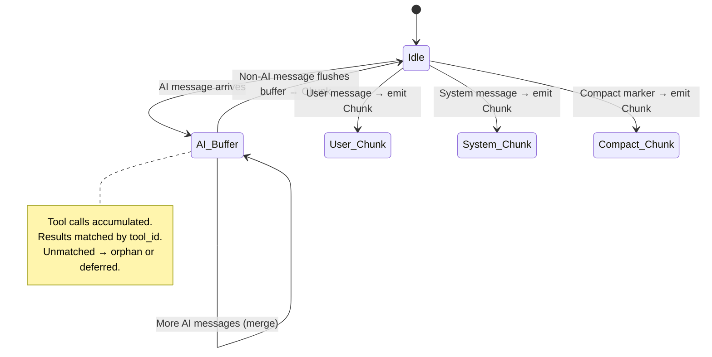

### Tool Pairing Logic

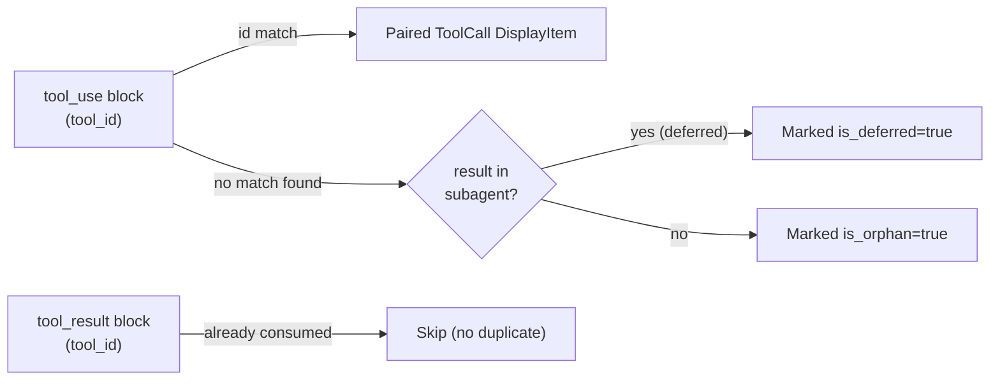

### Chunk Types

| Type      | Source              | Key Fields                                         |
| --------- | ------------------- | -------------------------------------------------- |
| `AI`      | assistant entries   | text, model, usage, tool_calls, items, duration_ms |
| `User`    | user entries        | user_text, permission_mode                         |
| `System`  | hook/system entries | output, is_error                                   |
| `Compact` | compact_boundary    | (separator marker)                                 |
| `Recap`   | away_summary        | output text                                        |

### DisplayItem Types

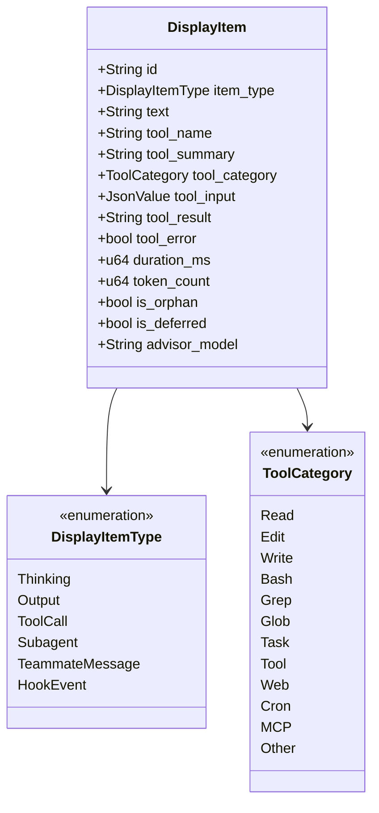

---

## Stage 4: Subagent Reconstruction (`subagent.rs`)

Subagents are child Claude processes, each writing to their own `agent-*.jsonl` file.
This stage discovers them, parses their files, and links each to the parent tool call.

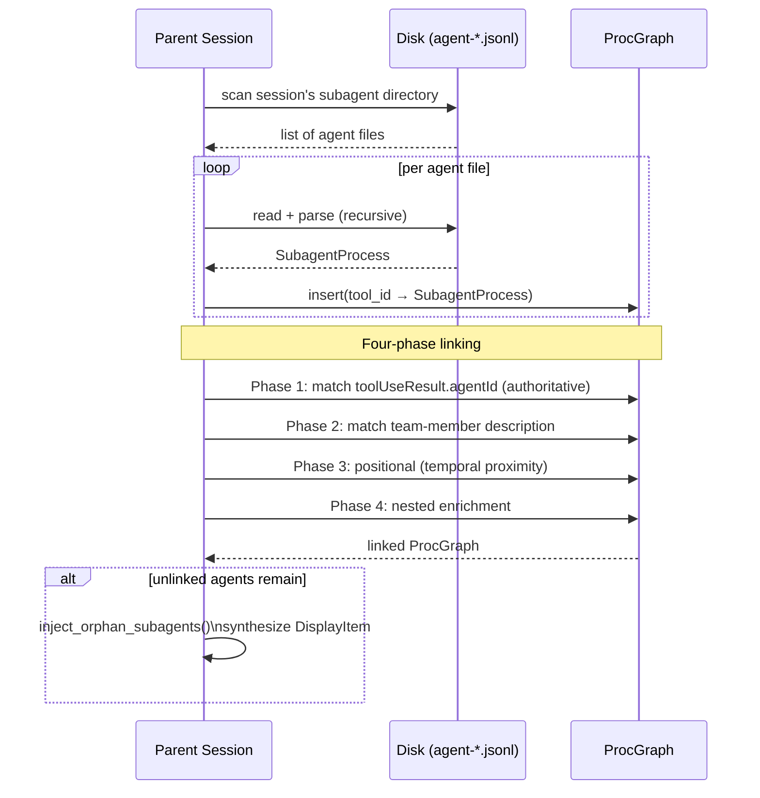

### Token Deduplication

Agents can appear both in the parent's tool_result AND as a separate JSONL file.
`TokenSnapshot` and `insert_best_snapshot()` keep only the more-complete token record,
preventing double-counting.

---

## Stage 5: Team Reconstruction (`team.rs`)

Teams are reconstructed from sparse signals (TaskCreate, TaskUpdate, SendMessage) in the message
stream.

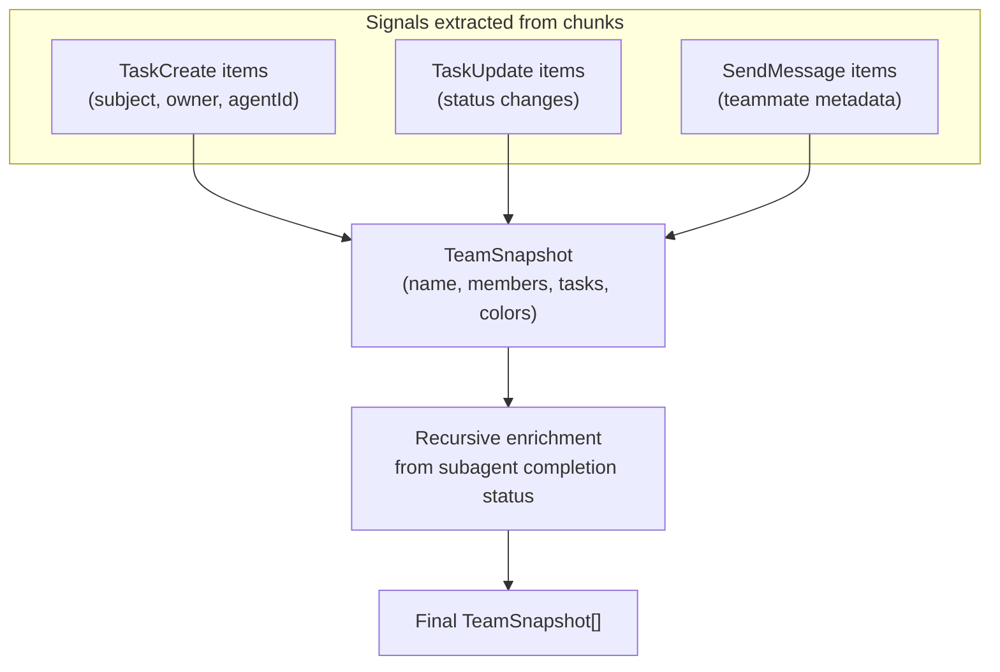

---

## Stage 6: Completion Detection (`ongoing.rs`)

`OngoingChecker` determines if a session is still running.

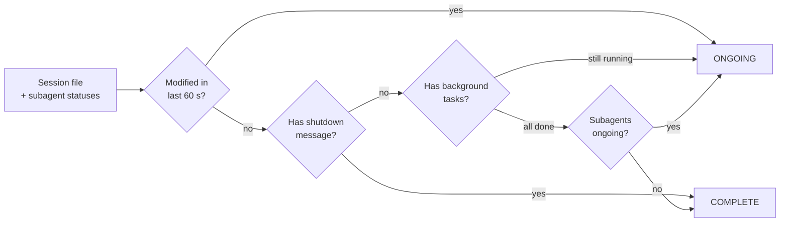

---

## Stage 7: Frontend Conversion (`convert.rs`)

Translates internal `Chunk` trees into JSON-serialisable `DisplayMessage` structs for the frontend.

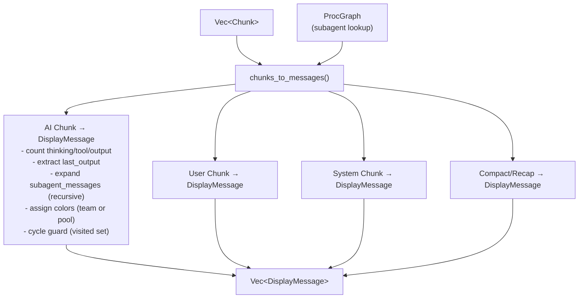

### Color Assignment

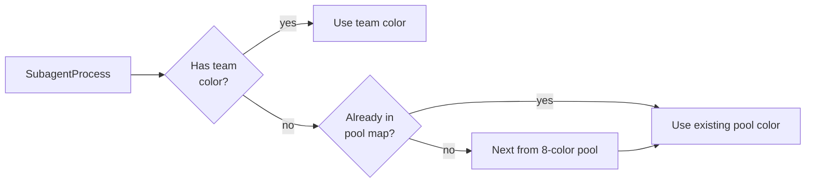

---

## Helper Modules

| Module          | Purpose                                                                |
| --------------- | ---------------------------------------------------------------------- |
| `linereader.rs` | Buffered line reader; tolerates lines exceeding default buffer         |
| `sanitize.rs`   | Strip XML tags, extract command output, resolve persisted output paths |
| `taxonomy.rs`   | `categorize_tool_name()` — maps tool name → ToolCategory               |
| `summary.rs`    | `tool_summary()` — generates human-readable one-liner per tool call    |
| `patterns.rs`   | Compiled regex patterns (command tags, teammate metadata, etc.)        |
| `dategroup.rs`  | Groups session list by Today / Yesterday / This Week / Older           |
| `debuglog.rs`   | Incremental debug log reader with deduplication                        |
| `project.rs`    | `project_name()` — derives "repo // branch" from cwd                   |
| `cache.rs`      | Per-file parse memoisation keyed by (path, mtime, size)                |

---

## Related Specs

- [02-file-watcher.md](02-file-watcher.md) — triggers re-runs of this pipeline
- [07-data-types.md](07-data-types.md) — full type definitions
- [08-session-lifecycle.md](08-session-lifecycle.md) — end-to-end flow including this pipeline
