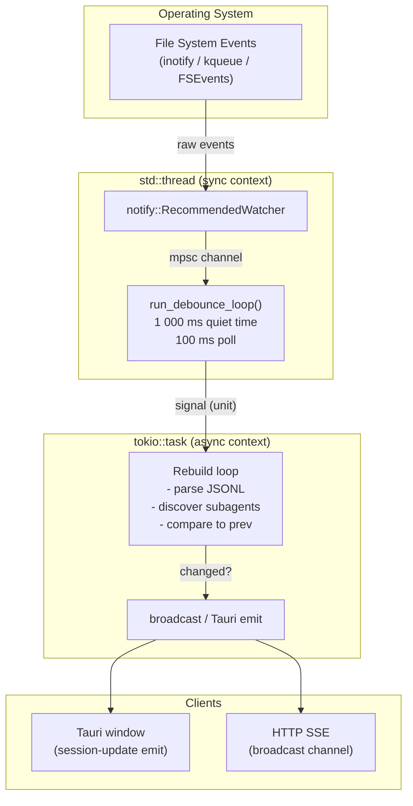
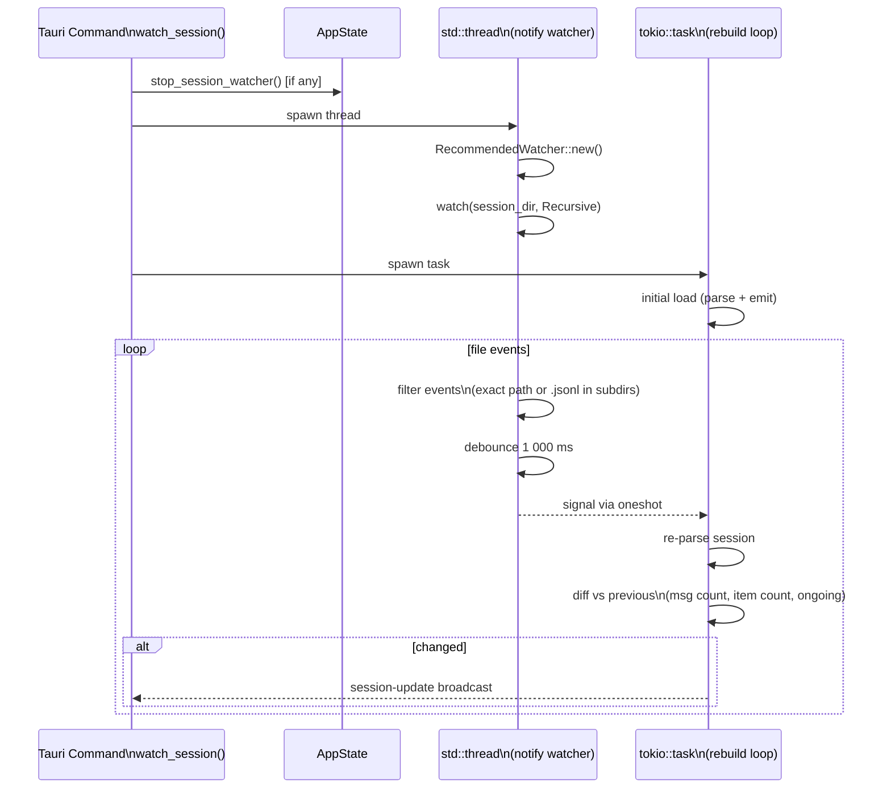
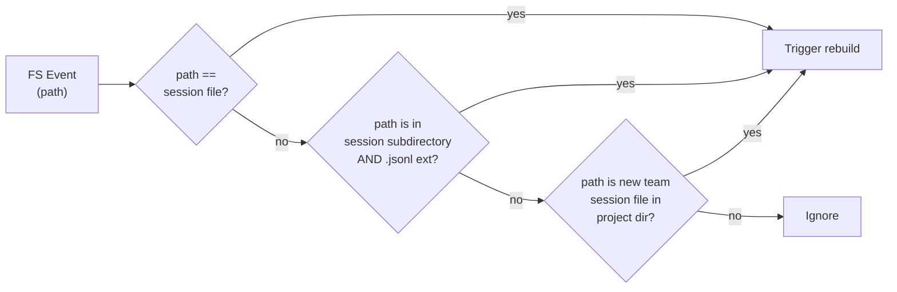
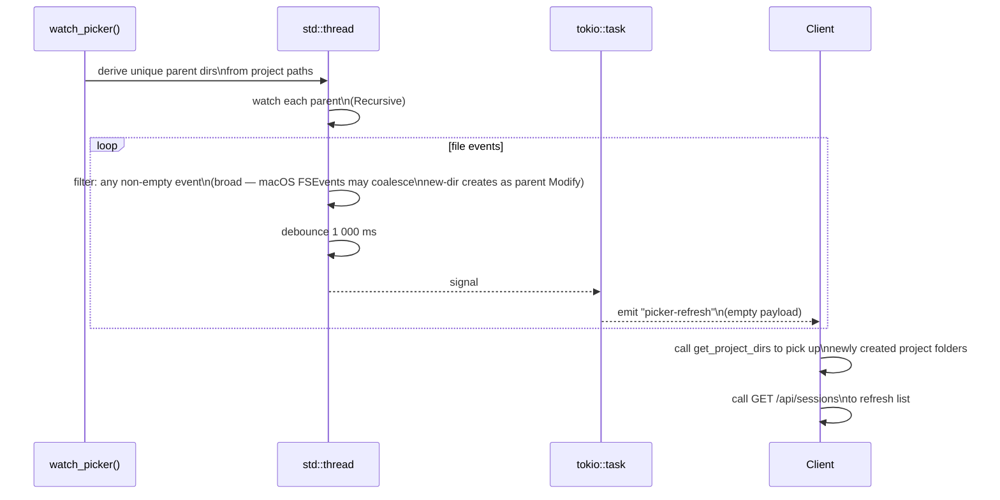
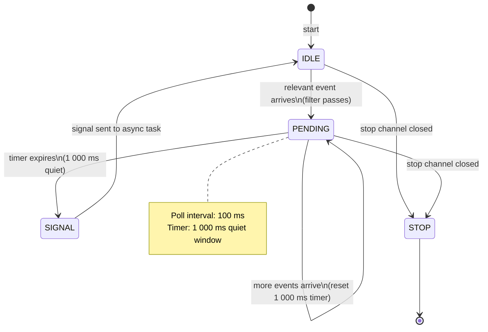
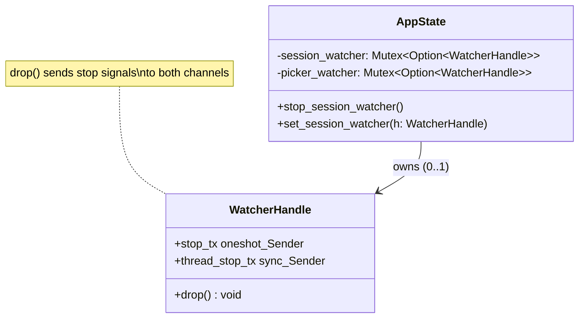
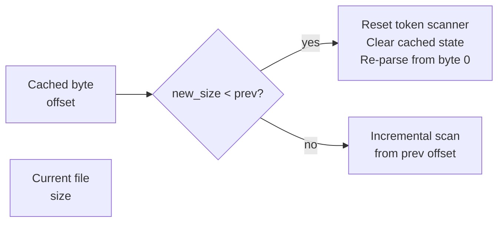
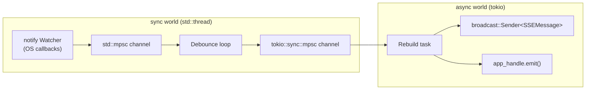

# Spec: File Watcher System

**Location**: `src-tauri/src/watcher.rs`

The file watcher is the live-update engine. It watches JSONL files and project directories on disk
using OS-level file system events, debounces rapid changes, and triggers re-parses that are
broadcast to all connected clients.

There are two distinct watchers:

| Watcher             | Watches                                    | Event emitted    |
| ------------------- | ------------------------------------------ | ---------------- |
| **Session watcher** | One session JSONL + its subagent directory | `session-update` |
| **Picker watcher**  | All project parent directories             | `picker-refresh` |

---

## Architecture



---

## Session Watcher Detail

### Startup Sequence



### Filter Logic

Only events matching these criteria trigger a rebuild:



### Deduplication Guard

Before emitting a `session-update`, the rebuild loop checks whether anything materially changed:

```
if message_count == prev_count
   AND display_item_count == prev_item_count
   AND ongoing == prev_ongoing
   → skip emit
```

This prevents noisy updates from unrelated file touches in watched directories.

---

## Picker Watcher Detail

The picker watcher is simpler — it emits a **lightweight signal** (no data) so the frontend can
call `/api/sessions` to fetch an updated session list.



---

## Debounce Loop (`run_debounce_loop`)



---

## WatcherHandle Lifecycle



Stopping a watcher is a two-signal operation:

1. `stop_tx` (oneshot) → signals the async rebuild task to exit
2. `thread_stop_tx` (sync mpsc) → signals the `std::thread` to exit the debounce loop

Both are sent when `WatcherHandle` is dropped, which happens whenever a new watcher replaces it.

---

## Truncation Detection

When the user runs `/clear` in Claude Code, the session file is truncated.
The rebuild loop detects this by comparing the new file size to the cached size:



---

## Concurrency Model



The watcher runs in a `std::thread` because the `notify` crate requires a sync callback.
All heavy work (parsing, broadcasting) happens in the async tokio task.

---

## Related Specs

- [01-parser-pipeline.md](01-parser-pipeline.md) — the parse logic triggered by the watcher
- [03-state-management.md](03-state-management.md) — AppState that holds watcher handles
- [04-http-api.md](04-http-api.md) — SSE endpoint that receives broadcasts
- [08-session-lifecycle.md](08-session-lifecycle.md) — end-to-end live update sequence
