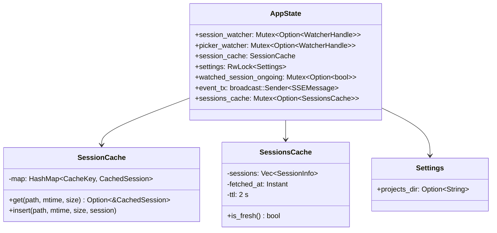
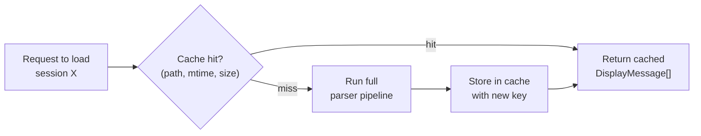
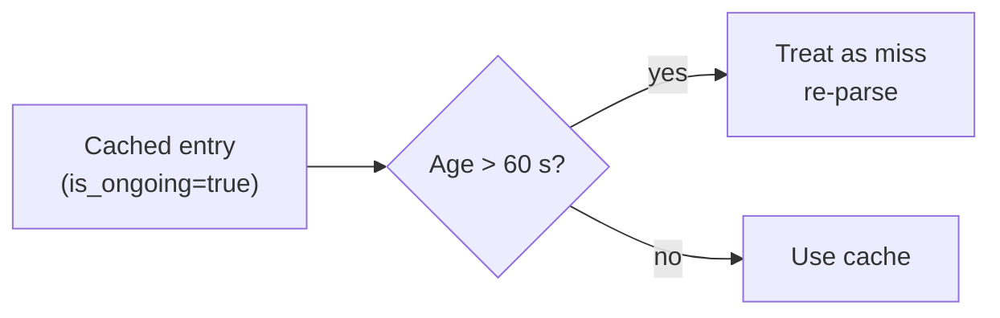
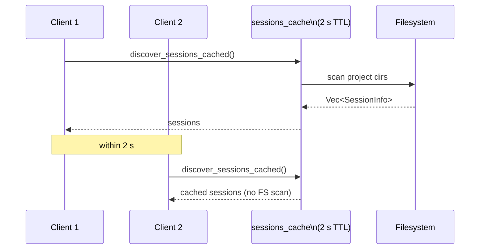
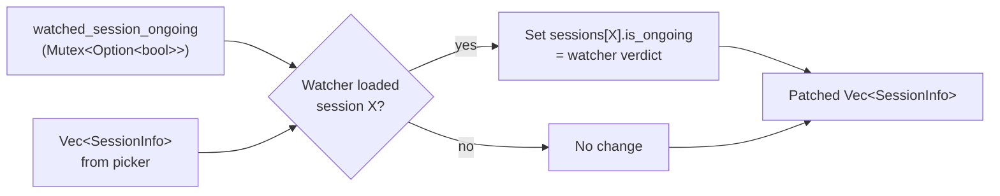
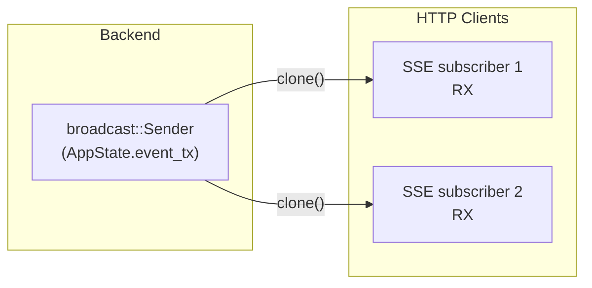
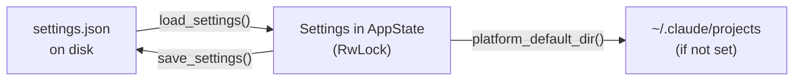

# Spec: State Management

**Locations**: `src-tauri/src/state.rs`, `src-tauri/src/parser/cache.rs`, `src-tauri/src/settings.rs`

`AppState` is the central in-memory store for the Rust backend. It is shared across all Tauri
commands and HTTP handlers via `Arc<AppState>`, protected by per-field `Mutex`es.

---

## AppState Structure



---

## Session Cache (`cache.rs`)

The session cache avoids re-parsing unchanged files. It uses a composite key:

```
CacheKey = (file_path, modification_time, file_size)
```



### Ongoing Session Freshness

For sessions marked `is_ongoing = true`, the cached result is considered **stale after 60 seconds**
even if the file appears unchanged (the parser may have new subagent data).



---

## Sessions List Cache (Picker Cache)

A second short-lived cache coalesces concurrent picker requests:



This prevents thundering-herd filesystem scans when the picker-refresh signal causes multiple
clients to call `/api/sessions` simultaneously.

---

## Watched Session Ongoing Override

The picker's `is_ongoing` for a session is derived from a lightweight heuristic (last-modified
time). The session watcher, however, has the authoritative result from a full parse.

`apply_watched_ongoing()` patches the picker's list with the watcher's verdict:



---

## SSE Broadcast Channel

All HTTP clients subscribe to a `broadcast::Sender<SSEMessage>` stored in `AppState`.



`AppState::broadcast()` sends to the channel. Lagged receivers (slow clients) are simply dropped
— they re-connect via `EventSource` and receive the next event.

---

## Settings (`settings.rs`)

User settings live in `~/.config/claude-code-trace/settings.json`.



### Platform Defaults

| Platform | Default `projects_dir` |
| -------- | ---------------------- |
| All      | `~/.claude/projects`   |

The configured value takes precedence; if not set, the platform default is used in all lookups.

---

## Concurrency Invariants

| Resource                  | Protection                            | Notes                                                   |
| ------------------------- | ------------------------------------- | ------------------------------------------------------- |
| `session_watcher`         | `Mutex`                               | Replaced atomically; old handle dropped → stops watcher |
| `picker_watcher`          | `Mutex`                               | Same pattern                                            |
| `session_cache`           | Internal `Mutex` (via `SessionCache`) | Fine-grained per-entry                                  |
| `settings`                | `RwLock`                              | Many readers, rare writes                               |
| `sessions_cache`          | `Mutex`                               | Short critical section; TTL check + replace             |
| `watched_session_ongoing` | `Mutex`                               | Written by watcher task, read by picker command         |

---

## Related Specs

- [02-file-watcher.md](02-file-watcher.md) — writes `watched_session_ongoing`
- [04-http-api.md](04-http-api.md) — reads `AppState` for all HTTP handlers
- [08-session-lifecycle.md](08-session-lifecycle.md) — full state transition sequence
