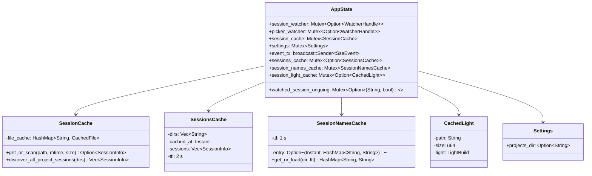
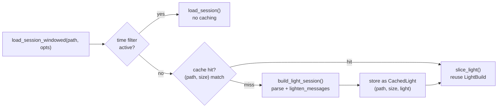
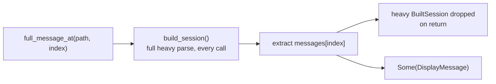
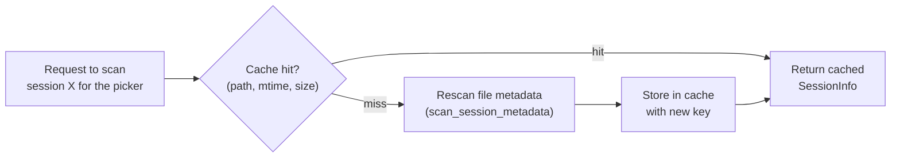
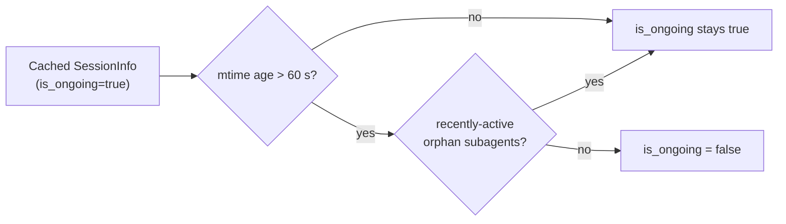
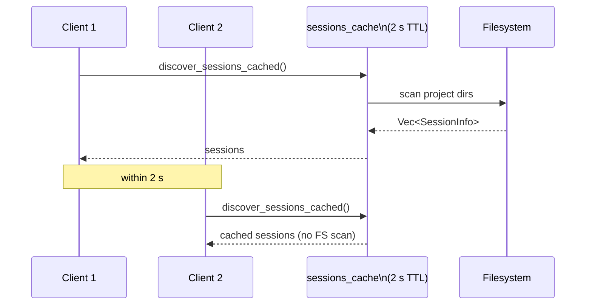
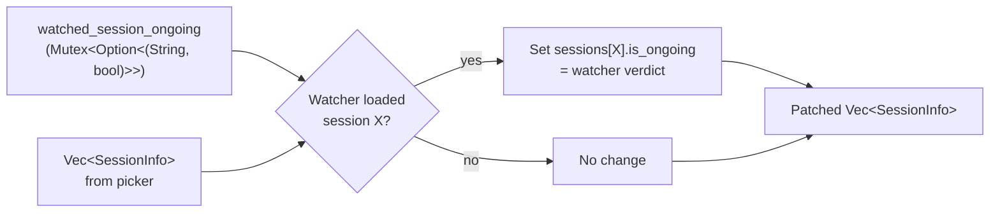
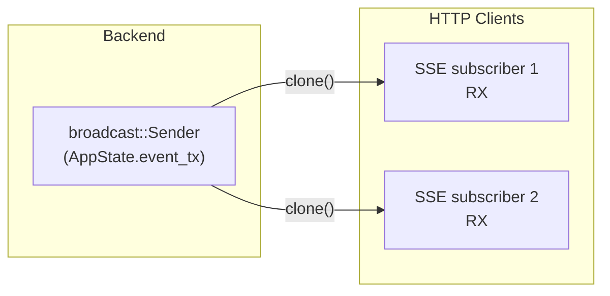
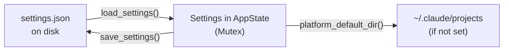

# Spec: State Management

**Locations**: `src-tauri/src/state.rs`, `src-tauri/src/session_load.rs`, `src-tauri/src/parser/cache.rs`, `src-tauri/src/settings.rs`

`AppState` is the central in-memory store for the Rust backend. It is shared across all Tauri
commands and HTTP handlers via `Arc<AppState>`, protected by per-field `Mutex`es.

---

## AppState Structure



`session_cache`, `sessions_cache`, and `session_names_cache` all support the **session picker** —
they cache lightweight `SessionInfo` metadata (and the separate name registry), never parsed
message bodies. `session_light_cache` is unrelated: it supports the **active session's list
view** and holds a lightened message build. See below for how list-view caching and detail-view
loading differ.

---

## Two Caching Behaviors for a Loaded Session

Once a session is open, two different code paths read it, and they deliberately do not share a
cache:

| Path                              | Serves                                   | Caches?                                 | Keyed by       | Holds                                                  |
| --------------------------------- | ---------------------------------------- | --------------------------------------- | -------------- | ------------------------------------------------------ |
| `AppState::load_session_windowed` | List view (windowed/virtualized fetches) | Yes — one slot in `session_light_cache` | `(path, size)` | `LightBuild`: messages with heavy tool bodies stripped |
| `AppState::full_message_at`       | Detail view (single message)             | Never                                   | n/a            | nothing persisted — full build dropped on return       |

### List view: `session_light_cache` (`state.rs`)

`load_session_windowed` backs the virtualized list. On a cache miss (different `path` or a
changed `size`; no `mtime` in the key) it calls `session_load::build_light_session`, which runs
the full parse pipeline and then `lighten_messages` to strip heavy per-item fields (`tool_input`,
`tool_result`, `tool_result_json`, `last_output`) recursively, including nested subagent
transcripts. The result (`LightBuild`) is stored in the single `session_light_cache` slot and
reused by every subsequent scroll-driven range fetch for that session, sliced by
`session_load::slice_light`. Time-filtered loads bypass this cache entirely (rare, used by the
by-id range endpoint) and call `session_load::load_session` directly.



Because the cache holds only one slot, switching sessions (a different `path`) or a
grown/truncated file (`size` changed) simply rebuilds it — memory stays bounded to the active
session's lightened build. `clear_session_build_cache()` drops the slot explicitly, e.g. when
leaving a session for the picker.

### Detail view: always fresh, never cached (`state.rs`)

`full_message_at` serves a single message's full detail (including heavy tool bodies). It calls
`session_load::build_session` fresh on every single call, extracts the one requested message by
index, and returns it — the full `BuiltSession` (containing every message's heavy tool
input/output) is dropped as soon as the function returns. It never reads from or writes to
`session_light_cache`.

This is a deliberate memory-vs-latency tradeoff: a tool-output-heavy session can be hundreds of
MB. Caching the full heavy build for as long as the session stays open would mean holding that
much memory in the Rust process the entire time. Re-parsing on every detail click instead costs
roughly the same latency as the session's first list load, but never persists heavy tool bodies
between clicks — memory is freed the instant the click is served.



---

## Session Metadata Cache (`parser/cache.rs`)

`SessionCache` is a distinct, older mechanism that has nothing to do with message bodies or the
light cache above — it caches lightweight `SessionInfo` metadata (title, timestamps, token
totals, ongoing flag) so the **picker** doesn't rescan every session file's content on every
refresh. It backs `AppState::discover_sessions_cached` via `session_cache: Mutex<SessionCache>`,
which is separate from `session_light_cache`. It uses a composite key:

```
CacheKey = (file_path, modification_time, file_size)
```



### Ongoing Session Freshness

Even on a cache hit, `SessionInfo.is_ongoing` is re-checked at read time rather than trusted
as-is: a session's `is_ongoing` flag is considered **stale after 60 seconds** of no file
modification (`apply_staleness`, `parser/ongoing.rs`), and if not ongoing by that check, a
follow-up check looks for recently-active orphan subagent files (which can update without
touching the parent session file). This means a `SessionInfo` can be served from cache while its
`is_ongoing` value is still recomputed fresh every read.



---

## Sessions List Cache (Picker Cache)

A second short-lived cache coalesces concurrent picker requests:



This prevents thundering-herd filesystem scans when the picker-refresh signal causes multiple
clients to call `/api/sessions` simultaneously. Once the underlying scan resolves (cached or
fresh), `discover_sessions_cached` joins the live `/rename` session-name registry on every call,
via the short-TTL `session_names_cache` (1 s) — a rename never touches the JSONL file, so the
transcript-file cache above cannot see it, and the name registry is joined after the fact.

---

## Watched Session Ongoing Override

The picker's `is_ongoing` for a session is derived from a lightweight heuristic (last-modified
time). The session watcher, however, has the authoritative result from a full parse.

`apply_watched_ongoing()` patches the picker's list with the watcher's verdict:



---

## SSE Broadcast Channel

All HTTP clients subscribe to a `broadcast::Sender<SseEvent>` stored in `AppState`.



`AppState::broadcast()` sends to the channel. Lagged receivers (slow clients) are simply dropped
— they re-connect via `EventSource` and receive the next event.

---

## Settings (`settings.rs`)

User settings live in `~/.config/claude-code-trace/settings.json`.



### Platform Defaults

| Platform | Default `projects_dir` |
| -------- | ---------------------- |
| All      | `~/.claude/projects`   |

The configured value takes precedence; if not set, the platform default is used in all lookups.

---

## Concurrency Invariants

| Resource                  | Protection | Notes                                                                |
| ------------------------- | ---------- | -------------------------------------------------------------------- |
| `session_watcher`         | `Mutex`    | Replaced atomically; old handle dropped → stops watcher              |
| `picker_watcher`          | `Mutex`    | Same pattern                                                         |
| `session_cache`           | `Mutex`    | Guards the metadata `HashMap`; fine-grained per-entry lookups inside |
| `settings`                | `Mutex`    | Read on most requests, written rarely                                |
| `sessions_cache`          | `Mutex`    | Short critical section; TTL check + replace                          |
| `session_names_cache`     | `Mutex`    | Short critical section; 1 s TTL check + replace                      |
| `session_light_cache`     | `Mutex`    | One slot; replaced on `(path, size)` change or explicit clear        |
| `watched_session_ongoing` | `Mutex`    | Written by watcher task, read by picker command                      |

---

## Related Specs

- [02-file-watcher.md](02-file-watcher.md) — writes `watched_session_ongoing`
- [04-http-api.md](04-http-api.md) — reads `AppState` for all HTTP handlers
- [08-session-lifecycle.md](08-session-lifecycle.md) — full state transition sequence
  </content>
