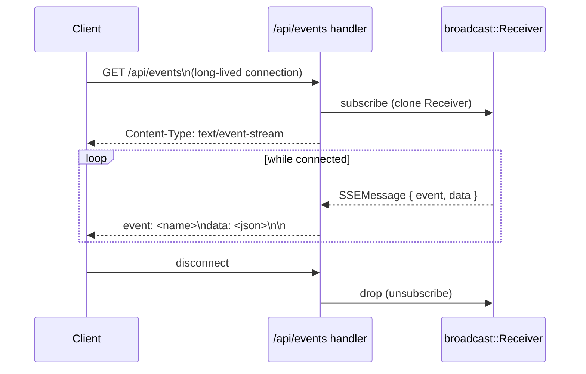
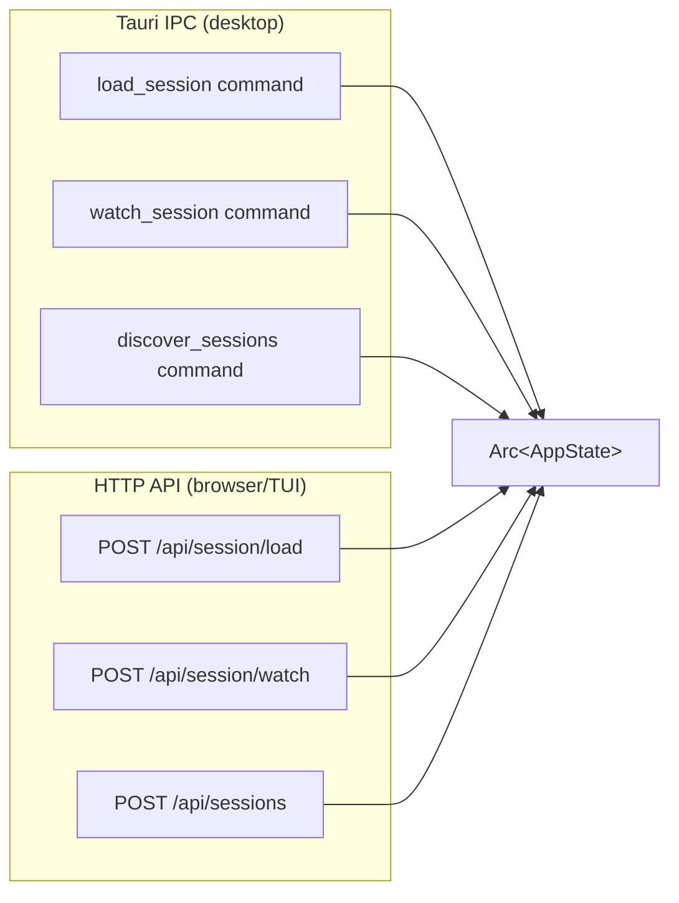

# Spec: HTTP API & SSE

**Location**: `src-tauri/src/http_api.rs`

The Rust backend exposes a full HTTP API so that browsers and the TUI can access the same
functionality as the Tauri desktop frontend. The server runs on port **11423** by default
(configurable via `CCTRACE_HTTP_PORT`).

---

## Architecture

```mermaid
graph TB
    subgraph Rust["Rust Backend (Axum)"]
        ROUTER["Axum Router\n/api/*"]
        MW["Middleware\nCORS (any origin)\nJSON responses"]
        STATE["Arc&lt;AppState&gt;"]
    end

    subgraph Endpoints["REST Endpoints"]
        GET_SETTINGS["GET /api/settings"]
        GET_DIRS["GET /api/project-dirs"]
        POST_SESSIONS["POST /api/sessions"]
        POST_LOAD["POST /api/session/load"]
        GET_META["GET /api/session/meta"]
        POST_WATCH["POST /api/session/watch"]
        POST_UNWATCH["POST /api/session/unwatch"]
        POST_PICKER_WATCH["POST /api/picker/watch"]
        POST_PICKER_UNWATCH["POST /api/picker/unwatch"]
        GET_GIT["GET /api/git-info"]
        GET_DEBUG["GET /api/debug-log"]
        GET_SETTINGS_W["POST /api/settings/set"]
        GET_SSE["GET /api/events\n(SSE stream)"]
        STATIC["GET /*\n(optional static assets)"]
    end

    ROUTER --> MW --> STATE
    ROUTER --> GET_SETTINGS
    ROUTER --> GET_DIRS
    ROUTER --> POST_SESSIONS
    ROUTER --> POST_LOAD
    ROUTER --> GET_META
    ROUTER --> POST_WATCH
    ROUTER --> POST_UNWATCH
    ROUTER --> POST_PICKER_WATCH
    ROUTER --> POST_PICKER_UNWATCH
    ROUTER --> GET_GIT
    ROUTER --> GET_DEBUG
    ROUTER --> GET_SETTINGS_W
    ROUTER --> GET_SSE
    ROUTER --> STATIC
```



---

## Endpoint Reference

### `GET /api/settings`

Returns current settings and the platform default projects directory.

**Response**

```json
{
  "projects_dir": "/Users/you/.claude/projects",
  "default_dir": "/Users/you/.claude/projects"
}
```

---

### `GET /api/project-dirs`

Returns all project directories found under `projects_dir`.

**Response**

```json
{ "dirs": ["/Users/you/.claude/projects/my-app"] }
```

---

### `POST /api/sessions`

Discovers sessions across provided project directories.

**Request**

```json
{ "dirs": ["/Users/you/.claude/projects/my-app"] }
```

**Response**

```json
{
  "sessions": [
    {
      "path": "...",
      "session_id": "abc123",
      "first_message": "Write a function...",
      "mod_time": "2025-05-01T10:00:00Z",
      "total_tokens": 12345,
      "cost_usd": 0.05,
      "model": "claude-opus-4-6",
      "turn_count": 12,
      "git_branch": "main",
      "is_ongoing": false
    }
  ]
}
```

Results are cached for 2 seconds (see [03-state-management.md](03-state-management.md)).

---

### `POST /api/session/load`

Fully parses a session JSONL file and returns display-ready messages.

**Request**

```json
{ "path": "/path/to/session.jsonl" }
```

**Response**

```json
{
  "messages": [
    /* DisplayMessage[] */
  ],
  "teams": [
    /* TeamSnapshot[] */
  ],
  "ongoing": true,
  "meta": { "cwd": "...", "git_branch": "main", "permission_mode": "default" },
  "session_totals": { "total_tokens": 5000, "cost_usd": 0.02, "model": "..." }
}
```

---

### `POST /api/session/watch` / `POST /api/session/unwatch`

Starts or stops the session watcher. The watcher pushes `session-update` events over SSE.

**Watch request**: `{ "path": "..." }`
**Both responses**: `{ "ok": true }`

---

### `POST /api/picker/watch` / `POST /api/picker/unwatch`

Starts or stops the picker watcher. Pushes `picker-refresh` events over SSE.

**Watch request**: `{ "dirs": ["..."] }`
**Both responses**: `{ "ok": true }`

---

### `GET /api/git-info`

Returns git metadata for a working directory.

**Query params**: `?cwd=/path/to/dir`

**Response**

```json
{
  "branch": "main",
  "dirty": false,
  "worktree_dirs": ["/path/to/worktree"]
}
```

---

### `GET /api/debug-log`

Returns incremental debug log entries.

**Query params**: `?session_path=...&since=<timestamp>&level=warn`

**Response**

```json
{
  "entries": [{ "timestamp": "...", "level": "Warn", "category": "hook", "message": "..." }]
}
```

---

### `POST /api/settings/set`

Updates the projects directory setting.

**Request**: `{ "projects_dir": "/custom/path" }`
**Response**: `{ "ok": true }`

---

### `GET /api/events` — SSE Stream

The SSE endpoint streams real-time events to connected clients.



#### Event Types

| Event name       | Payload                | Trigger                                  |
| ---------------- | ---------------------- | ---------------------------------------- |
| `session-update` | `SessionUpdatePayload` | Session JSONL changed                    |
| `picker-refresh` | `{}` (empty)           | Any `.jsonl` file in project dir changed |

#### `session-update` Payload

```json
{
  "messages": [ /* DisplayMessage[] */ ],
  "teams": [ /* TeamSnapshot[] */ ],
  "ongoing": true,
  "permission_mode": "default",
  "session_totals": { "total_tokens": ..., "cost_usd": ..., "model": "..." }
}
```

---

## Configuration

| Env var              | Default                  | Description                               |
| -------------------- | ------------------------ | ----------------------------------------- |
| `CCTRACE_HTTP_HOST`  | `127.0.0.1`              | Bind address                              |
| `CCTRACE_HTTP_PORT`  | `11423` (Docker: `1421`) | Listen port                               |
| `CCTRACE_STATIC_DIR` | (unset)                  | Directory to serve as static files at `/` |

The default port for native binaries is `11423` (defined in `http_api.rs:38` as
`DEFAULT_HTTP_PORT`). The Docker image overrides this to `1421` via `CCTRACE_HTTP_PORT=1421` so
that the API and the bundled static frontend are served from a single, well-known port — this is
what the README and `docker-compose.yml` reference.

When `CCTRACE_STATIC_DIR` is set, the frontend build output is served directly, enabling the pure
headless / Docker deployment mode.

---

## Tauri IPC Mirror

Every HTTP endpoint has an exact Tauri command counterpart in `src-tauri/src/commands/`.
The commands share the same `AppState` and call the same parser functions.



---

## CORS Policy

The HTTP server accepts requests from any origin (`Access-Control-Allow-Origin: *`) to support
local browser-based development without proxy setup.

---

## Related Specs

- [03-state-management.md](03-state-management.md) — AppState used by every handler
- [05-frontend-web.md](05-frontend-web.md) — browser client using this API
- [06-tui.md](06-tui.md) — TUI client using this API
- [08-session-lifecycle.md](08-session-lifecycle.md) — SSE flow end-to-end
