# Spec: Web Frontend

**Locations**: `src/`, `shared/`

The web frontend is a React 18 app built with Vite. It runs inside the Tauri WebView for the
desktop mode, or as a standalone browser page served by the Rust HTTP backend.

All data comes from either Tauri IPC (`invoke`) or HTTP REST+SSE (`fetch`/`EventSource`),
selected at runtime by `src/lib/isTauri.ts`.

---

## Component Hierarchy

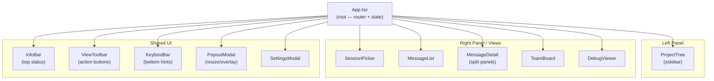

---

## View State Machine

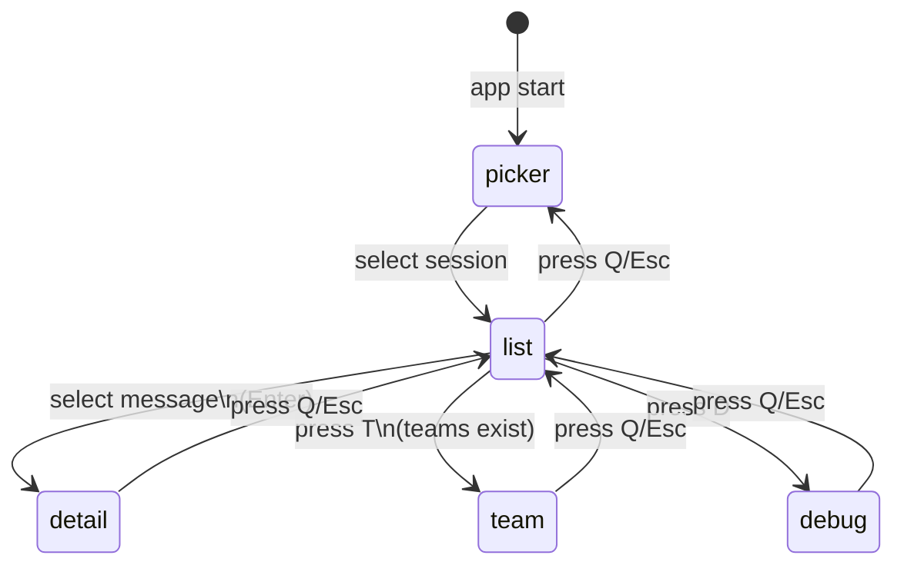

---

## Hook Architecture

### `useSession` — Session State

Manages the full lifecycle of a loaded session: loading, live updates, teams, metadata.

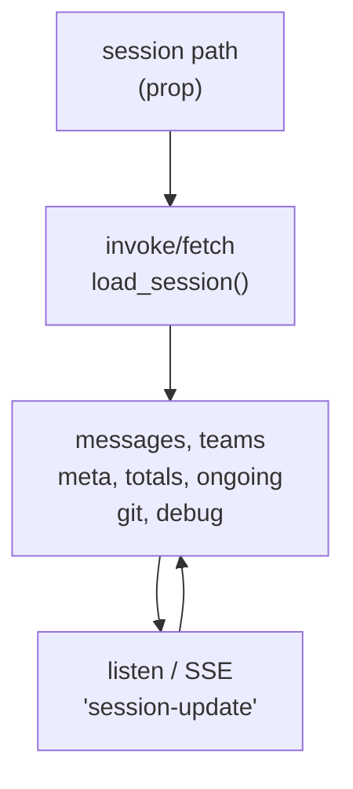

Key responsibilities:

- Initial load via `invoke("load_session", ...)` (Tauri) or `POST /api/session/load`
- Subscribe to `session-update` events and merge diffs
- Start/stop session watcher (`watch_session` / `unwatch_session`)
- Fetch git info and debug log on demand

---

### `usePicker` — Session Discovery

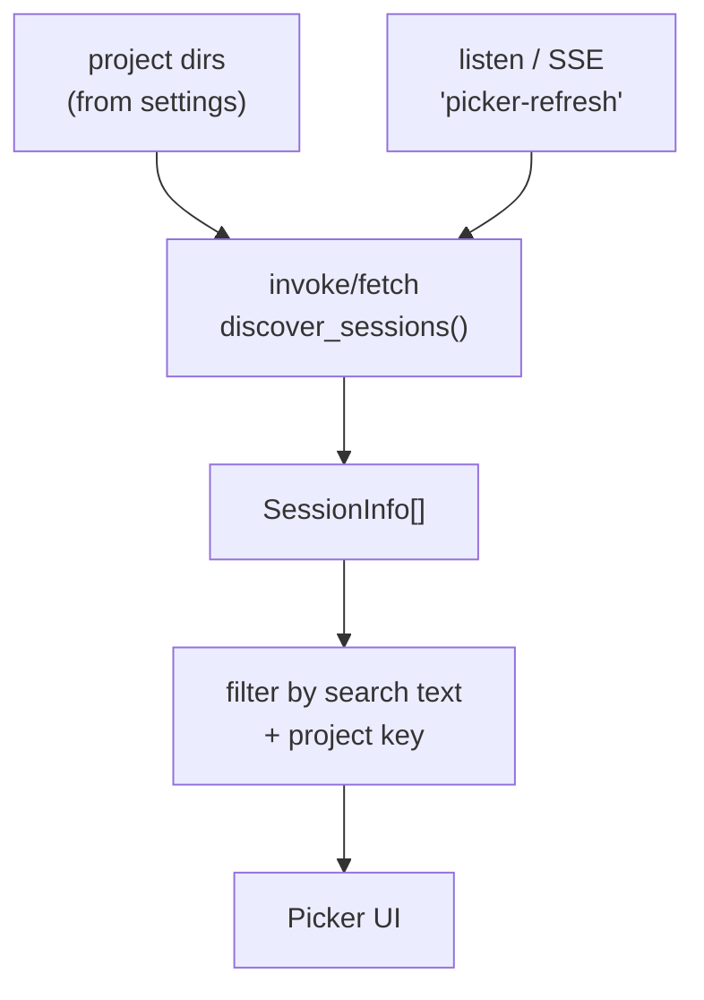

---

### `useKeyboard` — Global Keyboard Handler

Routes key events to the active view. Ignores events targeting `INPUT`, `TEXTAREA`, and
`contentEditable` elements.

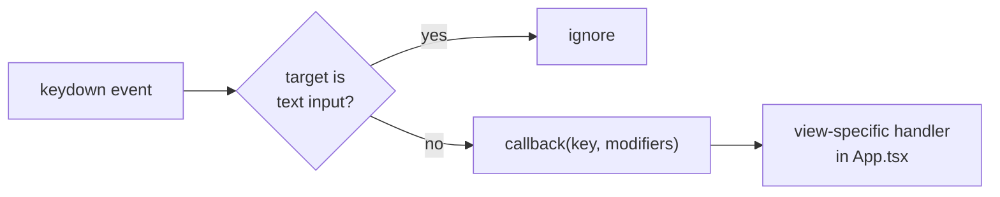

---

### `useAutoScroll` — Smart Auto-Scroll

Auto-scrolls the message list when new messages arrive, but only if the user is near the bottom.

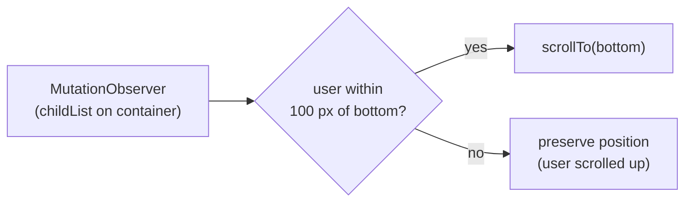

---

### `useScrollToSelected` — Selection Scroll

Scrolls the selected item into view when the selection changes.

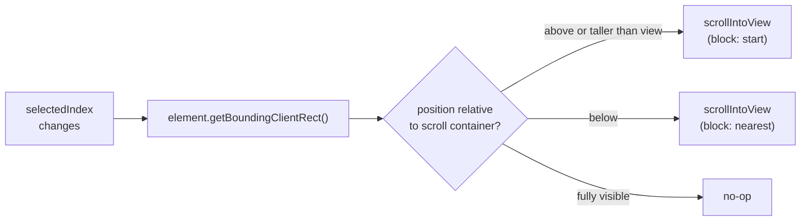

---

### `useViewActions` — Expand/Collapse Delegation

Decouples the toolbar's "Expand All / Collapse All" buttons from the active view component.

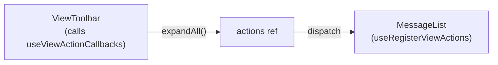

The toolbar holds a stable ref. The active view registers its handlers. When the toolbar fires,
the view's handler executes without a re-render cycle.

---

### `useTauriEvent` — Event Subscription

Generic hook that subscribes to a named Tauri event and calls a handler on each emission.
Handles unlisten cleanup on unmount and AbortController for in-flight async operations.

---

### `useToggleSet` — Expand State

A `Set<number>` backed by React state. Supports:

- `toggle(i)` — flip single index
- `setAll(items)` — expand all
- `clear()` — collapse all

Shared between web and TUI (lives in `shared/hooks/useToggleSet.ts`).

---

## Key Components

### `MessageDetail` — Multi-Panel Detail View

The most complex component. Shows items from a selected message and supports recursive subagent
drill-down.

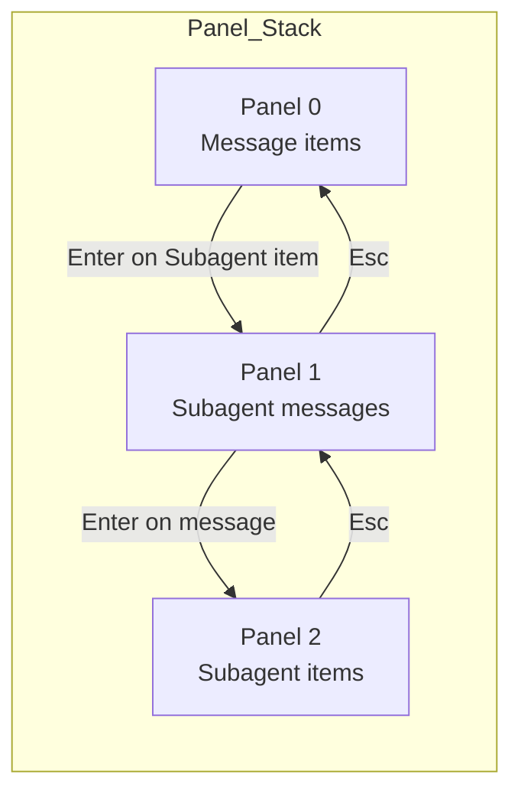

Layout: horizontally resizable two-column split.

- Left column: item list (tools, thinking, outputs)
- Right column: selected item detail (JSON viewer, markdown, etc.)

Keyboard navigation:

- `j/k` — move between items (within focused panel)
- `h/l` — switch left/right panel focus
- `Enter` — drill into subagent
- `Esc/q` — pop panel
- `Tab` — expand/collapse selected item
- `e/c` — expand/collapse all items

---

### `ProjectTree` — Hierarchical Session Browser

Groups sessions by project key, nesting worktree sessions under their parent.

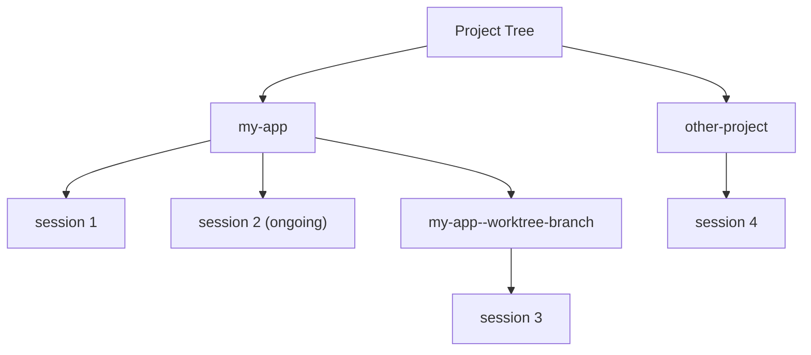

Project key derivation is in `shared/projectTree.ts`:

- Split path by `--` to get hierarchy segments
- Each segment becomes a tree node
- Worktrees become children of the base project

---

### `SessionPicker` — Session List with Search

Displays all sessions grouped by date with token/cost stats.
Supports text search and project filtering (via `ProjectTree` selection).

---

### `InfoBar` — Session Metadata

Top bar showing: project · session_id (8 chars) · git branch · permission mode ·
context % · tokens · cost · ongoing spinner.

Context % uses a colour gradient:

- `< 50%` → green
- `50–80%` → orange
- `> 80%` → red

---

### `DetailItem` — Item Renderer

Renders a single `DisplayItem` with expandable body:

| Item type         | Collapsed preview | Expanded body                 |
| ----------------- | ----------------- | ----------------------------- |
| `Thinking`        | token count       | full thinking text            |
| `Output`          | first line        | full text / markdown          |
| `ToolCall`        | tool_summary      | tool_input JSON + tool_result |
| `Subagent`        | agent type + desc | subagent messages (recursive) |
| `TeammateMessage` | first line        | full text                     |
| `HookEvent`       | hook_name         | key-value pairs + metadata    |

---

## Tauri / HTTP Abstraction

`src/lib/invoke.ts` and `src/lib/listen.ts` provide a unified API that switches
between Tauri IPC and HTTP fetch/EventSource at runtime.

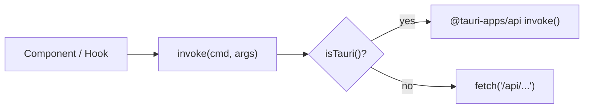

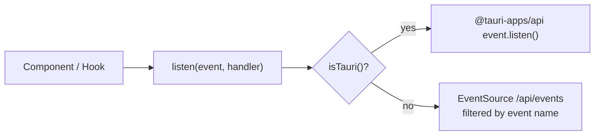

---

## Frontend Data Types

All types are defined in `shared/types.ts` and shared with the TUI.
See [07-data-types.md](07-data-types.md) for full type definitions.

---

## Build Configuration

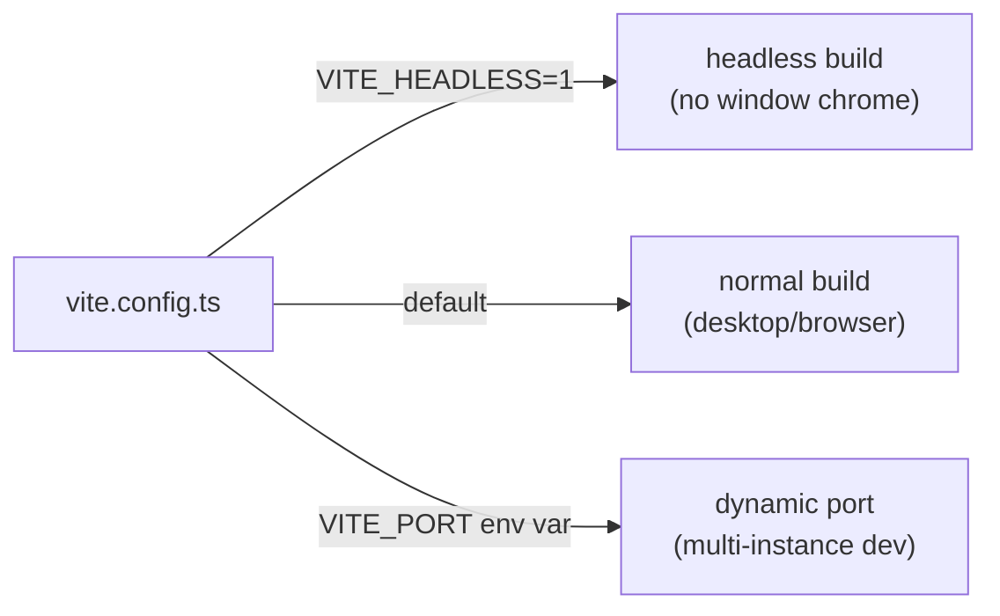

Static assets are served from `dist/` when `CCTRACE_STATIC_DIR` is set in the Rust backend.

---

## Related Specs

- [04-http-api.md](04-http-api.md) — API consumed by this frontend
- [07-data-types.md](07-data-types.md) — shared type system
- [08-session-lifecycle.md](08-session-lifecycle.md) — loading + live update flow
- [13-item-rendering.md](13-item-rendering.md) — per-item rendering details (icons, bodies, expansion)
