# Spec: Terminal UI (TUI)

**Location**: `tui/`

The TUI is a React/Ink application that provides a full-featured session browser in the terminal.
It communicates with the same Rust HTTP backend as the browser frontend over `localhost:11423`.

---

## Architecture

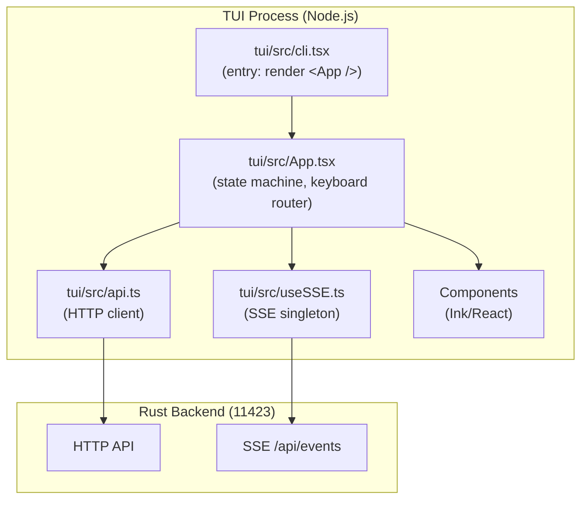

---

## Startup Flow

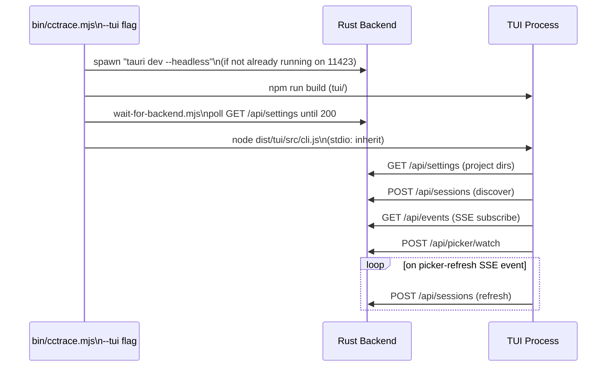

---

## View State Machine

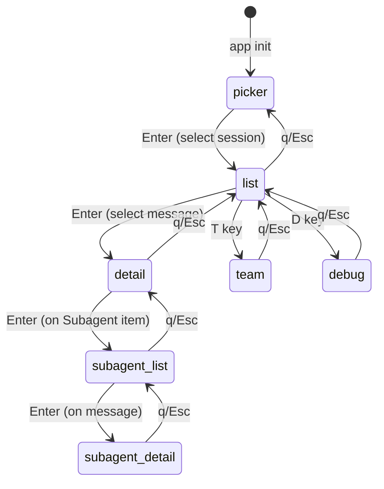

State variables managing nested navigation:

```
view: "picker" | "list" | "detail" | "team" | "debug"
subagentItem: DisplayItem | null    (item that was drilled into)
subagentDetailMsg: DisplayMessage | null  (message inside subagent drill)
```

---

## Layout

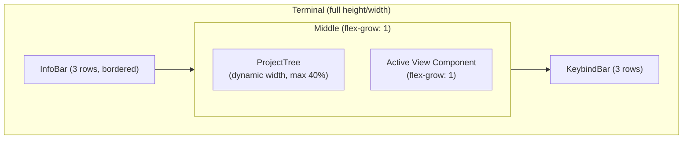

---

## Keyboard Routing

All keyboard input is handled by a **single `useInput` listener** in `App.tsx`.
The handler is stored in a `useRef` so that Ink's `useInput` never re-subscribes on re-renders.

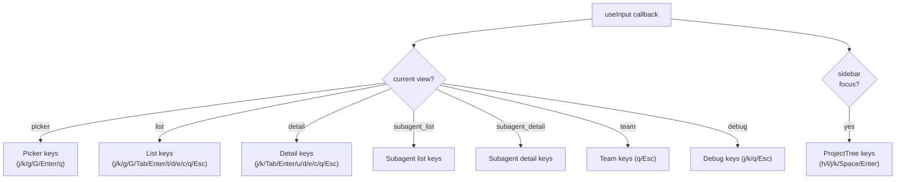

---

## Component Inventory

### `SessionPicker`

Groups sessions by date bucket (Today / Yesterday / This Week / This Month / Older).

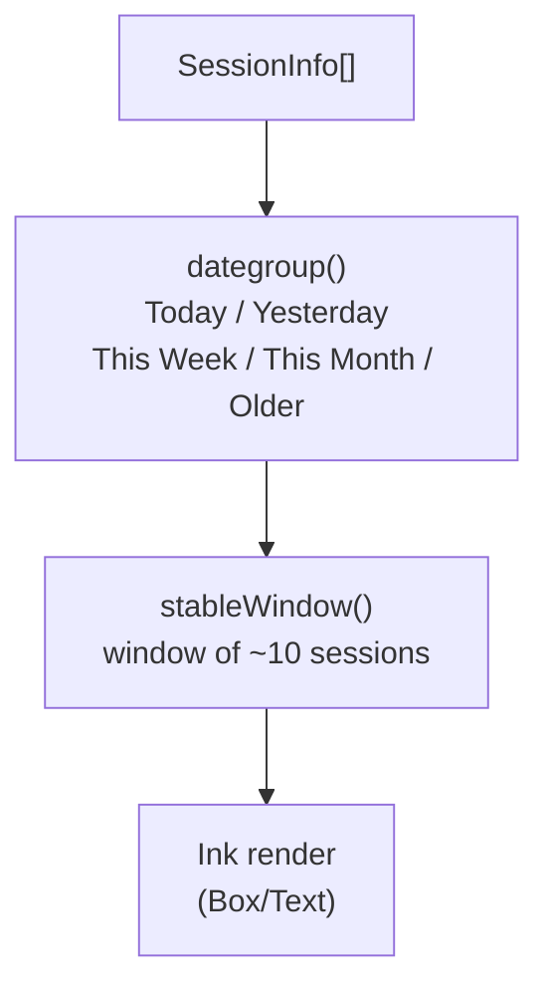

Per-session card layout:

```
▸ [model] branch · tokens · cost                   2025-05-01 10:00
  First message line...
  ─────────────────────────────────────
```

---

### `MessageList`

Lists messages from a loaded session with windowed rendering.

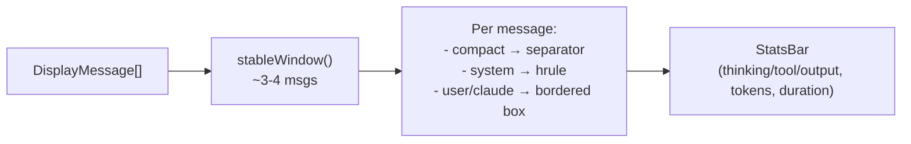

---

### `DetailView`

Renders items from a selected message with expandable bodies and scroll.

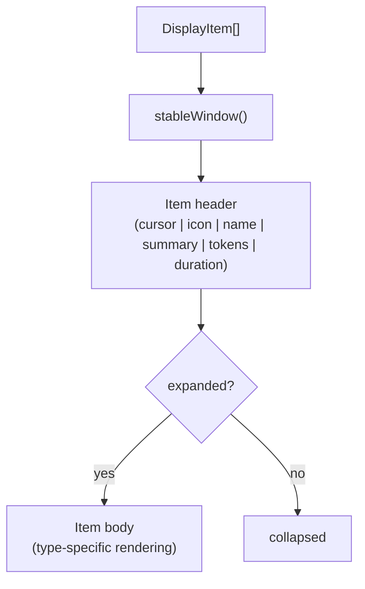

Item body rendering by type:

| `item_type`       | Body content                        |
| ----------------- | ----------------------------------- |
| `Thinking`        | scrollable text block               |
| `Output`          | pretty-printed JSON or markdown     |
| `ToolCall`        | input JSON + hrule + result/error   |
| `Subagent`        | agent ID, desc, prompt, last result |
| `TeammateMessage` | plain text                          |
| `HookEvent`       | hook name, cmd, metadata key-values |

---

### `ProjectTree` (TUI)

Sidebar showing project hierarchy with expand/collapse.

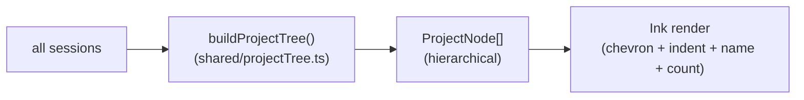

Keyboard navigation:

- `h` / `l` — move keyboard focus between sidebar and main panel
- `j` / `k` — navigate tree nodes
- `Space` — expand/collapse a group node
- `Enter` — select a project (filter sessions)

---

### `InfoBar` (TUI)

```
┌─────────────────────────────────────────────────────────┐
│ my-app · abc12345 · * main · default │ 45.2% · 8.3k · $0.03 ● │
└─────────────────────────────────────────────────────────┘
```

Context colour:

- `< 50%` → accent blue
- `50–80%` → orange
- `> 80%` → red

---

## SSE Integration (`useSSE.ts`)

Singleton `EventSource` with reference counting, shared across all components.

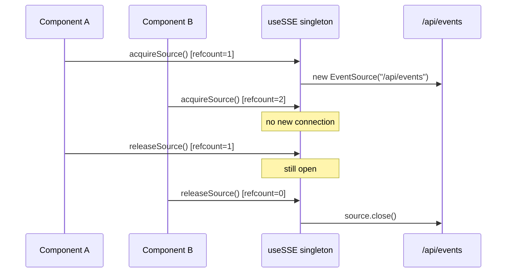

`useSSE<T>(event, handler)` subscribes to a named event and calls `handler(data: T)` on receipt.

### Picker Auto-Refresh

The TUI subscribes to the `"picker-refresh"` event (the backend's actual event name) and
re-fetches the session list via `api.discoverSessions(dirs)` on each signal. The dirs are
remembered in a `projectDirsRef` populated when the initial discovery succeeds — this mirrors
the web frontend pattern in `src/hooks/usePicker.ts`.

> Historical note: an earlier version subscribed to `"picker-update"` and tried to destructure
> `payload.sessions`. Because the backend has always emitted `"picker-refresh"` with an empty
> payload (`watcher.rs:340`), picker auto-refresh in the TUI was a no-op. Fixed in this branch.

---

## Windowing (`lib/window.ts`)

Prevents "shaking" lists when content changes.

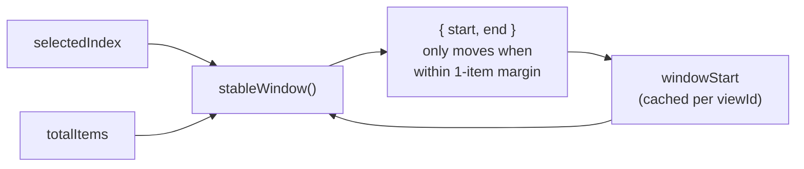

The window is only scrolled when selection reaches within 1 item of the current edge —
not on every selection change. This eliminates the "vertical shaking" caused by re-centering.

---

## Theme (`lib/theme.ts`)

256-color palette (hex values mapping to ANSI terminal colors):

| Role            | Color     |
| --------------- | --------- |
| Primary text    | `#d0d0d0` |
| Secondary text  | `#8a8a8a` |
| Accent (Claude) | `#5fafff` |
| Model: Opus     | `#ff5f87` |
| Model: Sonnet   | `#5fafff` |
| Model: Haiku    | `#87d787` |
| Ongoing         | `#5faf00` |
| Token high      | `#ff8700` |
| Error           | `#ff0000` |
| Thinking        | `#767676` |
| Tool            | `#5fafff` |
| Agent           | `#5fafaf` |
| Hook            | `#ffdf00` |

---

## Build & Distribution

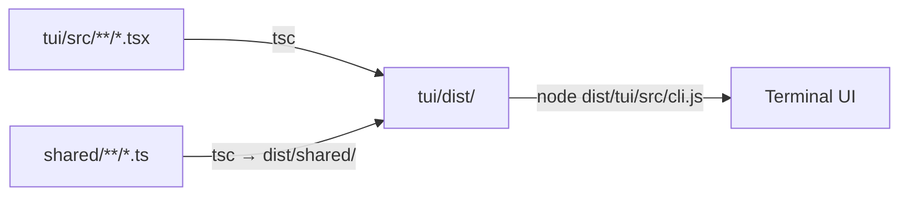

The TUI imports shared modules via relative paths (`../../shared/...`) that survive compilation
into `dist/` because the shared output is placed at `dist/shared/`.

---

## Related Specs

- [04-http-api.md](04-http-api.md) — API consumed by TUI
- [05-frontend-web.md](05-frontend-web.md) — web frontend sharing same types
- [07-data-types.md](07-data-types.md) — shared type system
- [13-item-rendering.md](13-item-rendering.md) — per-type item rendering (icons, bodies, selection accent)
