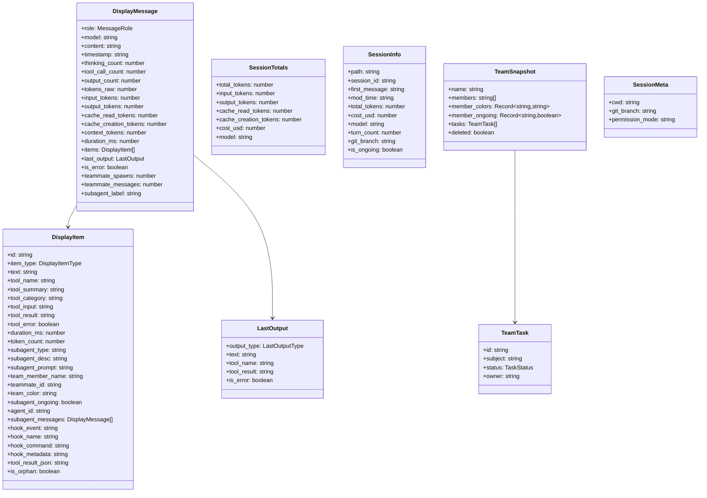
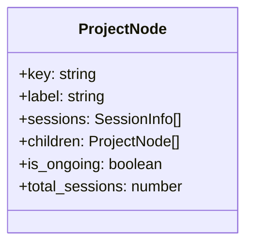
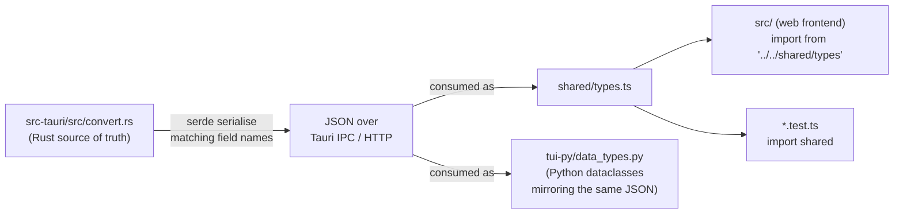

# Spec: Shared Data Types

**Location**: `shared/types.ts` (TypeScript), `src-tauri/src/convert.rs` (Rust source)

All display types are defined once in `shared/types.ts` and shared between the web frontend,
TUI, and tests. The Rust backend serialises these types via `serde` with matching field names.

---

## Type Hierarchy



---

## Enumerations

### `MessageRole`

```typescript
type MessageRole = "user" | "claude" | "system" | "compact" | "recap";
```

| Value     | Description                   |
| --------- | ----------------------------- |
| `user`    | Human turn                    |
| `claude`  | Claude's AI response          |
| `system`  | System/hook/error output      |
| `compact` | Compaction boundary separator |
| `recap`   | Session-away recap summary    |

---

### `DisplayItemType`

```typescript
type DisplayItemType =
  | "Thinking"
  | "Output"
  | "ToolCall"
  | "Subagent"
  | "TeammateMessage"
  | "HookEvent";
```

| Value             | Description                       |
| ----------------- | --------------------------------- |
| `Thinking`        | Claude's internal reasoning block |
| `Output`          | Text output from Claude           |
| `ToolCall`        | Tool invocation + result          |
| `Subagent`        | Spawned sub-agent call            |
| `TeammateMessage` | Message from a team member        |
| `HookEvent`       | Claude Code hook execution        |

---

### `LastOutputType`

```typescript
type LastOutputType = "Text" | "ToolResult" | "ToolCalls";
```

---

### `TaskStatus`

```typescript
type TaskStatus = "pending" | "in_progress" | "completed" | "cancelled";
```

---

## `DisplayMessage` Field Notes

| Field               | Notes                                                                             |
| ------------------- | --------------------------------------------------------------------------------- |
| `content`           | Sanitised text content for preview                                                |
| `subagent_label`    | Human-readable label for a subagent session (e.g., "claude-sonnet-4-6 · 3 turns") |
| `teammate_spawns`   | Number of team member agents spawned in this message                              |
| `teammate_messages` | Total messages from team members in this message's items                          |
| `context_tokens`    | Running total of input tokens (context window usage)                              |
| `tokens_raw`        | Un-deduplicated raw token count (for debugging)                                   |

---

## `DisplayItem` Field Notes

| Field               | Notes                                                                      |
| ------------------- | -------------------------------------------------------------------------- |
| `id`                | Unique within session — `tool_id` for tool calls, synthetic UUID otherwise |
| `tool_input`        | JSON-serialised (string)                                                   |
| `tool_result`       | Plain string representation                                                |
| `tool_result_json`  | Pretty-printed JSON (set when result is object/array)                      |
| `subagent_messages` | Recursively expanded child messages (empty when not a subagent)            |
| `subagent_ongoing`  | `true` if the spawned agent is still running                               |
| `is_orphan`         | `true` for tool calls from discarded/rewound timelines                     |
| `hook_metadata`     | Pretty-printed JSON of all hook attachment key-value pairs                 |

---

## `SessionInfo` Field Notes

| Field           | Notes                                                                                                                                                                                  |
| --------------- | -------------------------------------------------------------------------------------------------------------------------------------------------------------------------------------- |
| `first_message` | First user turn content (truncated at ~200 chars)                                                                                                                                      |
| `mod_time`      | ISO-8601 timestamp of last file modification                                                                                                                                           |
| `session_id`    | UUID of the root session entry                                                                                                                                                         |
| `git_branch`    | Git branch from the last JSONL entry (per-entry; tracks `/cd` and v2.1.157+ EnterWorktree switches). Pre-v2.1.176 sessions may show a stale branch after `/cd` — cwd is authoritative. |

---

## Project Tree Types (`shared/projectTree.ts`)



`buildProjectTree(sessions)` partitions sessions by project key (derived from the JSONL file path)
and nests worktree sessions under their parent project.

---

## Type Sharing Strategy



The Python TUI does not import from `shared/types.ts`; it has its own
dataclasses in `tui-py/data_types.py` that mirror the same JSON shape. The
field names match the Rust source via the same JSON serialisation.

The Rust structs in `convert.rs` are the canonical definitions. The TypeScript types in
`shared/types.ts` must stay in sync manually — there is no auto-generation step.

---

## Format Helpers (`shared/format.ts`)

Shared formatting utilities used by both web and TUI:

| Function             | Description          |
| -------------------- | -------------------- |
| `formatTokens(n)`    | `12345` → `"12.3k"`  |
| `formatCost(n)`      | `0.0512` → `"$0.05"` |
| `formatDuration(ms)` | `1500` → `"1.5s"`    |
| `timeAgo(date)`      | `"3 hours ago"`      |
| `truncate(s, n)`     | Truncates with `…`   |

---

## Related Specs

- [01-parser-pipeline.md](01-parser-pipeline.md) — Rust source of these types
- [05-frontend-web.md](05-frontend-web.md) — web consumer
- [06-tui.md](06-tui.md) — TUI consumer
