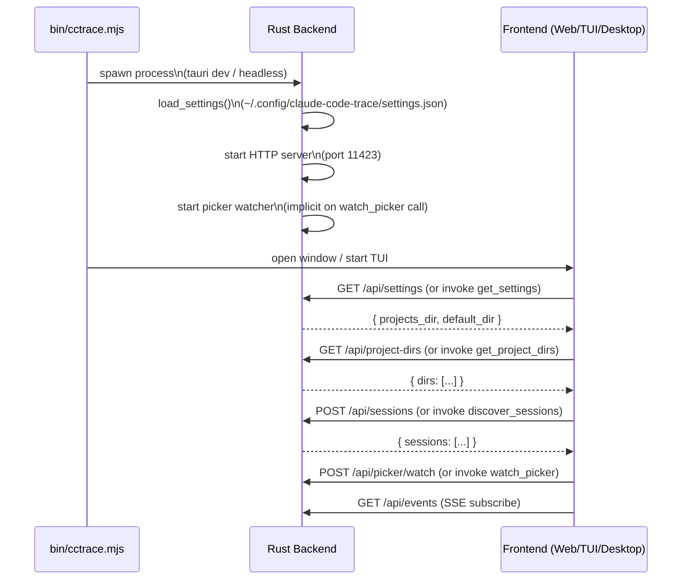
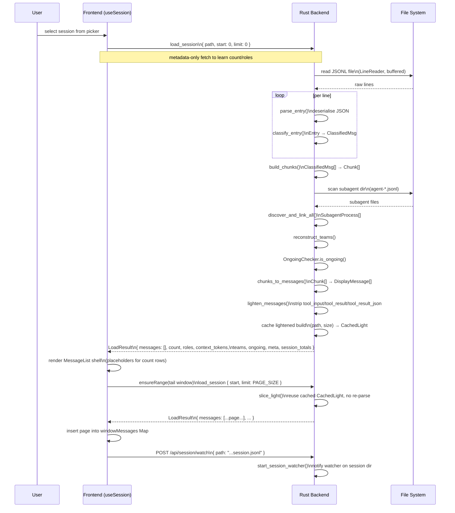
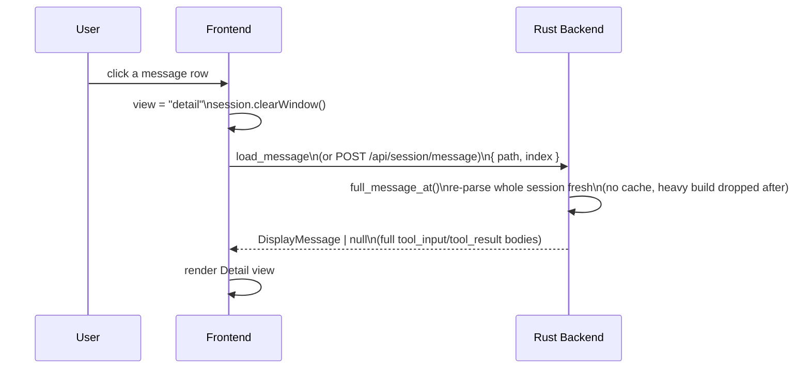
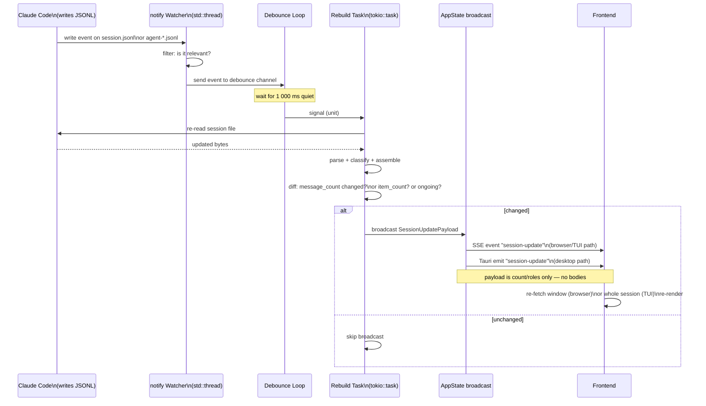
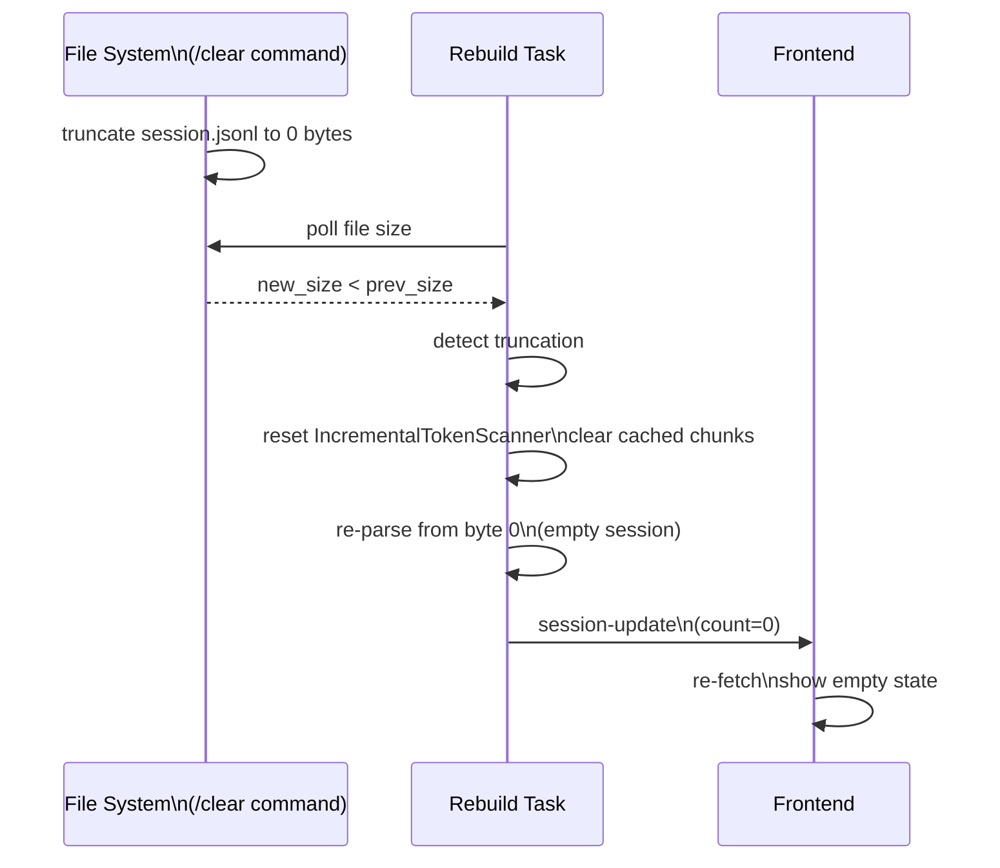
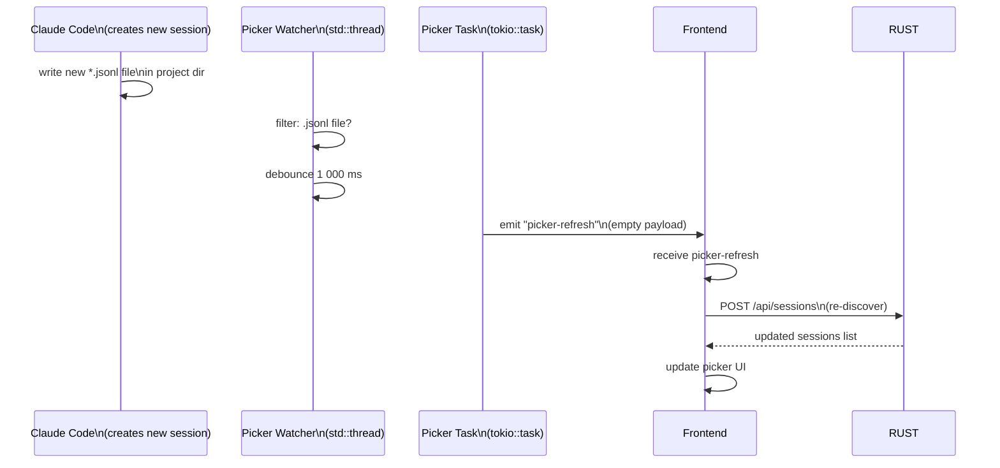
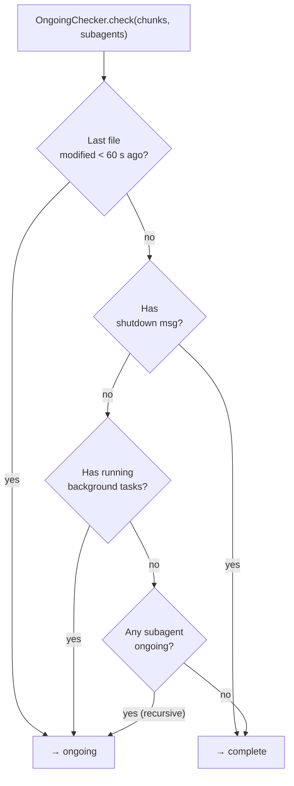
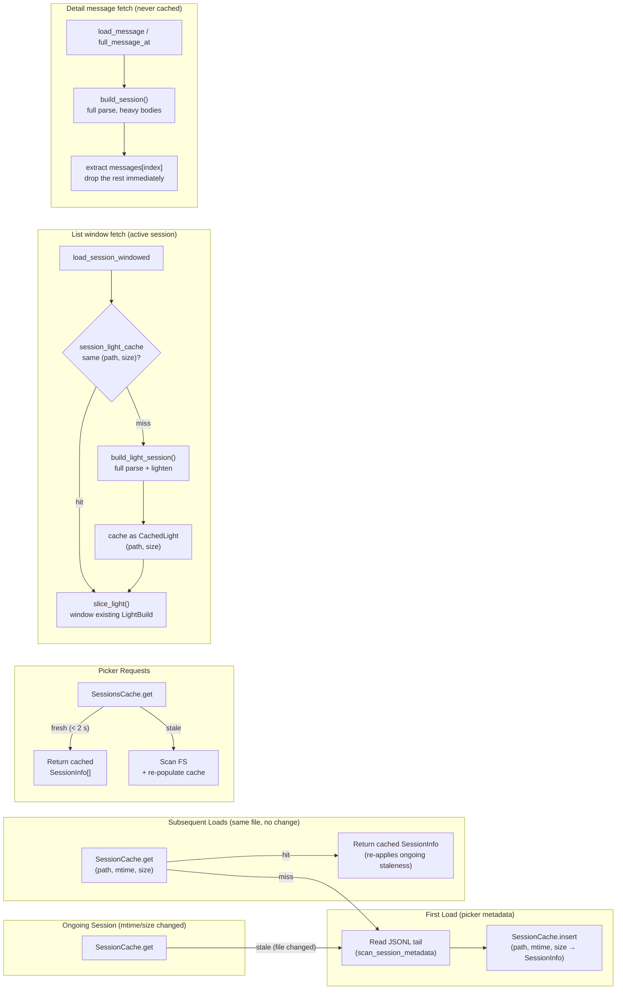
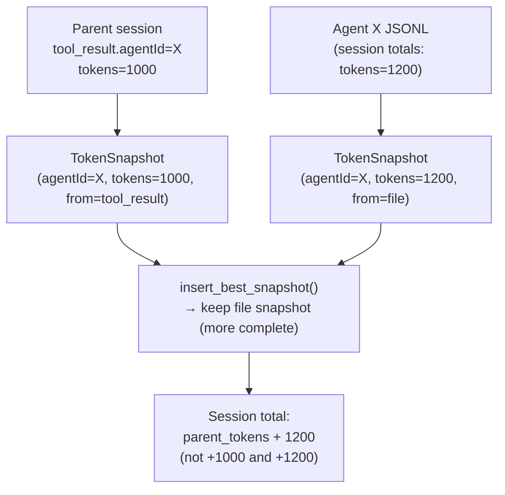
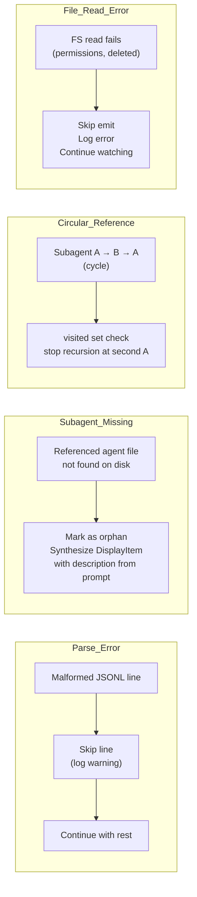

# Spec: End-to-End Session Lifecycle

This document traces the complete journey of a Claude Code session from initial file discovery
through live updates, covering both desktop (Tauri IPC) and browser/TUI (HTTP) paths.

---

## Phase 1: Application Startup

---

## Phase 2: Session Selection and Loading

Loading a session is windowed, not whole-file: the frontend (`useSession.ts`) fetches
message bodies a `PAGE_SIZE=100` page at a time via `ensureRange`, and keeps only a
sparse in-memory `Map<index, DisplayMessage>` of the pages near the viewport — far pages
are evicted as the user scrolls. `load_session` (Tauri command / `POST
/api/session/load`) accepts `start`/`limit` windowing params and always returns a
`LoadResult`: the requested `messages` slice plus `count` (total message count), `start`,
`roles` (role of every message, the lightweight full-session index), `context_tokens`,
and the existing `teams`/`ongoing`/`meta`/`session_totals` fields (which describe the
whole session regardless of the window).

As the user scrolls, the virtualized list calls `ensureRange(start, end)` again, which
fetches only the missing pages in that range and evicts pages outside a small keep-margin
band around the viewport — the session's full message list is never held in memory on
the frontend.

### Detail view message fetch

Detail-view message bodies are fetched separately and on demand, never as part of the
list load. Opening a message in Detail calls a distinct backend entry point:

See "Opening the Detail view drops the list window" below for what happens to the list's
loaded pages when this fetch begins.

---

## Phase 3: Live Update Loop

---

## Phase 4: Session `/clear` (Truncation)

---

## Phase 5: Picker Refresh

---

## Session Completion Detection Flow

---

## Caching Strategy Throughout Lifecycle

There are three independent caches in `AppState`, each serving a different consumer.
They are not layers of the same cache — a request only ever touches one of them.

**`session_cache` (`SessionCache`, keyed by `(path, mtime, size)`)** — the picker's
per-file metadata cache. It backs `discover_all_project_sessions` (called from
`discover_sessions_cached`): scanning every project directory's `SessionInfo` (title,
timestamps, ongoing flag, token totals) on every picker refresh would mean re-reading
every session file's tail on every refresh. A cache hit re-applies ongoing staleness
(`apply_staleness`, ~60s) and a subagent-activity recheck to the cached `SessionInfo`
rather than reparsing, so an ongoing session still reports fresh liveness without a full
rescan. This is the cache the "First Load / Subsequent Loads / Ongoing Session" flow
below describes; it never holds `DisplayMessage[]` — only lightweight `SessionInfo`.

**`session_light_cache` (`CachedLight`, keyed by `(path, size)` — no mtime)** — the
active session's windowed-list-fetch cache, used only by `load_session_windowed`.
Scrolling the message list calls `ensureRange`, which issues one `load_session` per
missing page; without this cache each page fetch would re-parse and re-link the whole
session file. On a cache hit, `slice_light` windows the already-built `LightBuild`
(messages with heavy tool bodies stripped by `lighten_messages`) instead of rebuilding.
A different path, or the same path with a changed size (grown or truncated), invalidates
and rebuilds. Time-filtered loads bypass this cache entirely (rare, used only by the
by-id range endpoint). Only one session's build is held at a time — `AppState` has a
single `Mutex<Option<CachedLight>>` slot, not a map — so opening a new session evicts
the previous one automatically. `clear_session_build_cache()` also drops it explicitly
(see "Opening the Detail view drops the list window" below).

**No cache for `full_message_at`** — the Detail view's single-message fetch. This
deliberately re-parses the whole session fresh (`build_session`) on every call and drops
the heavy build as soon as one message is extracted. A tool-output-heavy session's full
build can be hundreds of MB; caching it for as long as the session stays open would hold
that in the Rust process the whole time. Re-parsing trades per-click latency (roughly the
cost of the session's first list load) for never persisting heavy tool-output bodies in
memory between Detail clicks.

---

## Opening the Detail view drops the list window

Opening the Detail view calls `session.clearWindow()` before fetching the message body:
this drops every page currently held in the frontend's `windowMessages` map (the sparse
`Map<index, DisplayMessage>` `ensureRange` populates) since the list is no longer
visible while Detail is showing. The backend's `session_light_cache` is untouched by
this — it isn't cleared here, only the frontend's in-memory window is.

Returning to the list view does not restore anything cached: `ensureRange` runs again
for whatever range is now visible and re-fetches those pages fresh via `load_session`.
If the backend's `session_light_cache` is still warm for that `(path, size)`, the refetch
is a cheap `slice_light` rather than a full re-parse; if the file changed size in the
meantime (e.g. the session grew while Detail was open), the next fetch rebuilds it.

---

## Token Counting Across Subagents

Token deduplication ensures agents counted in both parent tool results and their own JSONL files
are not double-counted.

---

## Error Paths

---

## Platform Paths Summary

| Step                         | Desktop (Tauri IPC)           | Browser / TUI (HTTP)        |
| ---------------------------- | ----------------------------- | --------------------------- |
| Discover sessions            | `invoke("discover_sessions")` | `POST /api/sessions`        |
| Load session (windowed list) | `invoke("load_session")`      | `POST /api/session/load`    |
| Load full message (detail)   | `invoke("load_message")`      | `POST /api/session/message` |
| Watch session                | `invoke("watch_session")`     | `POST /api/session/watch`   |
| Receive updates              | `listen("session-update")`    | `EventSource /api/events`   |
| Watch picker                 | `invoke("watch_picker")`      | `POST /api/picker/watch`    |
| Picker refresh               | `listen("picker-refresh")`    | `EventSource /api/events`   |

---

## Related Specs

- [01-parser-pipeline.md](01-parser-pipeline.md) — parse stages used in phases 2 and 3
- [02-file-watcher.md](02-file-watcher.md) — watcher detail for phases 3 and 5
- [03-state-management.md](03-state-management.md) — caching used throughout
- [04-http-api.md](04-http-api.md) — HTTP endpoints used by browser/TUI path
- [05-frontend-web.md](05-frontend-web.md) — frontend hooks for phases 2 and 3
- [06-tui.md](06-tui.md) — TUI flow for phases 2 and 3
