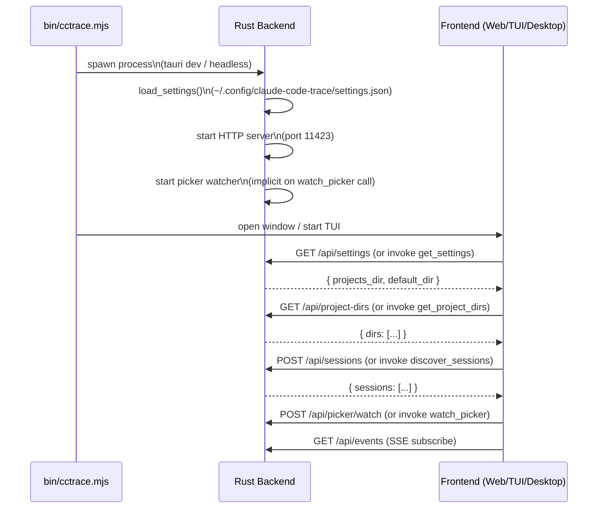
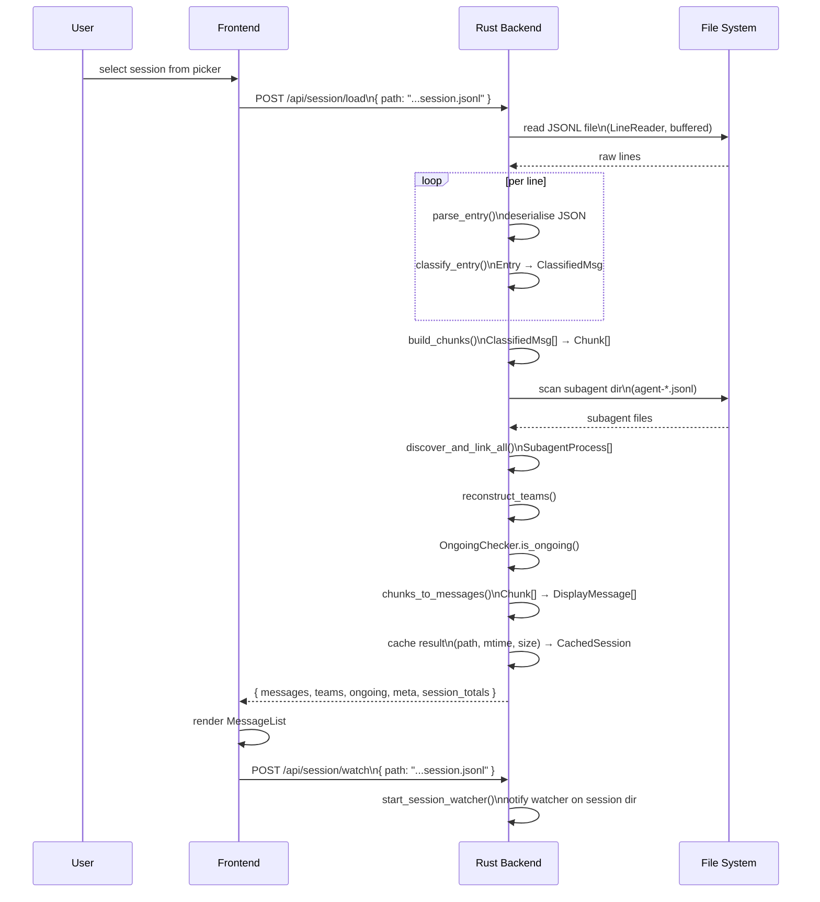
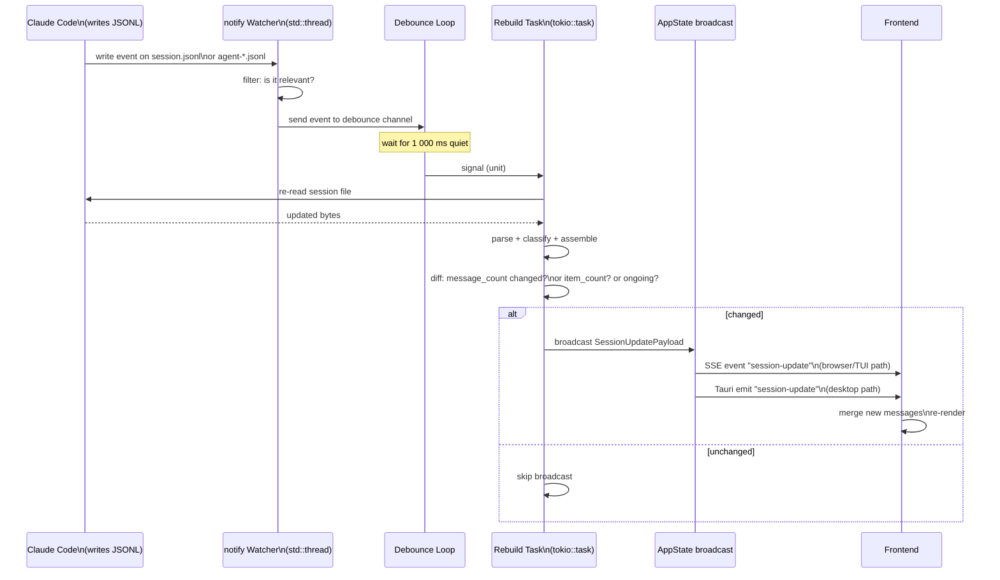
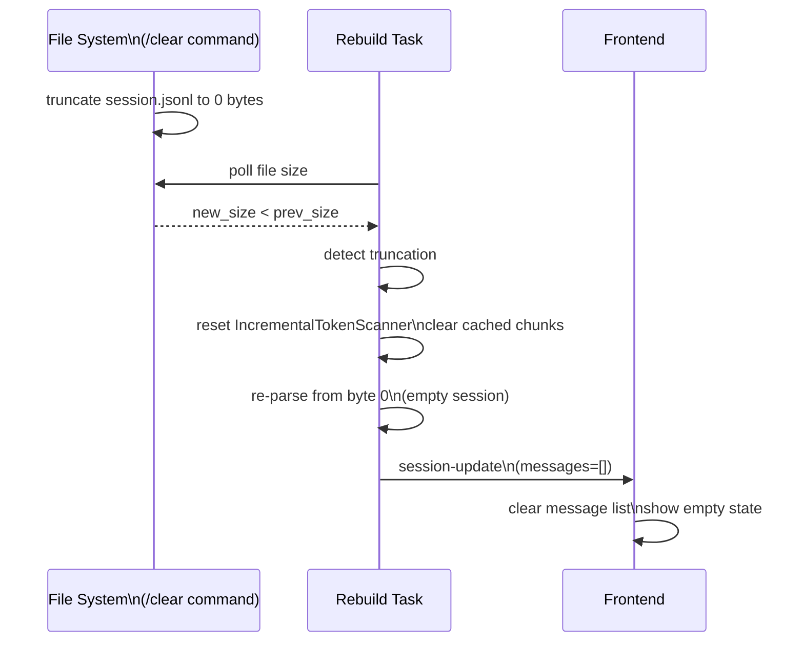
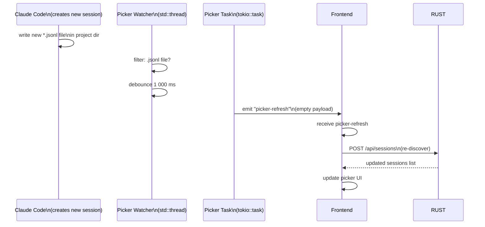
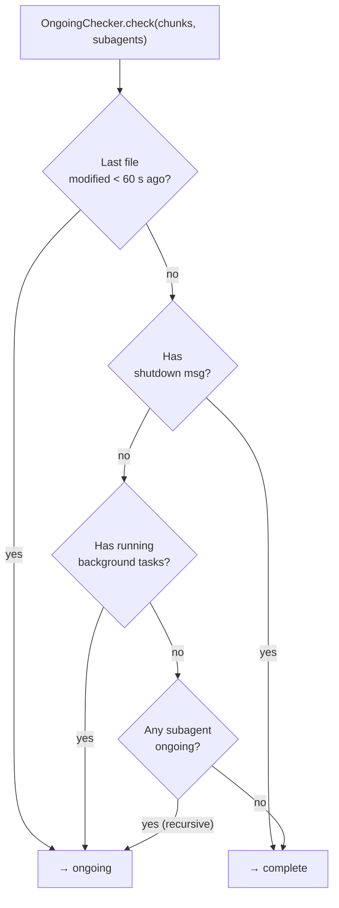
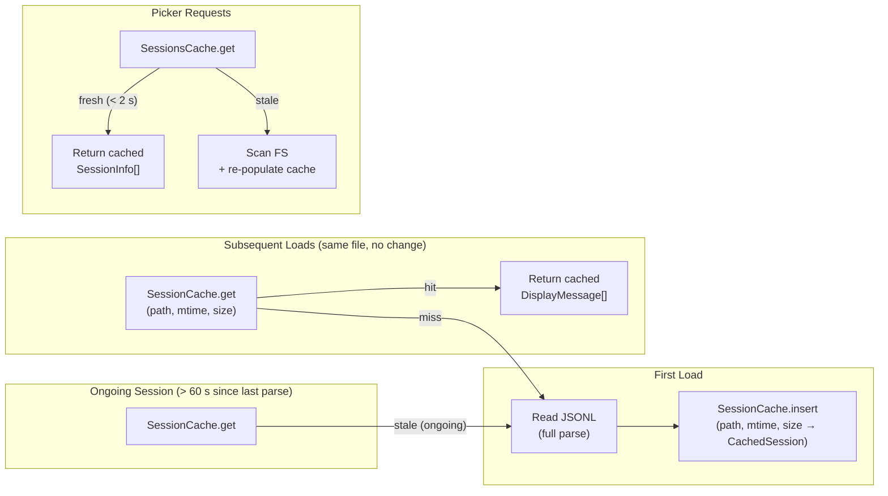
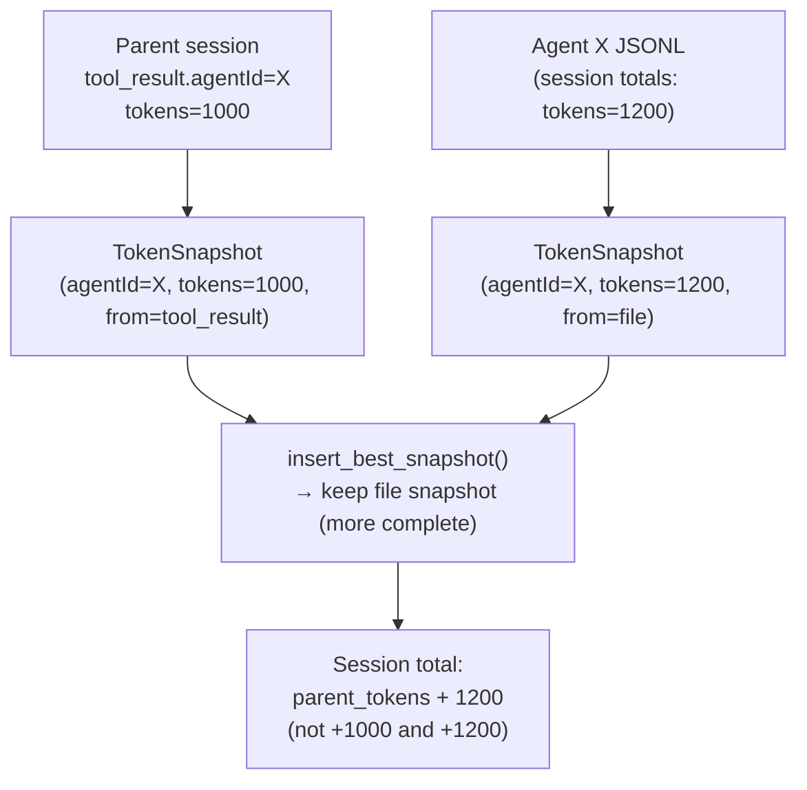
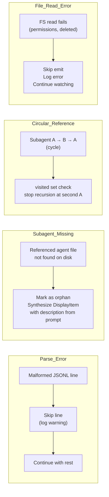

# Spec: End-to-End Session Lifecycle

This document traces the complete journey of a Claude Code session from initial file discovery
through live updates, covering both desktop (Tauri IPC) and browser/TUI (HTTP) paths.

---

## Phase 1: Application Startup

---

## Phase 2: Session Selection and Loading

---

## Phase 3: Live Update Loop

---

## Phase 4: Session `/clear` (Truncation)

---

## Phase 5: Picker Refresh

---

## Session Completion Detection Flow

---

## Caching Strategy Throughout Lifecycle

---

## Token Counting Across Subagents

Token deduplication ensures agents counted in both parent tool results and their own JSONL files
are not double-counted.

---

## Error Paths

---

## Platform Paths Summary

| Step              | Desktop (Tauri IPC)           | Browser / TUI (HTTP)      |
| ----------------- | ----------------------------- | ------------------------- |
| Discover sessions | `invoke("discover_sessions")` | `POST /api/sessions`      |
| Load session      | `invoke("load_session")`      | `POST /api/session/load`  |
| Watch session     | `invoke("watch_session")`     | `POST /api/session/watch` |
| Receive updates   | `listen("session-update")`    | `EventSource /api/events` |
| Watch picker      | `invoke("watch_picker")`      | `POST /api/picker/watch`  |
| Picker refresh    | `listen("picker-refresh")`    | `EventSource /api/events` |

---

## Related Specs

- [01-parser-pipeline.md](01-parser-pipeline.md) — parse stages used in phases 2 and 3
- [02-file-watcher.md](02-file-watcher.md) — watcher detail for phases 3 and 5
- [03-state-management.md](03-state-management.md) — caching used throughout
- [04-http-api.md](04-http-api.md) — HTTP endpoints used by browser/TUI path
- [05-frontend-web.md](05-frontend-web.md) — frontend hooks for phases 2 and 3
- [06-tui.md](06-tui.md) — TUI flow for phases 2 and 3
