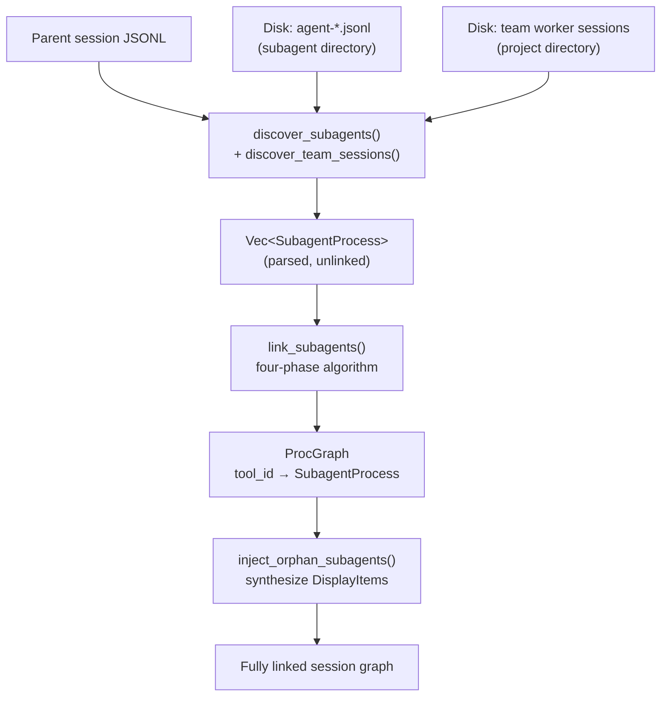
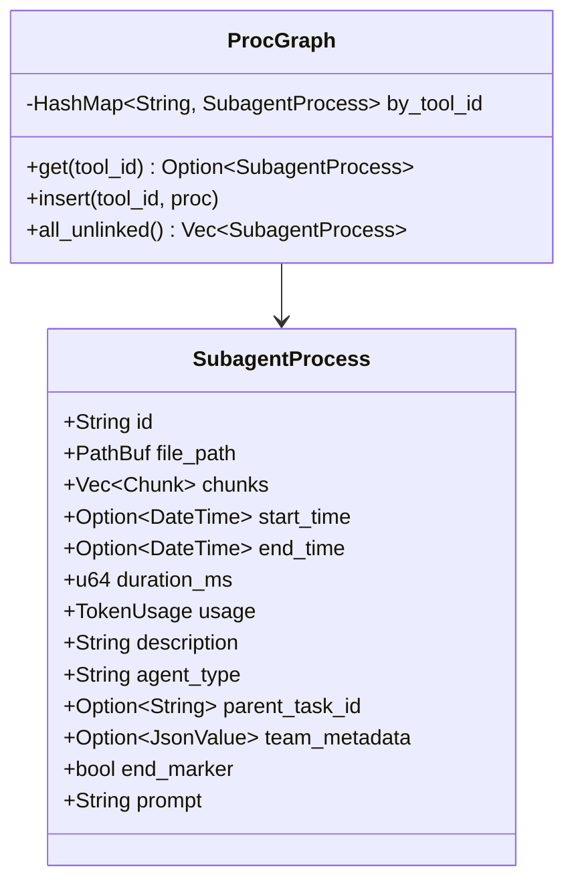
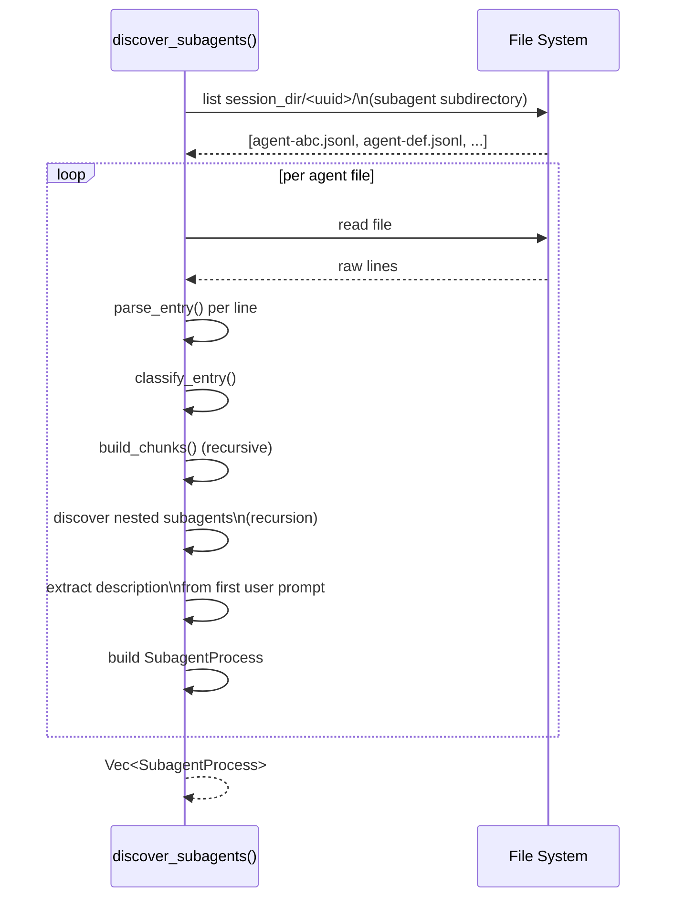
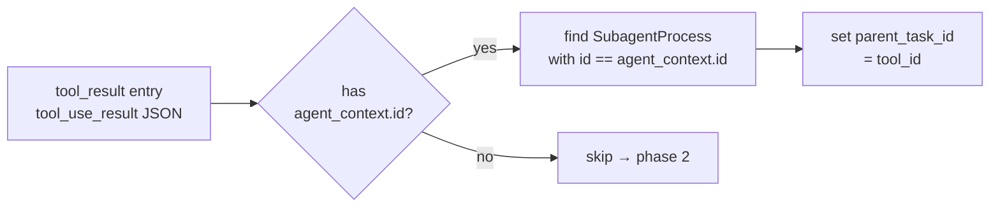
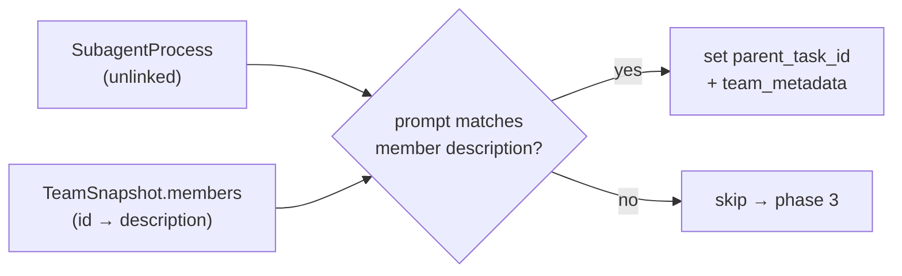
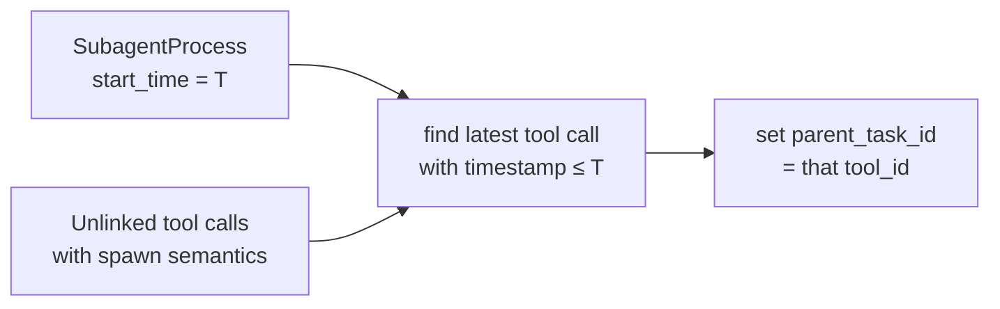
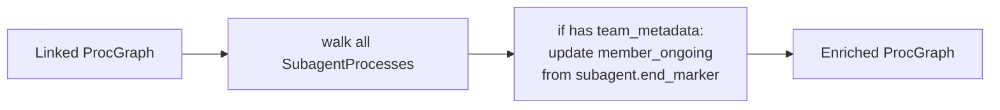
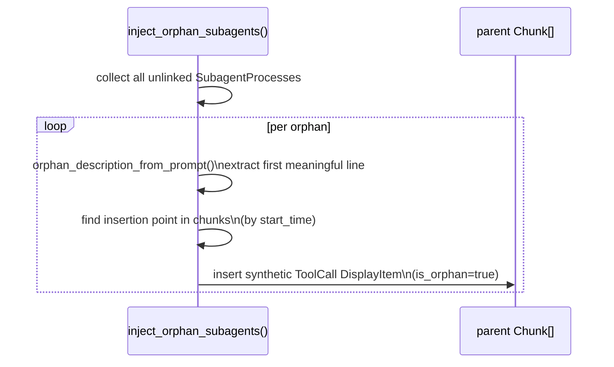
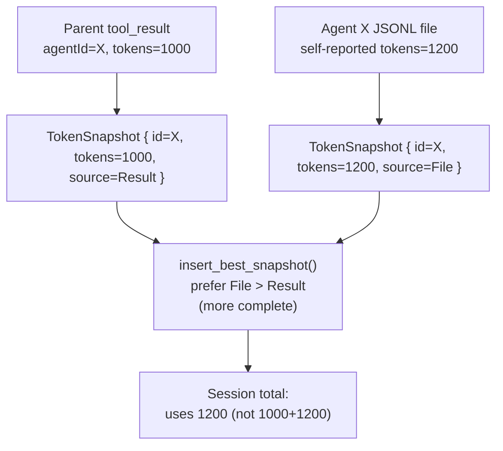
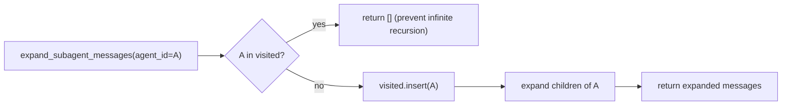

# Spec: Subagent Discovery and Linking

**Location**: `src-tauri/src/parser/subagent.rs`

Subagent linking is the most complex part of the pipeline. It reconstructs the parent→child
relationship between a session's tool calls and the spawned agent sessions, each stored in a
separate `agent-*.jsonl` file.

---

## Overview

---

## SubagentProcess Structure

---

## Discovery Phase

Recursion depth is bounded by the actual agent nesting depth in the file system. Deep nesting
(e.g., agent spawns agent spawns agent) is handled by recursive calls, but stack overflows are
mitigated by iterative traversal for deeply nested structures.

### Team Session Discovery

`discover_team_sessions()` scans the project directory for session files that match
`(teamName, agentName)` pairs extracted from parent chunks. Each candidate file is
identified by `read_team_session_meta()`, which scans lines until finding one with
a non-empty `agentName`. `teamName` is optional: pre-v2.1.178 sessions carry both,
while v2.1.178+ implicit-team sessions carry only `agentName`.

`is_team_task()` identifies named-agent tool calls by checking for the `name` key in
tool input (not `team_name`), so both explicit team spawns (pre-v2.1.178) and implicit
team spawns (v2.1.178+) are correctly classified.

Before Claude Code v2.1.174, Workflow tool `agent()` subagents omitted attribution
headers from their JSONL entries. A session file where no line carries any attribution
returns `("", "")` and is gracefully skipped. A file where attribution appears only
on later entries (mixed pre/post-fix session) is still correctly identified.

Claude Code v2.1.178 removed `TeamCreate`/`TeamDelete` and made `teamName` optional
in multi-agent sessions. Sessions recorded after this version may have teammates with
`agentName` set but `teamName` absent — this is the authoritative signal and such
sessions are fully discoverable.

---

## Four-Phase Linking Algorithm

The algorithm tries progressively weaker signals to link each `SubagentProcess` to its parent
tool call. Stronger signals take precedence and cannot be overridden.

### Phase 1: Result-Based (Authoritative)

Reads `tool_use_result` JSON in the parent session. Claude Code v2.1.118+ includes the agent's
UUID in the result payload.

### Phase 2: Team Member Description Match

For team-based sessions, each team member has a known description string. This phase matches the
agent's extracted prompt against team member descriptions.

### Phase 3: Positional (Temporal Proximity)

Assigns the agent to the tool call that is temporally closest **before** the agent's start time,
among tool calls that are still unlinked.

### Phase 4: Nested Enrichment

After all agents are linked, recursively update team metadata from linked subagent completion
states.

---

## Orphan Injection

Subagents that survive all four phases without being linked (no tool call found) get a synthetic
`DisplayItem` injected at the position of their start time.

---

## Token Deduplication

The same agent can appear in two places:

1. In the parent session's `tool_result` (from `SendMessage`'s response)
2. As its own `agent-*.jsonl` file

---

## Cycle Detection

Mutually-referencing agents (e.g., agent A spawns agent B which references agent A) are caught
by a `visited: HashSet<AgentId>` passed through the recursive expansion in `convert.rs`.

---

## Description Extraction (`orphan_description_from_prompt`)

For orphan agents where no tool call context exists, the display description is derived from the
agent's prompt text:

1. Skip blank lines and lines matching a list of common metadata prefixes
2. Take the first substantive line (max 120 chars)
3. Truncate with `…` if needed
4. Fallback to `"Agent"` if no line found

---

## Related Specs

- [01-parser-pipeline.md](01-parser-pipeline.md) — context for subagent discovery within the pipeline
- [07-data-types.md](07-data-types.md) — `DisplayItem.subagent_messages` recursive type
- [08-session-lifecycle.md](08-session-lifecycle.md) — where linking fits in the full lifecycle
