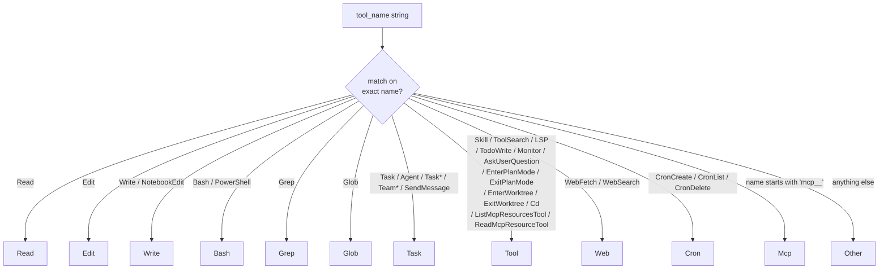
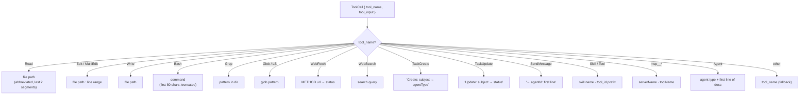
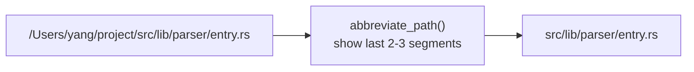
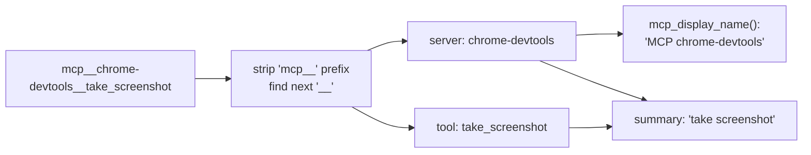
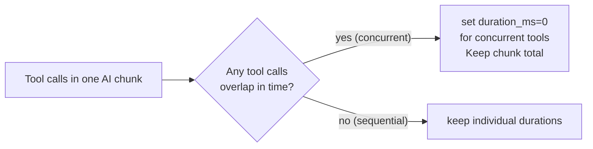

# Spec: Tool Taxonomy and Summary System

**Locations**: `src-tauri/src/parser/taxonomy.rs`, `src-tauri/src/parser/summary.rs`

Every tool call in a session is categorised and given a human-readable summary for display in
the UI. This spec documents the categorisation rules and summary generation logic.

---

## Tool Category Taxonomy

The Rust enum has 12 variants (`taxonomy.rs:6-19`):
`Read`, `Edit`, `Write`, `Bash`, `Grep`, `Glob`, `Task`, `Tool`, `Web`, `Cron`, `Mcp`, `Other`.

### Category Mapping Table

| Category | Matched tool names                                                                                                                                                                             |
| -------- | ---------------------------------------------------------------------------------------------------------------------------------------------------------------------------------------------- |
| `Read`   | `Read`                                                                                                                                                                                         |
| `Edit`   | `Edit`                                                                                                                                                                                         |
| `Write`  | `Write`, `NotebookEdit`                                                                                                                                                                        |
| `Bash`   | `Bash`, `PowerShell`                                                                                                                                                                           |
| `Grep`   | `Grep`                                                                                                                                                                                         |
| `Glob`   | `Glob`                                                                                                                                                                                         |
| `Task`   | `Task`, `Agent`, `TaskCreate`, `TaskUpdate`, `TaskList`, `TaskGet`, `TaskStop`, `TaskOutput`, `TeamCreate`, `TeamDelete`, `SendMessage`                                                        |
| `Tool`   | `Skill`, `ToolSearch`, `LSP`, `TodoWrite`, `Monitor`, `AskUserQuestion`, `ListMcpResourcesTool`, `ReadMcpResourceTool`, `EnterPlanMode`, `ExitPlanMode`, `EnterWorktree`, `ExitWorktree`, `Cd` |
| `Web`    | `WebFetch`, `WebSearch`                                                                                                                                                                        |
| `Cron`   | `CronCreate`, `CronDelete`, `CronList`                                                                                                                                                         |
| `Mcp`    | any name starting with `mcp__`                                                                                                                                                                 |
| `Other`  | anything not listed above (e.g. `LS`, `Find`, third-party tools)                                                                                                                               |

> Note: `SendMessage` (cross-agent messaging) is `Task`, not `Tool`.
> Note: `NotebookEdit` is `Write`, not `Edit`.

---

## Summary Generation

Each tool call receives a one-line human-readable summary for the collapsed view.

---

## Path Abbreviation

File paths in summaries are shortened to avoid overwhelming narrow display columns.

If the path is short enough to fit, no abbreviation is applied.

---

## MCP Tool Naming

MCP tools follow the naming convention `mcp__<server>__<tool>`. Two helpers in `taxonomy.rs`
parse this format:

- `parse_mcp_tool_name(name) → Option<(server, tool)>`
- `mcp_display_name(name) → String` (e.g. `mcp__chrome-devtools__take_screenshot` → `"MCP chrome-devtools"`)

The category for all `mcp__` tools is `Mcp` regardless of server. Names that match the prefix
pattern but have an empty server or tool segment (e.g. `mcp____tool`) are rejected by
`parse_mcp_tool_name` and fall through to category `Other`.

---

## Icon Mapping (Frontend)

Each category maps to an icon displayed in the UI. Icons are defined in `src/components/Icons.tsx`
for the web frontend and `tui-py/items.py` + `tui-py/theme.py` for the TUI.

| Category | Web icon  | TUI unicode |
| -------- | --------- | ----------- |
| `Read`   | FileRead  | `▪`         |
| `Edit`   | FileEdit  | `▪`         |
| `Write`  | FileWrite | `▪`         |
| `Bash`   | Terminal  | `⚙`         |
| `Grep`   | Search    | `⚙`         |
| `Glob`   | Folder    | `⚙`         |
| `Task`   | Task      | `✦`         |
| `Web`    | Globe     | `⚙`         |
| `Cron`   | Clock     | `⚙`         |
| `MCP`    | Plugin    | `⚙`         |
| `Tool`   | Wrench    | `⚙`         |
| `Other`  | Dot       | `⚙`         |

---

## Duration Inflation Suppression

When multiple tool calls execute concurrently (e.g., parallel agent spawns), their individual
`duration_ms` values can be inflated because they measure wall-clock time that overlaps.

`suppress_inflated_durations()` in `chunk.rs` detects concurrent tool calls and clears their
individual durations, keeping only the overall chunk duration.

---

## Related Specs

- [01-parser-pipeline.md](01-parser-pipeline.md) — where taxonomy/summary fit in the pipeline
- [07-data-types.md](07-data-types.md) — `DisplayItem.tool_category` and `tool_summary` fields
- [05-frontend-web.md](05-frontend-web.md) — `DetailItem` renders these summaries
