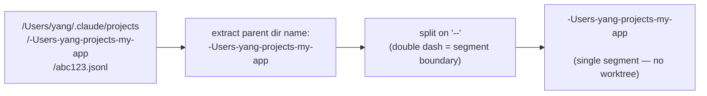
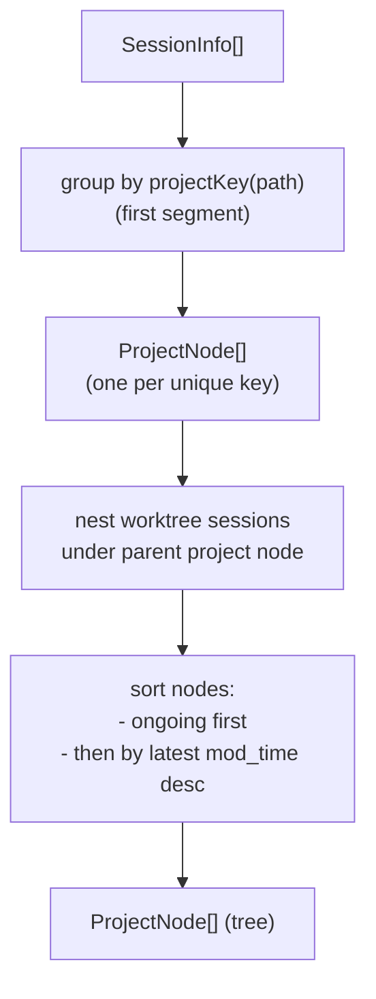
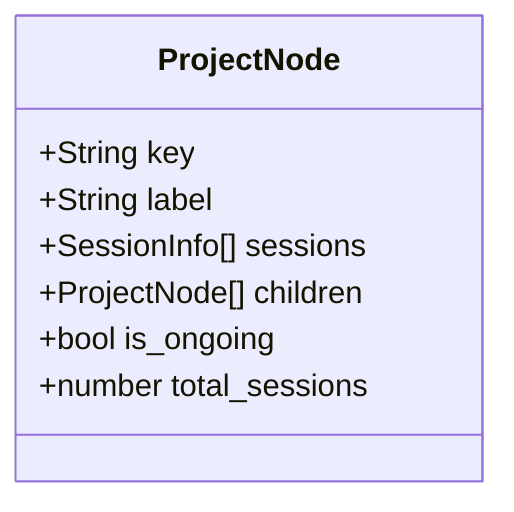
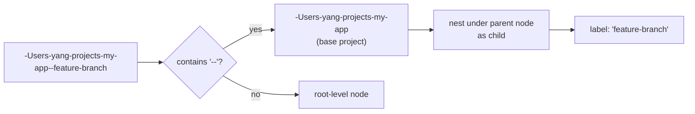
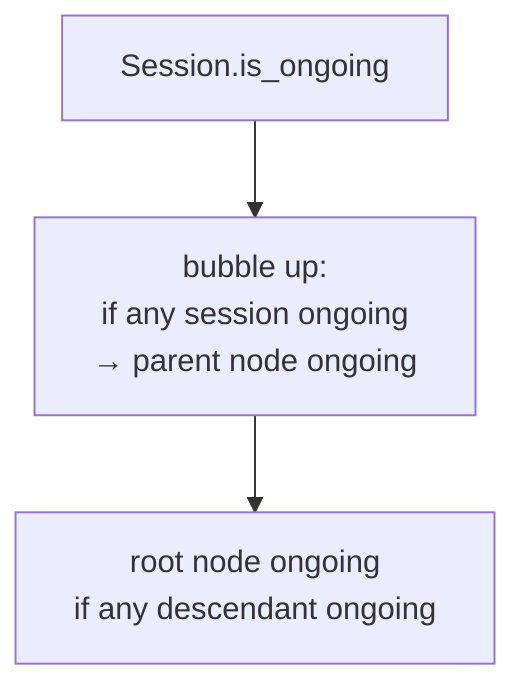

# Spec: Project Tree Builder

**Location**: `shared/projectTree.ts`

The project tree groups a flat list of sessions into a hierarchical tree based on the project
key encoded in each session's JSONL file path. The same logic is used by the web frontend,
the TUI sidebar, and session sorting.

---

## Project Key Derivation

Claude Code stores session files under a path of the form:

```
~/.claude/projects/-Users-yang-projects-my-app/abc123.jsonl
```

The directory segment after `projects/` encodes the original absolute path with `/` replaced by
`-`. This is the **project key**.



Worktree sessions have double-dash separators:

```
-Users-yang-projects-my-app--feature-branch
→ segments: ["-Users-yang-projects-my-app", "feature-branch"]
→ parent: my-app
→ child: my-app--feature-branch
```

---

## Tree Construction



---

## ProjectNode Structure



`label` is the human-readable display name:

- Strip the leading `-Users-yang-` prefix
- Replace remaining `-` with `/` to recover the original path
- Show only the last 1-2 path segments for brevity

---

## Worktree Nesting Logic



### Orphan worktrees (no anchor session)

The base project may have **no session of its own** — e.g. a headless/deterministic
orchestrator that only ever runs agent phases inside per-item worktrees and never opens a
session at the repo root. In that case `buildTree` **synthesizes** the base project node
(keyed by the prefix before the worktree marker) so the worktree still nests under its repo
with a `CLAUDE-WORKTREES` group, instead of orphaning as a flat root. A synthesized node is
created only when no real prefix-ancestor session exists, so anchored runs are unaffected.

---

## Ongoing Status Propagation

A project node is `is_ongoing = true` if **any** of its sessions (or children's sessions) is
ongoing.



---

## Display Name Examples

| Raw key                                   | Display label                           |
| ----------------------------------------- | --------------------------------------- |
| `-Users-yang-projects-my-app`             | `my-app`                                |
| `-Users-yang-projects-my-app--feature-x`  | `my-app` (parent) + `feature-x` (child) |
| `-Users-yang-work-company-repo--hotfix-1` | `repo` (parent) + `hotfix-1` (child)    |

---

## Integration Points

| Consumer              | Usage                                             |
| --------------------- | ------------------------------------------------- |
| Web `ProjectTree.tsx` | Renders hierarchical sidebar with expand/collapse |
| TUI `ProjectTree.tsx` | Same tree in terminal, with keyboard navigation   |
| `SessionPicker.tsx`   | Filters sessions by selected project key          |
| `usePicker.ts`        | Builds tree on each session list refresh          |

---

## Related Specs

- [05-frontend-web.md](05-frontend-web.md) — `ProjectTree` React component (web)
- [06-tui.md](06-tui.md) — `ProjectTree` Textual widget (TUI)
- [07-data-types.md](07-data-types.md) — `SessionInfo` and `ProjectNode` types
