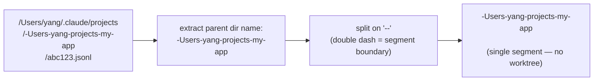
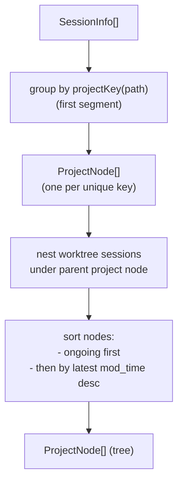
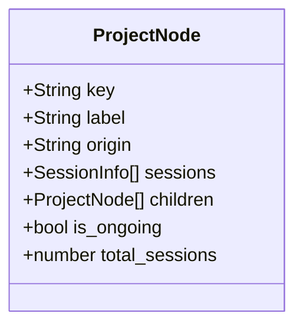
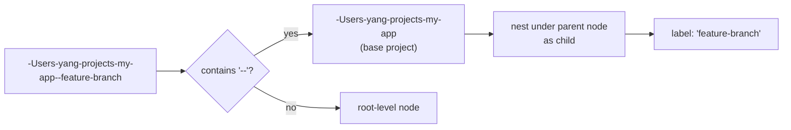
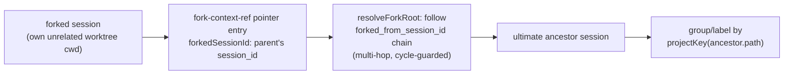
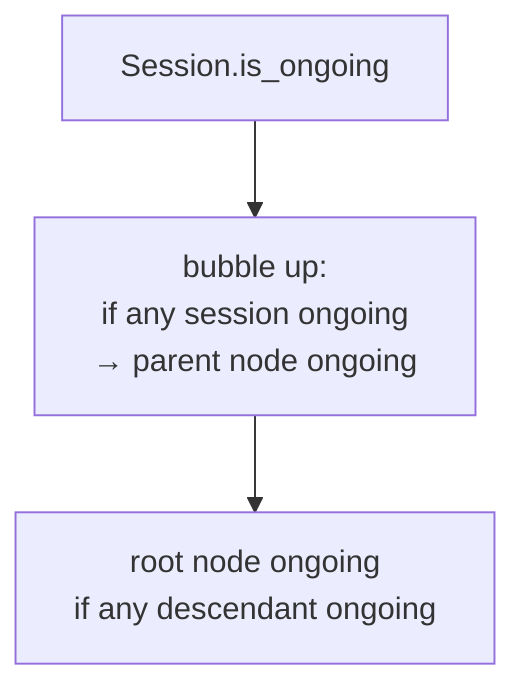

# Spec: Project Tree Builder

**Location**: `shared/projectTree.ts`

The project tree groups a flat list of sessions into a hierarchical tree based on the project
key encoded in each session's JSONL file path. The same logic is used by the web frontend,
the TUI sidebar, and session sorting.

---

## Project Key Derivation

Claude Code stores session files under a path of the form:

```
~/.claude/projects/-Users-yang-projects-my-app/abc123.jsonl
```

The directory segment after `projects/` encodes the original absolute path with `/` replaced by
`-`. This is the **project key**.


```mermaid
flowchart LR
    PATH["/Users/yang/.claude/projects\n/-Users-yang-projects-my-app\n/abc123.jsonl"]
    PATH --> EXTRACT["extract parent dir name:\n-Users-yang-projects-my-app"]
    EXTRACT --> SPLIT["split on '--'\n(double dash = segment boundary)"]
    SPLIT --> SEGMENTS["-Users-yang-projects-my-app\n\n(single segment — no worktree)"]
```

Worktree sessions have double-dash separators:

```
-Users-yang-projects-my-app--feature-branch
→ segments: ["-Users-yang-projects-my-app", "feature-branch"]
→ parent: my-app
→ child: my-app--feature-branch
```

---

## Tree Construction


```mermaid
flowchart TD
    SESSIONS["SessionInfo[]"]
    SESSIONS --> GROUP["group by projectKey(path)\n(first segment)"]
    GROUP --> NODES["ProjectNode[]\n(one per unique key)"]
    NODES --> WORKTREES["nest worktree sessions\nunder parent project node"]
    WORKTREES --> SORT["sort nodes:\n- ongoing first\n- then by latest mod_time desc"]
    SORT --> TREE["ProjectNode[] (tree)"]
```

---

## ProjectNode Structure


```mermaid
classDiagram
    class ProjectNode {
        +String key
        +String label
        +String origin
        +SessionInfo[] sessions
        +ProjectNode[] children
        +bool is_ongoing
        +number total_sessions
    }
```

`origin` is the real cwd-derived path the node is anchored at (when known) — see "Real
path takes precedence over the key" above.

`label` is the human-readable display name. It is derived from the session's **origin
working directory** — `dirs[0]`, the first `cwd` seen in the JSONL, which is the directory
the session started in and the folder the JSONL file lives under:

- Take the last path segment of the origin dir (e.g. `/Users/yang/repos/sso-server` → `sso-server`)
- Fall back to decoding the project key only when no origin dir is available (older cached payloads)

The origin dir — not the last-seen `cwd` — is used on purpose. A session that `/cd`s across
repos records a different `cwd` per entry; naming the node from the last one would file a
session started in `sso-server` under whatever repo it happened to end in. The origin is the
stable home, and it is also lossless: decoding the encoded key is ambiguous (`sso-server`
would decode to `server`, since `-` is both a separator and a literal character).

A session that touched more than one working directory additionally surfaces the full,
first-seen-order list (`dirs`) on its own row in the picker as a `CWDs: a, b, c` line —
see [05-frontend-web.md](05-frontend-web.md) and [06-tui.md](06-tui.md).

---

## Worktree Nesting Logic


```mermaid
flowchart LR
    KEY["-Users-yang-projects-my-app--feature-branch"]
    KEY --> DETECT{"contains '--'?"}
    DETECT -->|"yes"| PARENT["-Users-yang-projects-my-app\n(base project)"]
    DETECT -->|"no"| ROOT["root-level node"]
    PARENT --> CHILD["nest under parent node\nas child"]
    CHILD --> LABEL["label: 'feature-branch'"]
```

### Real path takes precedence over the key (issue #259)

Claude Code v2.1.234 added `CLAUDE_CODE_PROJECT_DIR_NAME`, letting a host assign an
arbitrary short name to a project's `~/.claude/projects/<dir>` folder instead of the
usual path-derived encoding above. When that happens the project key carries no
relation to the real path at all, so string-prefix matching on the key alone could
wrongly nest two unrelated projects that happen to share a prefix, or fail to nest two
genuinely related ones.

Each `ProjectNode` also carries `origin` — the real cwd-derived path used for its label
(see "ProjectNode Structure" below). `buildTree`'s parent search (`nestsUnder` in
`shared/projectTree.ts`) checks this first: when both the candidate node and its
prospective parent have a known `origin`, nesting requires the child's origin to be a
real filesystem descendant of the parent's origin (`isRealDescendant`). The key-prefix
check above is used only as a fallback, when `origin` is unavailable for either side
(e.g. synthesized orphan-worktree nodes, which have no session of their own to derive a
real path from — see below).

### Orphan worktrees (no anchor session)

The base project may have **no session of its own** — e.g. a headless/deterministic
orchestrator that only ever runs agent phases inside per-item worktrees and never opens a
session at the repo root. In that case `buildTree` **synthesizes** the base project node
(keyed by the prefix before the worktree marker) so the worktree still nests under its repo
with a `CLAUDE-WORKTREES` group, instead of orphaning as a flat root. A synthesized node is
created only when no real prefix-ancestor session exists, so anchored runs are unaffected.

### Forked sessions (`/fork`)

Worktree nesting above relies on the child's project key sharing the parent's as a string
prefix — true when the child's `cwd` is literally a subdirectory of the parent's. As of
Claude Code v2.1.221, `/fork` instead gives the forked session its own worktree with a
brand-new `cwd` from its very first entry, so the fork's project key has **no path relation
to the parent's at all** — prefix matching can never reconnect them (issue #238).


```mermaid
flowchart LR
    FORK["forked session\n(own unrelated worktree cwd)"]
    FORK --> PTR["fork-context-ref pointer entry\nforkedSessionId: parent's session_id"]
    PTR --> RESOLVE["resolveForkRoot: follow\nforked_from_session_id chain\n(multi-hop, cycle-guarded)"]
    RESOLVE --> ANCHOR["ultimate ancestor session"]
    ANCHOR --> KEY["group/label by\nprojectKey(ancestor.path)"]
```

`buildProjectNodes` (`shared/projectTree.ts`) resolves every session's grouping key via
`resolveForkRoot` before anything else: a forked session counts toward — and, if it's first,
names — the project of the session it was ultimately forked from, not its own. The same
resolution is applied in `usePicker.ts`'s selected-project filter (against the full,
unfiltered session list, so a fork parent excluded by an active search query is still found)
and mirrored in the Python TUI (`project_tree.py`, `app.py`). If the parent session isn't in
the current listing (e.g. its file was deleted), the forked session falls back to grouping
under its own project — same as today's un-forked behavior.

---

## Ongoing Status Propagation

A project node is `is_ongoing = true` if **any** of its sessions (or children's sessions) is
ongoing.


```mermaid
flowchart TD
    LEAF["Session.is_ongoing"]
    LEAF --> PROP["bubble up:\nif any session ongoing\n→ parent node ongoing"]
    PROP --> ROOT_PROP["root node ongoing\nif any descendant ongoing"]
```

---

## Display Name Examples

| Raw key                                   | Display label                           |
| ----------------------------------------- | --------------------------------------- |
| `-Users-yang-projects-my-app`             | `my-app`                                |
| `-Users-yang-projects-my-app--feature-x`  | `my-app` (parent) + `feature-x` (child) |
| `-Users-yang-work-company-repo--hotfix-1` | `repo` (parent) + `hotfix-1` (child)    |

---

## Integration Points

| Consumer              | Usage                                             |
| --------------------- | ------------------------------------------------- |
| Web `ProjectTree.tsx` | Renders hierarchical sidebar with expand/collapse |
| TUI `ProjectTree.tsx` | Same tree in terminal, with keyboard navigation   |
| `SessionPicker.tsx`   | Filters sessions by selected project key          |
| `usePicker.ts`        | Builds tree on each session list refresh          |

---

## Related Specs

- [05-frontend-web.md](05-frontend-web.md) — `ProjectTree` React component (web)
- [06-tui.md](06-tui.md) — `ProjectTree` Textual widget (TUI)
- [07-data-types.md](07-data-types.md) — `SessionInfo` and `ProjectNode` types
