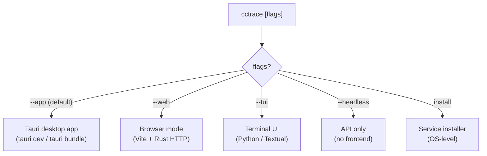
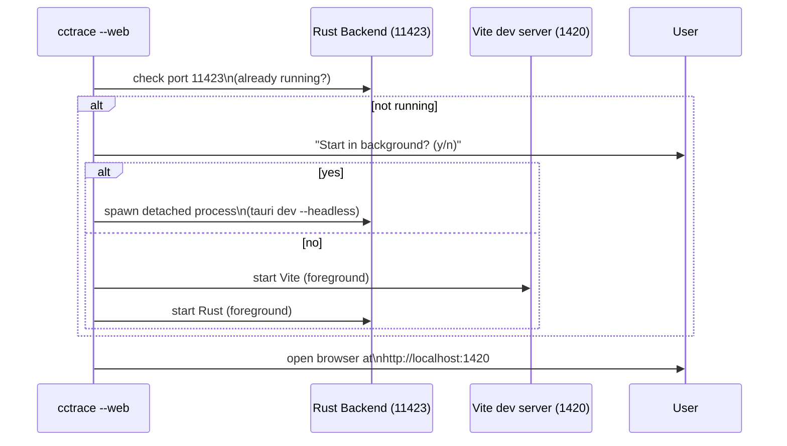
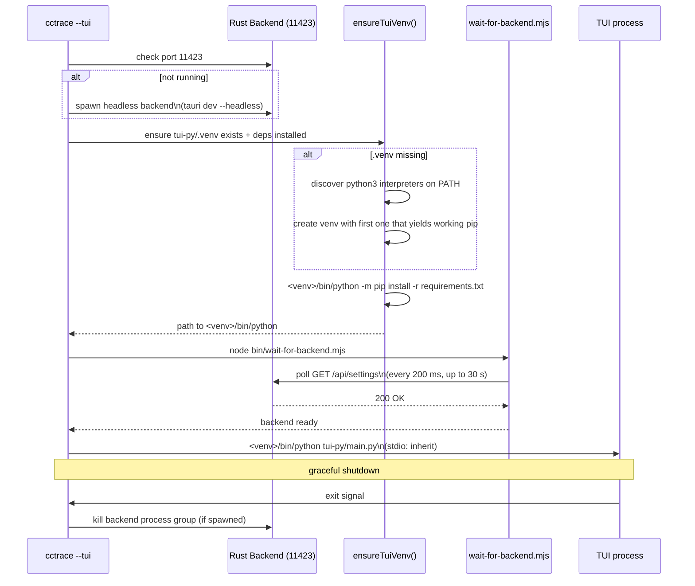
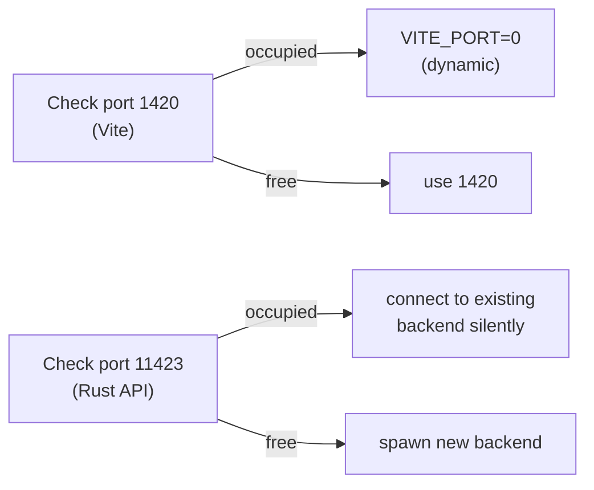
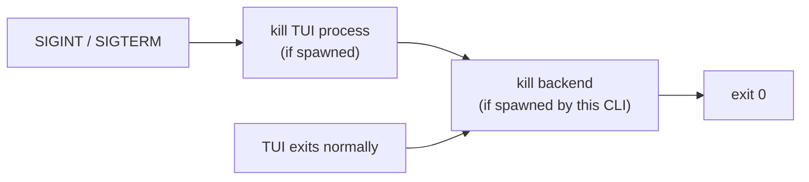
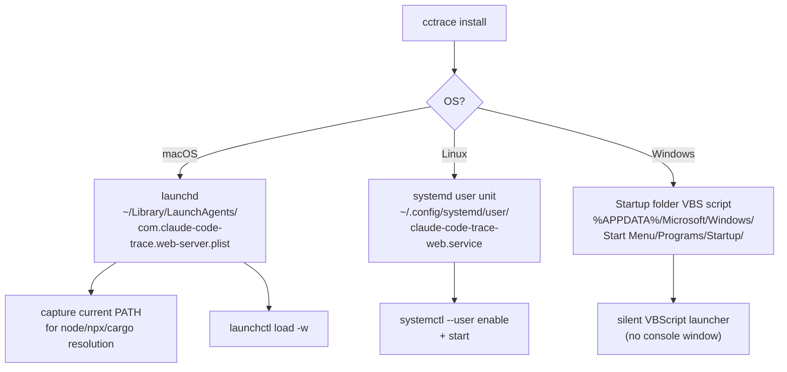
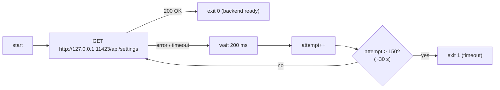

# Spec: CLI Launcher and Service Installer

**Locations**: `bin/cctrace.mjs`, `bin/python-venv.mjs`, `bin/install-service.mjs`, `bin/wait-for-backend.mjs`

The CLI entrypoint `cctrace` selects which mode to run and orchestrates the necessary processes.
It also supports installing the server as a persistent OS service.

---

## Mode Selection

---

## Web Mode Flow

---

## TUI Mode Flow

The backend spawn (`npx tauri dev -- -- --headless`) is only reached when no
backend was already running on 11423 — if one was, `--tui` connects to it and
never kills it on exit, since it may be shared with the desktop app or
another client.

When `--tui` does spawn its own backend, it uses `detached: true` and kills
via `process.kill(-backend.pid, "SIGTERM")` on TUI exit — signalling the
whole process group, not just the immediate `npx` child. `npx tauri dev`
nests further processes (the Tauri CLI, Vite, the Rust backend); a plain
`backend.kill()` only reaches `npx` and leaves Vite/the Rust backend as
orphans still holding their ports, breaking a later `cctrace --web` with
`EADDRINUSE` on 1420.

### Why a dedicated venv

The TUI's Python deps install into a dedicated `tui-py/.venv` (created on first
launch, reused after) rather than via a bare `pip` + `python3`. A bare `pip` and
a bare `python3` can resolve to **different** interpreters on a developer's
machine — an asdf shim, an unrelated active virtualenv (which may even lack
pip), system python, etc. — so deps could install where the app can't import
them. The venv guarantees install and launch use the same isolated interpreter.

Candidate interpreters are **discovered dynamically** by scanning PATH (plus
well-known install dirs) for `python3` / `python3.<minor>` — no hardcoded version
list — and each is validated by actually creating the venv and confirming pip is
present (some interpreters can `import ensurepip` yet still fail to seed pip).
The first candidate that yields a working venv is used.

---

## Port Management

If the backend is already running (e.g., launched by a previous session), the CLI connects to it
silently without prompting — this is the "graceful reconnect" behaviour.

---

## Graceful Shutdown

Exit codes propagate: if TUI exits with a non-zero code, the CLI exits with the same code.

---

## Service Installer (`install-service.mjs`)

Installs `cctrace --web` as a persistent background service that starts at login.

### macOS launchd Plist Key Settings

| Key                        | Value                                 |
| -------------------------- | ------------------------------------- |
| `Label`                    | `com.claude-code-trace.web-server`    |
| `ProgramArguments`         | `[node, /path/to/cctrace.mjs, --web]` |
| `RunAtLoad`                | `true`                                |
| `KeepAlive.SuccessfulExit` | `false` (restart on crash)            |
| `StandardOutPath`          | `~/.claude/claude-code-trace-web.log` |
| `StandardErrorPath`        | same log file                         |

---

## Backend Health Check (`wait-for-backend.mjs`)

---

## Related Specs

- [04-http-api.md](04-http-api.md) — the backend this launcher starts
- [06-tui.md](06-tui.md) — the TUI process this launcher orchestrates
- [00-overview.md](00-overview.md) — system context
