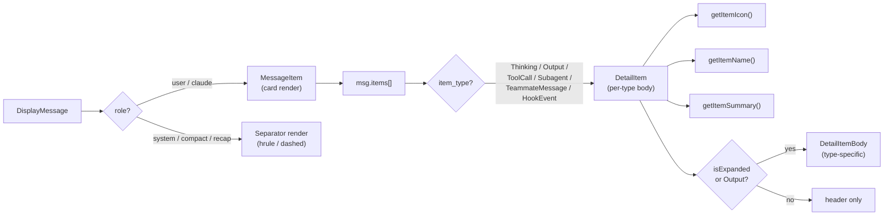
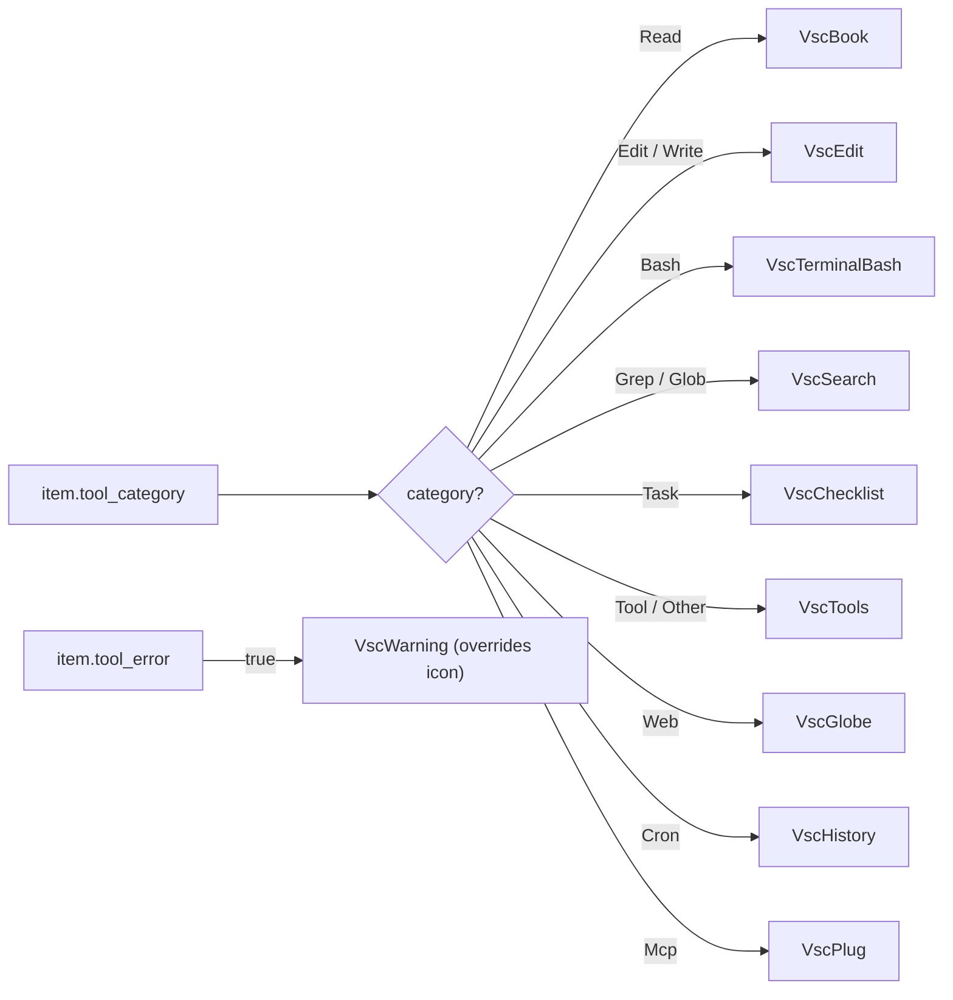
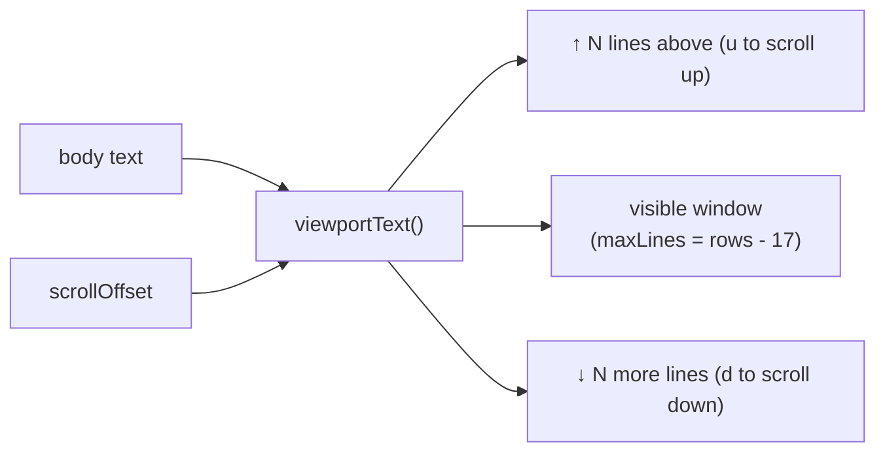
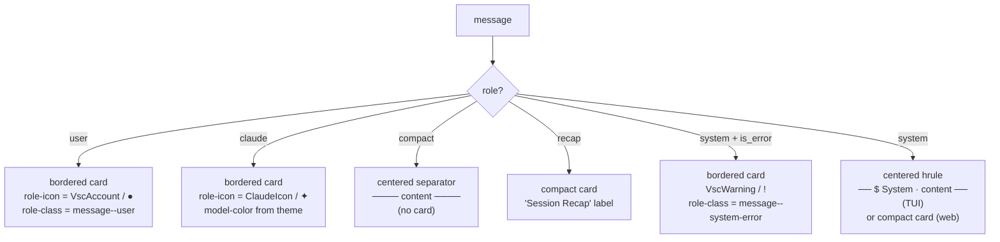
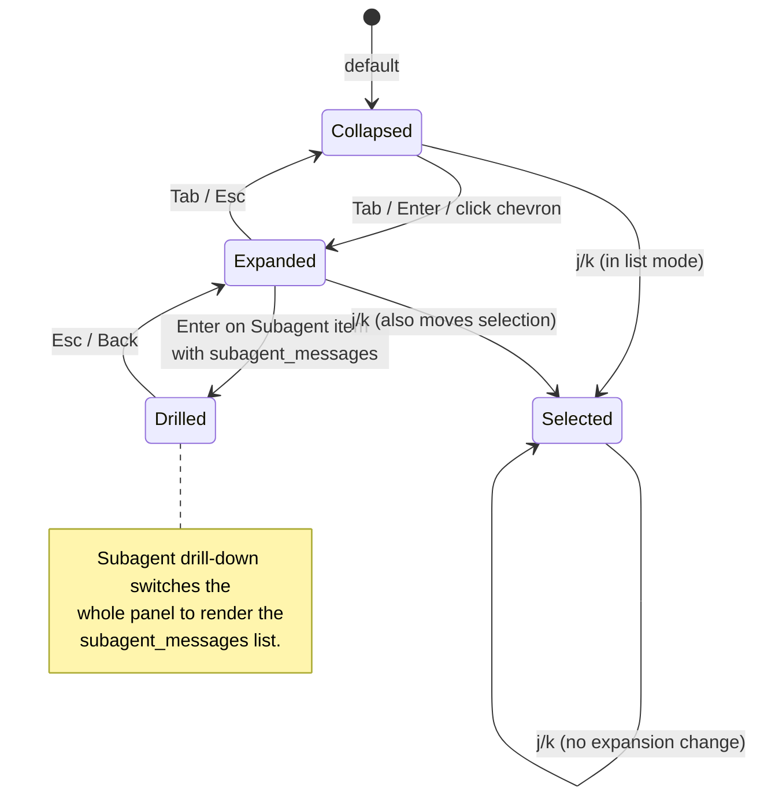
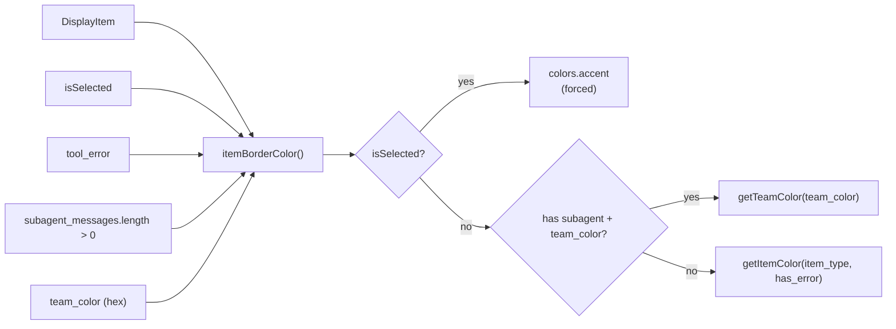
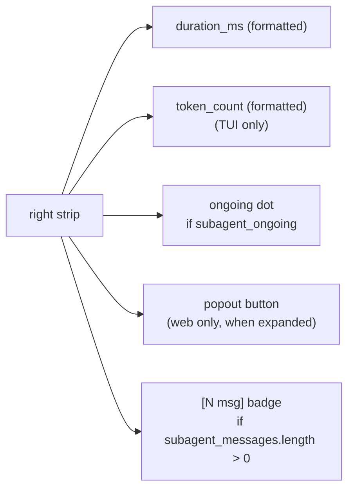
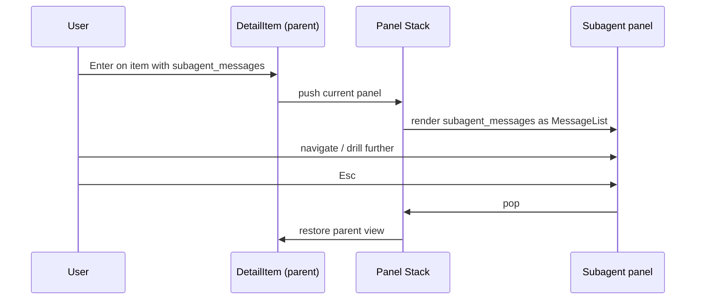
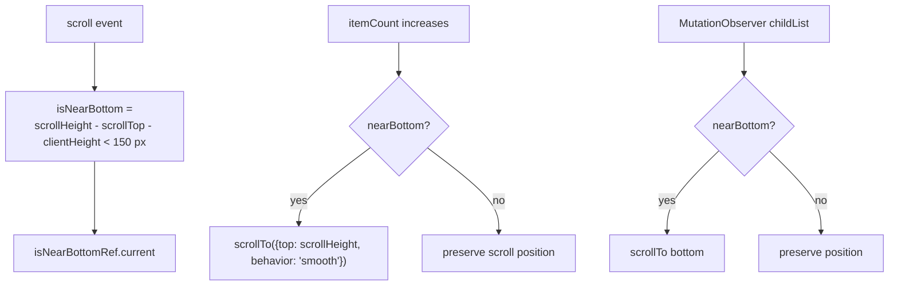
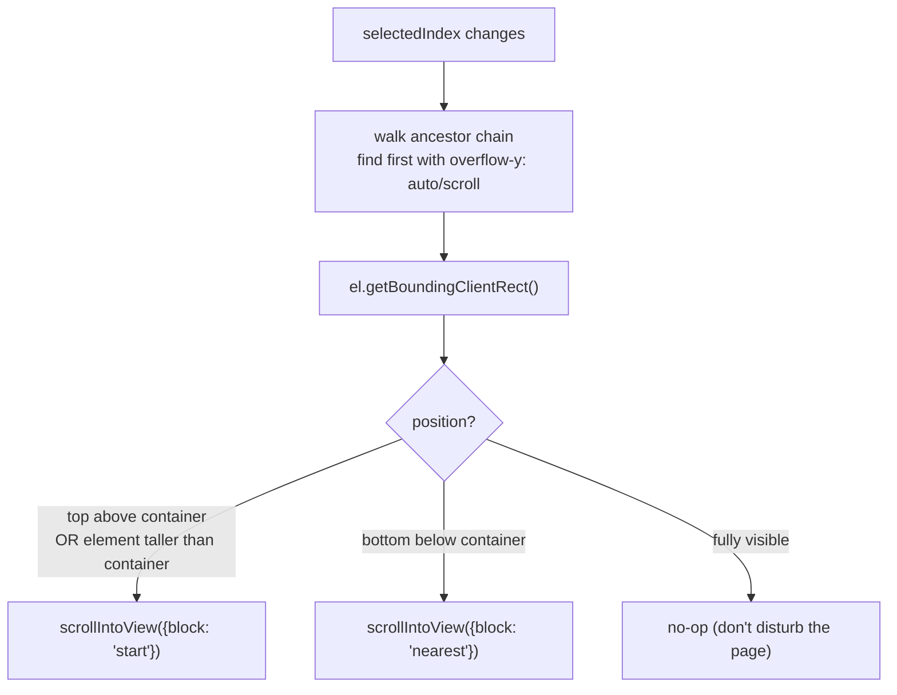

# Spec: Item Rendering by Type

**Locations**:
`src/components/DetailItem.tsx`, `src/components/MessageItem.tsx`, `src/components/Icons.tsx`,
`tui-py/widgets/detail_view.py`, `tui-py/widgets/message_list.py`,
`tui-py/items.py`, `tui-py/theme.py`,
`src/hooks/useScrollToSelected.ts`, `src/hooks/useAutoScroll.ts`.

Every `DisplayItem` in a session carries an `item_type` discriminant. Web and TUI both dispatch
on that discriminant to choose the icon, name, summary, expanded body, and accent colour. This
spec documents the rendering contract.

---

## Rendering Pipeline



> **`Output` is always inline.** Both renderers show the assistant's prose (`Output` items)
> unconditionally, not just when expanded, so a turn reads as commentary interleaved with tool
> calls in chronological order. The collapsed-row summary is therefore empty (the full text
> shows in the body, not a truncated preview). See [Expanded Body Per Type](#expanded-body-per-type).

---

## Item Type → Visual Mapping

The three "introspection" functions are mirrored between web (`DetailItem.tsx`) and TUI
(`tui-py/items.py`). Same logic, different glyph/icon vocabulary.

| `item_type`       | Name source                        | Summary source                                 | Web icon (`react-icons`)                        | TUI icon (Unicode) |
| ----------------- | ---------------------------------- | ---------------------------------------------- | ----------------------------------------------- | ------------------ |
| `Thinking`        | literal `"Thinking"`               | `text.slice(0,80)` (or "Content not recorded") | `VscLightbulbEmpty`                             | `◆` (U+25C6)       |
| `Output`          | literal `"Output"`                 | `""` (prose shown inline in body)              | `VscComment`                                    | `▪` (U+25AA)       |
| `ToolCall`        | `tool_name` or `"Tool"`            | `tool_summary`                                 | `toolCategoryIcons[tool_category]` or `Warning` | `⚙` (U+2699)       |
| `Subagent`        | `subagent_type` or `"Subagent"`    | `subagent_desc`                                | `ClaudeIcon`                                    | `✦` (U+2726)       |
| `TeammateMessage` | `team_member_name` or `"Teammate"` | `text.slice(0,100)` (web) / `text` (TUI)       | `ClaudeIcon`                                    | `◈` (U+25C8)       |
| `HookEvent`       | `hook_event` or `"Hook"`           | `hook_name` + `: ` + truncated `hook_command`  | `VscExtensions` (hook icon)                     | `⚡` (U+26A1)      |

### Web Tool Category Icons (`Icons.tsx`)



### TUI Tool Glyph

The TUI uses a single `⚙` (U+2699) for every `ToolCall` regardless of category. Category-level
visual differentiation is provided by the **name** column (`tool_name`), not the glyph.

---

## Expanded Body Per Type

The expanded body is the type-specific rendering when the item is opened. Both renderers branch
on `item_type` but use different layout primitives.

### Web (`DetailItemBody`)

| `item_type`       | Body layout (CSS classes)                                                                                                                                                                                                                                                                                                                                                                                                                                                                                                                           |
| ----------------- | --------------------------------------------------------------------------------------------------------------------------------------------------------------------------------------------------------------------------------------------------------------------------------------------------------------------------------------------------------------------------------------------------------------------------------------------------------------------------------------------------------------------------------------------------- |
| `Thinking`        | `.detail-item__text--thinking` — single text block, falls back to "Thinking content is not recorded in session logs." when `text` is empty                                                                                                                                                                                                                                                                                                                                                                                                          |
| `Output`          | `.detail-item__text--markdown` — `<ReactMarkdown>{text}</ReactMarkdown>`                                                                                                                                                                                                                                                                                                                                                                                                                                                                            |
| `ToolCall`        | Two sections: `Input` and `Output`. **Edit tool** input renders as a diff view (`.detail-item__diff`) with file path header, red `−` removed lines, and green `+` added lines via `parseEditInput()` + `EditDiffLines`; shows a "replace all" badge when `replace_all` is true. **Other tools** render input as `<pre><code>{formatJson(tool_input)}</code></pre>`. Output: `tool_result_json` as `<pre><code>` if set, else `formatJson(tool_result)` as `<pre><code>` if valid JSON, else plain text; `.detail-item__text--error` if `tool_error` |
| `Subagent`        | Up to 4 labelled sections: `Agent ID` (mono), `Description`, `Prompt`, `Content` (`text`)                                                                                                                                                                                                                                                                                                                                                                                                                                                           |
| `TeammateMessage` | Single text block (`text`)                                                                                                                                                                                                                                                                                                                                                                                                                                                                                                                          |
| `HookEvent`       | Three sections: `Hook` (`{hook_event}: {hook_name}`), `Command` (`<pre>` if present), `Metadata` (`<pre>` if present)                                                                                                                                                                                                                                                                                                                                                                                                                               |
| `default`         | Single text block                                                                                                                                                                                                                                                                                                                                                                                                                                                                                                                                   |

Both renderers show the `Output` body inline regardless of expansion state (the assistant's
prose is always shown in chronological position); all other types render their body only when
`isExpanded`. Because that prose is shown by the `Output` items themselves, the message view
(`MessageDetail` on web, `DetailView` in the TUI) suppresses the flattened `msg.content` blob it
would otherwise render above the items whenever the turn contains at least one `Output` item —
the blob concatenated every text block out of order and duplicated what the items already show.
Turns with no `Output` items (e.g. tool-only or plain user/system messages) still render
`msg.content`.

### TUI (`DetailItemBody`)

````mermaid
flowchart TD
    BODY["DetailItemBody(item, cols, scrollOffset)"]
    BODY --> T{"item_type?"}

    T -->|"Thinking"| TH["ScrollBlock\ncolor: itemThinking\nfallback text if empty"]
    T -->|"Output"| OUT["ScrollBlock\n(formatJson(text))"]
    T -->|"ToolCall"| TC["concat:\n'Input:' + (Edit tool → _format_edit_diff as ```diff fence,\n  else _md_json(tool_input))\n+ hrule\n+ ('Error:' or 'Result:') +\n  tool_result_json fenced block if set,\n  else _md_json(tool_result)\n→ ScrollBlock"]
    T -->|"Subagent"| SA["concat:\n'id: ...'\n'description: ...'\n'prompt: ...'\n+ hrule\n'Result: ...'\n→ ScrollBlock"]
    T -->|"TeammateMessage"| TM["ScrollBlock(text)"]
    T -->|"HookEvent"| HK["Three labelled rows:\nhook: {event}: {name}\ncmd: {command}\nmetadata: {metadata}"]
````

#### `ScrollBlock` (TUI only)



The TUI's expanded body is a single scrollable text region with `u`/`d` keys. The web frontend
uses native browser scroll on `<pre>`/`<div>` elements.

---

## Message-Level Rendering

`MessageItem` (web) / `MessageList` (TUI) chooses a layout based on `message.role` before any
item-level rendering happens.



### Web `MessageItem` Header

```
[role-icon] [Role label] [model · color] [subagent_label badge] [ongoing dots] [Detail →] [timestamp]
```

Where:

- `Detail →` button appears only when the message has any items, tool calls, or thinking blocks.
- `ongoing dots` shows only when `isOngoing` is true.
- `subagent_label` badge (e.g. `claude-sonnet-4-6 · 3 turns`) appears on subagent messages.

### TUI `MessageList` Header

```
[selection-indicator] [role-icon] [Role] [model] [subagent_label] [ongoing spinner] [N/total]
```

Same information; rendered as space-separated `<Text>` segments inside a bordered `<Box>`.

---

## Selection and Expansion State



State storage:

- `useToggleSet` (shared, see [`05-frontend-web.md`](05-frontend-web.md)) — `Set<number>` of expanded indices.
- `selectedIndex: number` — current cursor position.
- `subagentItem: DisplayItem | null` — non-null when drilled into a subagent (TUI + web).

---

## Selection Accent and Team Colour



- Selected items always render in the accent colour (overrides everything else).
- Subagent items inherit the team colour when present (so a teammate's items show in their colour).
- Other items use a per-type colour from the theme (`itemThinking`, `itemTool`, `itemAgent`, etc.).
- Errors render in the error colour regardless of category.

---

## Right-Aligned Item Metadata

Both renderers add a right-aligned strip after the item header:



---

## Subagent Drill-Down

Subagent items support recursive expansion. The `subagent_messages` array contains the full
nested message list of the spawned agent.



Web: implemented by `MessageDetail.tsx` as a horizontally-stacked panel split.
TUI: implemented by `App.tsx` state variables `subagentItem` and `subagentDetailMsg`.

---

## Auto-Scroll (`useAutoScroll`)

Auto-scrolls the message list to the bottom when new content arrives, but only if the user was
already near the bottom.



The 150 px threshold (configurable) is "near enough that the user is following the stream". If
they've scrolled up to read, the auto-scroll stops respecting them.

Only `childList` mutations trigger the observer — attribute or text changes (e.g. expand/collapse
on an existing item) do not cause unwanted scroll.

---

## Scroll-to-Selected (`useScrollToSelected`)

When the keyboard selection changes, the selected item must come into view. The hook walks up
the DOM to find the scrollable ancestor and aligns based on position.



The "no-op when already visible" branch matters: without it, every keyboard move would
re-centre the selected item, causing visible jitter.

---

## Web vs TUI Comparison Cheatsheet

| Concern             | Web                                                          | TUI                                                               |
| ------------------- | ------------------------------------------------------------ | ----------------------------------------------------------------- |
| Item header layout  | flex row with `.detail-item__name`, `.detail-item__summary`  | `<Text wrap="truncate">` with `padEnd(maxNameLen)`                |
| Item body scrolling | native browser scroll on `<pre>`/`<div>`                     | `ScrollBlock` with `bodyScrollOffset` and `u`/`d` keys            |
| Header scroll       | n/a                                                          | `headerScrollOffset` for message content above items              |
| Icon source         | `react-icons` (`@vscode/codicons` set via `react-icons/vsc`) | Unicode BMP glyphs (no Nerd Font dependency)                      |
| Tool category icon  | distinct icon per category                                   | single `⚙` for all categories                                     |
| Pop-out             | `PopoutModal` (resizable overlay)                            | n/a                                                               |
| Markdown rendering  | `react-markdown`                                             | `marked` + `marked-terminal` via `renderMarkdown()` (Output only) |
| Selection visual    | `.detail-item--selected` class + accent border-left          | `<Text bold>` + accent foreground colour                          |
| Team colour accent  | inline style `borderLeftColor: teamColor`, background tint   | `<Text color={teamColor}>` on the left bar glyph                  |
| Subagent badge      | `[N msg]` chip                                               | ` [N msg]` text segment                                           |

---

## Related Specs

- [05-frontend-web.md](05-frontend-web.md) — web component hierarchy and view state machine
- [06-tui.md](06-tui.md) — TUI component inventory and keyboard routing
- [07-data-types.md](07-data-types.md) — `DisplayItem` and `DisplayMessage` field reference
- [10-tool-taxonomy.md](10-tool-taxonomy.md) — `tool_category` source (used for icon dispatch)
- [11-project-tree.md](11-project-tree.md) — project tree rendering (separate from items/messages)
