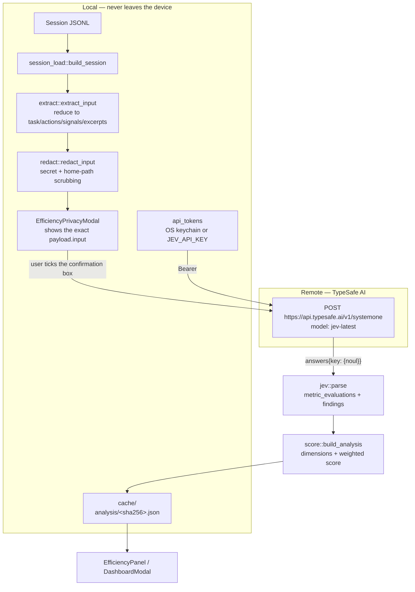
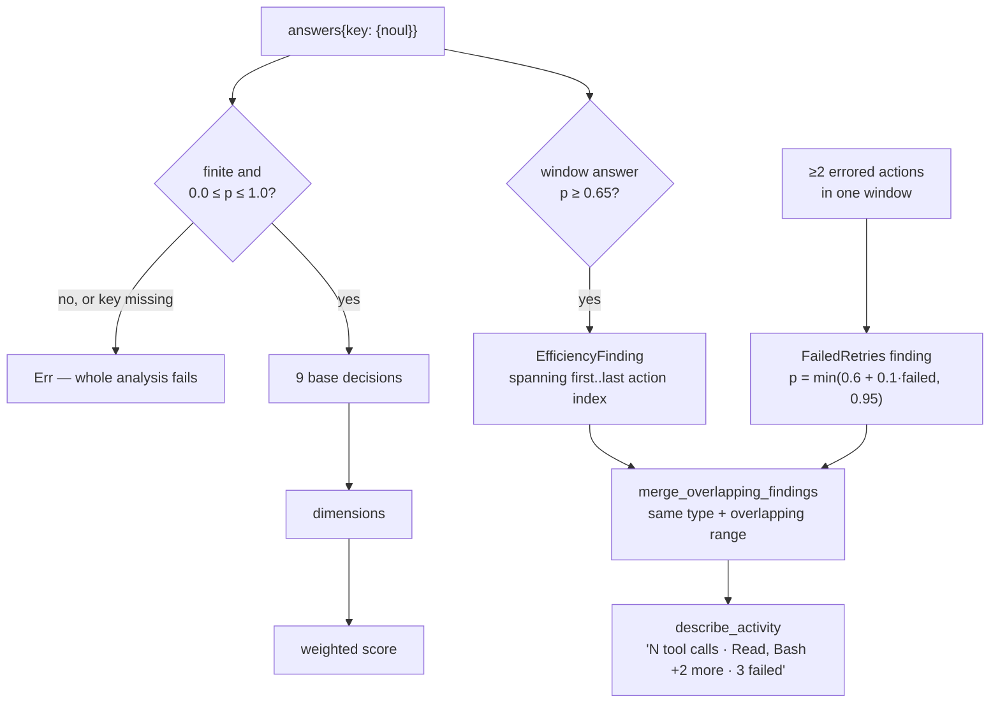
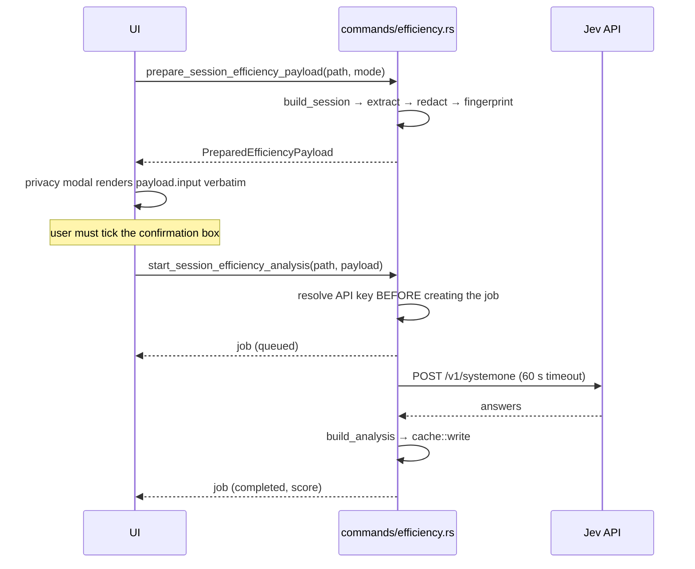

# Spec: Jev Efficiency Analysis Integration

**Location**: `src-tauri/src/efficiency/`, `src-tauri/src/commands/efficiency.rs`,
`src-tauri/src/credentials/api_tokens.rs`, `src/components/Efficiency*.tsx`

An **optional** integration that sends a reduced, locally redacted summary of one session to
**Jev** (TypeSafe AI's System One model) and turns the returned probabilities into a 0–100
efficiency score, six dimension scores, and trace-linked findings.

Jev answers **typed probability questions** ("noul" answers, a float in `0.0..=1.0`) rather
than generating prose. Every number in the dashboard is derived arithmetically from those
probabilities — the model never writes a sentence that reaches the UI.

The feature is inert until a Jev API key is configured. No analysis is ever sent without an
explicit per-request user confirmation.

---

## Architecture

---

## Module Responsibilities

| Module        | Responsibility                                                                     |
| ------------- | ---------------------------------------------------------------------------------- |
| `mod.rs`      | Shared types + the three version constants that invalidate caches                  |
| `extract.rs`  | `DisplayMessage[]` → `EfficiencyInput` (task, actions, signals, excerpts)          |
| `redact.rs`   | Regex scrubbing of secrets and the user's home path, in place on `EfficiencyInput` |
| `jev.rs`      | Question construction, HTTP call, response validation, findings derivation         |
| `score.rs`    | Probabilities → six dimensions → one weighted 0–100 score                          |
| `cache.rs`    | SHA-256 transcript fingerprint, on-disk analysis cache, staleness                  |
| `settings.rs` | Payload mode, recommendation provider, provider guardrails for Docker and web      |

---

## Payload Construction (`extract.rs`)

`EfficiencyInput` is the **only** thing sent. It has four parts:

| Field              | Content                                                                                                                                    |
| ------------------ | ------------------------------------------------------------------------------------------------------------------------------------------ |
| `task`             | First user message (≤1200 chars), turn count, summed duration, total tokens                                                                |
| `actions[]`        | One entry per `ToolCall` **and `Subagent`** item: message index, tool, category, summary (≤500), duration, error flag, repeated-call count |
| `signals`          | Tool-call count, failed calls, repeated calls, subagent count, context growth                                                              |
| `selectedExcerpts` | Role-prefixed message text                                                                                                                 |

`actions[].index` is the **Trace message index**, kept stable so a finding can scroll the
message list to its evidence.

**Repeated-call detection is local, not model-derived.** `normalized_action_key` lowercases the
tool name and collapses whitespace in the **full `tool_input`**; `repeatedSimilarCallCount` is the
number of _other_ actions sharing that key. It must never key off `tool_summary` — that string is
capped for the UI (60 chars for Bash), so a long shared `description` collapses genuinely different
commands into one key and reports them as repeated work.

`action_detail` decides what Jev reads: the display summary when it is intact, or the raw
`tool_input` (≤500 chars) when the summary was truncated or absent. Without this Jev receives two
byte-identical actions for two different commands and cannot tell them apart.

**Subagent spawns are actions.** A `Task`/`Agent` call is a `Subagent` item, not a `ToolCall`.
Filtering to `ToolCall` alone hid every one of them: a real session with 100 subagent calls sent
17 actions and reported `subagentCount: 0`, so `subagentsUseful` was answered on no evidence and
the subagents' work was invisible to every other metric. `subagentCount` counts `Subagent` items
only — keying it on the `Task` _category_ counted `TaskCreate`/`TaskUpdate`/`TaskList`/
`TeamCreate`/`SendMessage`, which spawn nothing.

### Excerpt selection (`excerpt_indices`)

Excerpts used to be "user messages plus failures, first 24". That had two consequences: a
successful assistant message matched no clause, so Jev judged `likelyTaskCompleted` without ever
seeing how the session ended; and on a long session the sample stopped at the opening.

Selection is now, in priority order, capped at `MAX_EXCERPTS`:

1. **The outcome** — the last `claude` message with content, reserved first so the cap can never
   squeeze it out.
2. **Requests and failures** — user messages, errored messages, messages with a failed tool,
   sampled with `evenly_spaced` so the whole timeline is covered rather than its first N matches.
3. **Successes** — remaining `claude` messages with content, filling any spare capacity so the
   sample is not purely negative. Jev previously saw every failure and no successes, which biased
   progress, tool-use, recovery and completion downward.

`evenly_spaced` always keeps the first and last candidate.

### Payload modes

| Mode              | Excerpt selection                                                  | Per-entry cap | Entry cap |
| ----------------- | ------------------------------------------------------------------ | ------------- | --------- |
| `minimized`       | User messages, errored messages, messages with a failed tool       | 1 200 chars   | 24        |
| `full-transcript` | **Every** message, plus each item's `tool_input` and `tool_result` | 5 000 chars   | **none**  |

`minimized` is the default (`AnalyticsConfiguration::default`).

---

## Redaction (`redact.rs`)

Applied to `task.firstUserMessage`, every `actions[].summary`, and every excerpt — replacing
matches with `[REDACTED]`:

| Pattern          | Catches                                                                                          |
| ---------------- | ------------------------------------------------------------------------------------------------ |
| `PRIVATE_KEY`    | `-----BEGIN … PRIVATE KEY----- … -----END … PRIVATE KEY-----`                                    |
| `BEARER`         | `Bearer <token>` (≥8 chars), keeping the scheme                                                  |
| `NAMED_SECRET`   | `api_key`/`access_token`/`auth`/`password`/`secret`/`cookie` followed by `=`, `:`, or JSON `":"` |
| `URL_SECRET`     | `?access_token=` / `api_key=` / `token=` / `key=` query values                                   |
| `ENV_ASSIGNMENT` | `SCREAMING_CASE` names ending `KEY`/`TOKEN`/`SECRET`/`PASSWORD`/`COOKIE`                         |

The user's home directory is then rewritten to `~`.

Redaction is **best-effort and pattern-based**. The privacy modal states this, and the modal
renders `payload.input` verbatim so the user reviews what actually goes out rather than a
description of it.

---

## Questions Asked of Jev (`jev.rs`)

### What "redundant work" means

The question sent to Jev states the rule rather than naming it, because "repeated work" on its own
has no agreed meaning and the model was left to invent one:

> An action is redundant **only** when it repeats earlier work whose result **could not have
> changed**, because nothing relevant was modified in between.

Explicitly **not** redundant, and named in the question so the model does not count them:

- re-running a command after a change that could alter its result (tests or a build after an edit)
- the same tool applied to a different target or different input
- a retry after an error or interruption

The question also tells the model to treat `repeatedSimilarCallCount` as evidence rather than
proof, since an identical call is legitimate once the state it reads has changed. A regression test
(`the_redundant_work_question_defines_what_counts_and_what_does_not`) pins both the base and window
wording so the rule cannot be silently dropped.

### Nine base metrics

`BASE_METRICS` is the single source of truth: it generates both the request's questions **and**
the dashboard's `metricEvaluations`, so the label a user reads is the question the model answered.

| Key                      | Label                     | Higher is better |
| ------------------------ | ------------------------- | ---------------- |
| `progressingEfficiently` | Progress                  | yes              |
| `toolCallsUseful`        | Useful tool calls         | yes              |
| `redundantWorkPresent`   | Avoided redundant work    | **no**           |
| `excessiveExploration`   | Proportionate exploration | **no**           |
| `likelyThrashing`        | Avoided thrashing         | **no**           |
| `effectiveRecovery`      | Effective recovery        | yes              |
| `tokenUsageEfficient`    | Efficient token use       | yes              |
| `subagentsUseful`        | Useful subagents          | yes              |
| `likelyTaskCompleted`    | Task completion           | yes              |

For a `higher_probability_is_better: false` metric the **displayed** score is `1 − p`, so every
tile in the dashboard reads "higher is better".

The token question explicitly instructs the model to judge resource efficiency only and **not**
to estimate monetary cost. A test asserts the serialised request body contains no "cost" string.

### Window questions

Actions are chunked into windows of `WINDOW_ACTIONS = 6`, capped at `MAX_WINDOWS = 12`. Each
window gets five questions (`repeated`, `thrashing`, `exploration`, `recovery`, `subagent`),
keyed `window_<n>_<kind>`. Each instruction names the exact zero-based action range to evaluate
so the model cannot drift outside its window.

---

## Response → Findings → Score

A missing or out-of-range probability for **any** base metric fails the entire analysis — the
job reports "Efficiency analysis failed" rather than scoring a partial response.

### Dimensions and weights (`score.rs`)

| Dimension     | Derived from                                        | Weight |
| ------------- | --------------------------------------------------- | ------ |
| `progress`    | `progressingEfficiently`                            | 0.25   |
| `toolUse`     | `toolCallsUseful`                                   | 0.20   |
| `focus`       | `1 − (redundantWorkPresent + likelyThrashing) / 2`  | 0.15   |
| `tokenUse`    | `tokenUsageEfficient`                               | 0.15   |
| `exploration` | `1 − excessiveExploration`                          | 0.10   |
| `recovery`    | `effectiveRecovery`                                 | 0.10   |
| —             | `likelyTaskCompleted` (score only, not a dimension) | 0.05   |

Weights total **1.00**. The result is rounded and clamped to `0..=100`.

---

## Job Lifecycle

Status values: `queued → preparing → redacting → sending → analysing → processing_result →
completed`, plus terminal `failed` / `cancelled`.

Each transition calls `emit_update`, which broadcasts on SSE (`efficiency-analysis-update`) and,
on desktop, emits the same Tauri event.

**The API key is resolved before the job is created.** A missing key returns an error
immediately and the UI opens `JevKeyRequiredModal`, so the user never sits through a privacy
modal followed by an inevitably failing background job.

`insert_latest_session_job` keeps **one job per session path** — starting a new analysis evicts
the previous job for that session.

The cache write happens **while still holding the jobs lock**, so a newer re-analysis must
replace the job before an older in-flight result can write its analysis.

---

## Credentials (`credentials/api_tokens.rs`)

| Token                    | Keychain account                  | Env var       |
| ------------------------ | --------------------------------- | ------------- |
| `Jev`                    | `jev-api-key`                     | `JEV_API_KEY` |
| `RecommendationProvider` | `recommendation-provider-api-key` | none          |

`resolve()` prefers the environment variable, then the OS store (macOS Keychain, Windows
Credential Manager, Linux Secret Service, under service `claude-code-trace`). `source()` reports
`"environment"` or `"secure-storage"` so settings can show provenance without revealing a value.

Tokens never enter `settings.json`, `analytics.json`, the analysis cache, or any API response.
`AnalyticsSettingsResponse` carries only a `configured` boolean, and `settings::save` force-clears
`api_key_configured` before writing to disk.

**Docker** has no OS keyring. `script/docker-entrypoint.sh` reads `JEV_API_KEY_FILE` (Compose
mounts `/run/secrets/jev_api_key`) and exports it as `JEV_API_KEY`. `redeploy.sh` reads the key
from stdin without echoing and passes it through stdin rather than a Docker argument.

**Web mode deliberately exposes no key-management endpoint.** `set_jev_api_key`,
`clear_jev_api_key`, and the recommendation-provider key commands are `#[cfg(feature = "desktop")]`
Tauri commands with **no** HTTP route, so a browser client cannot write or clear a credential.

---

## HTTP / IPC Surface

All routes sit behind `auth::require_client` on the shared API server.

| Method       | Route                                | Tauri command                                                        |
| ------------ | ------------------------------------ | -------------------------------------------------------------------- |
| GET / POST   | `/api/analytics/settings`            | `get/set_analytics_settings`                                         |
| POST         | `/api/analytics/jev/test`            | `test_jev_connection`                                                |
| POST         | `/api/analytics/recommendation/test` | `test_recommendation_provider`                                       |
| POST         | `/api/efficiency/prepare`            | `prepare_session_efficiency_payload`                                 |
| POST         | `/api/efficiency/start`              | `start_session_efficiency_analysis`                                  |
| GET          | `/api/efficiency/jobs`               | `list_efficiency_analysis_jobs`                                      |
| POST         | `/api/efficiency/job/{id}/cancel`    | `cancel_efficiency_analysis`                                         |
| GET / DELETE | `/api/efficiency/result?path=`       | `get/delete_session_efficiency`                                      |
| GET          | `/api/efficiency/summaries`          | `list_efficiency_summaries`                                          |
| desktop only | —                                    | `set/clear_jev_api_key`, `set/clear_recommendation_provider_api_key` |

`src/lib/invoke.ts` maps each command name to its route so the React code calls one `invoke()`
in both desktop and web mode.

---

## Cache and Staleness (`cache.rs`)

Analyses are written to `<config_root>/analysis/<sha256(session_path)>.json`. **The filename is a
hash, so the cache directory never discloses which sessions were analysed** — pinned by a test.

An analysis is marked `stale` when any of these differ from the current values:

- `transcriptFingerprint` — SHA-256 of the whole transcript, streamed in 64 KiB chunks
- `analysisVersion` (7) — payload/pipeline shape
- `decisionSetVersion` (4) — the set of questions asked
- `scoreFormulaVersion` (2) — the weighting

Bumping any constant invalidates every cached analysis without a migration. `EfficiencyPanel`
additionally treats `currentTurns !== analyzedTurns` as changed, so a session that grew since its
analysis says so even before a re-read.

---

## Recommendation Providers (`settings.rs`)

Separate from Jev: an optional local/subscription LLM used for recommendations.

| Provider                   | Constraint                                                          |
| -------------------------- | ------------------------------------------------------------------- |
| `codex-subscription`       | Requires the `codex` CLI; unavailable when `CCTRACE_RUNTIME=docker` |
| `claude-code-subscription` | Requires the `claude` CLI; unavailable in Docker                    |
| `openai-compatible`        | Always available                                                    |

`ensure_web_provider_supported` additionally restricts web mode to **loopback** OpenAI-compatible
endpoints with no embedded credentials — rejecting non-local hosts, userinfo, query strings, and
fragments. This stops a browser client from steering the server at an arbitrary remote host.

CLI connection tests run with `Stdio::null()` stdin, `kill_on_drop`, and a 60 s timeout, and
surface the provider's own error message plus an upgrade command when the error mentions a
version problem.

---

## Bugs / Open Concerns

Items found while writing this spec. None is fixed here.

> Resolved since first draft: subagent spawns are now sent and counted, and excerpt selection
> reserves the session outcome and spans the whole timeline (`ANALYSIS_VERSION` 7). The redundant-work
> question now states its rule and the repeat counter keys off the full tool input
> (`DECISION_SET_VERSION` 4).

### 1. Cancelling does not abort the in-flight Jev request

`cancel_efficiency_analysis_impl` only sets `job.cancelled`. The spawned task is already awaiting
`jev::analyse`; no `AbortHandle` is retained (`tokio::spawn`'s `JoinHandle` is dropped) and
`reqwest` gets no cancellation signal. The request still completes, so the session data has
already been sent and the API call is still billed. "Cancel" means "discard the result", not
"stop the transfer" — the UI does not say so.

### 2. Cancelling emits no update to other clients

`cancel_efficiency_analysis_impl` mutates the job and returns without calling `emit_update`. The
initiating frontend patches its own state optimistically in `useEfficiencyJobs.cancel`, so it
looks correct, but any **other** connected client (second browser tab, TUI, desktop alongside web)
keeps showing the job as running until some later transition emits.

### 3. `start` trusts a client-supplied payload

`start_session_efficiency_analysis_impl` validates only that `payload.session_path == path`. It
then sends `payload.input` to Jev verbatim and stores `payload.transcript_fingerprint` in the
cache. An authenticated client can therefore submit an **unredacted or fabricated** `input`, or
pin a fingerprint that makes a stale analysis look current. The redaction guarantee holds only
for clients that actually went through `prepare`. The server never re-extracts or re-redacts.

### 4. Findings stop after 72 actions

`MAX_WINDOWS (12) × WINDOW_ACTIONS (6)` caps window questions at the first 72 actions. Later
actions still appear in `state.actions` for the base metrics, but **no finding can ever be
generated for them**, so a long session's tail is silently uncovered. Nothing in the UI indicates
the findings are truncated.

Including subagent spawns made this sharper, not worse in kind: two measured sessions now send 117
and 241 actions, so 45 and 169 of them respectively sit outside every window. Widening the cap
trades directly against request size and the 60 s timeout, so it needs a deliberate choice rather
than a bigger constant.

### 5. `full-transcript` mode has no entry cap

`take(usize::MAX)` — every message becomes an excerpt of up to 5 000 chars. A large session can
build a request far beyond what the 60 s timeout can deliver, failing late with "Connection
failed" after the data has been transmitted.

### 6. `FailedRetries` probability is fabricated, not modelled

`0.6 + 0.1 · failed_count` (capped at 0.95) is a local heuristic, yet `EfficiencyPanel` renders it
as "N% likelihood" identically to a Jev-derived probability. A reader cannot tell which numbers
came from the model.

### 7. The progress sequence reports work that already happened

`preparing (10%)`, `redacting (25%)`, `sending (35%)`, and `analysing (60%)` all fire back-to-back
with no work between them — extraction and redaction happened earlier, in `prepare`. The
percentages are decorative and will sit at 60% for the entire real wait.

### 8. The analysis cache is never garbage-collected

Nothing deletes `analysis/*.json` when a session is removed. `list_summaries` reads and SHA-256s
**every** cached transcript on every call (it is called on mount and after each completed job), so
the cost grows with history. For a deleted session `transcript_fingerprint` errors,
`.unwrap_or(true)` marks it stale, and the orphan row is listed forever.

### 9. No TUI support

Zero references to Jev or efficiency in `tui-py/`. The feature exists on desktop and web only,
against the project's multi-surface parity goal. The TUI cannot start, view, or cancel an analysis.
